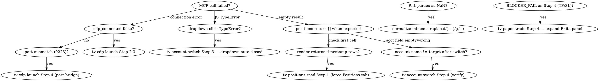

# tv-debug

> **MCP server:** [tradesdontlie/tradingview-mcp](https://github.com/tradesdontlie/tradingview-mcp) — the `mcp__tradingview-desktop__*` tool family.

Symptom → cause → fix matrix. Cross-references the other `tv-*` skills.

## Decision tree



## Symptom → fix table

### CDP / launch

| Symptom | Cause | Fix |
|---|---|---|
| `tv_health_check` → `CDP connection failed after 5 attempts` | TV not launched with `--remote-debugging-port` | `tv-cdp-launch` Steps 1–3 |
| `tv_launch` → "TradingView not found on win32" | WindowsApps path not searched | `tv-cdp-launch` Step 2 (manual exe path) |
| CDP responds via curl 9223 but MCP says fail | Port mismatch, MCP defaults 9222 | `tv-cdp-launch` Step 4 (Python forwarder if no admin) |
| `netsh interface portproxy add` → `requires elevation` | No admin | Use Python forwarder (`tv-cdp-launch` Step 4b) |
| Multiple TradingView.exe processes (8+) but no listener | Renderer subprocesses only — main proc crashed | `Stop-Process -Name TradingView -Force`, relaunch |

### Account switching

| Symptom | Cause | Fix |
|---|---|---|
| Click `HIGHFWWRABV55_SCOREABOVE50_V3` → landed on `theswarm` | Text-match collision (substring or DOM order) | Use `tv-account-switch` index-click |
| `Cannot read properties of undefined (reading 'click')` on `divs[N]` | Dropdown auto-closed between evals | Re-open dropdown immediately before clicking |
| Empty account name after click | Account-switch animation incomplete | `sleep 4` before reading `__curAcct()` |
| Account name doesn't match target | User manually clicked into a different account between your evals | Re-enumerate and switch again. NEVER trade without verify |

### Position reading

| Symptom | Cause | Fix |
|---|---|---|
| Reader returns rows like `{"sym": "2026-04-14 09:44:37", ...}` | History tab is foreground; first cell is a timestamp containing `:` | Tighten regex to `/^[A-Z][A-Z0-9_]+:[A-Z][A-Z0-9!._]+$/`. Force Positions tab first |
| `parseFloat(pnl)` → NaN | TV uses Unicode minus `−` (U+2212), not ASCII `-` | Normalize: `s.replace(/[−–]/g,'-')` |
| Reader returns `[]` when positions exist visually | Positions tab not selected, or table not yet rendered after switch | `tv-positions-read` Step 1 + sleep 4 |
| qty `42,434` parses as 42 | Locale comma in number | `parseFloat(qty.replace(/,/g,''))` |

### Trade placement (defers to `tv-paper-trade`)

| Symptom | Cause | Fix |
|---|---|---|
| Step 4 returns `BLOCKER_FAIL: only N inputs visible` | Exits panel collapsed — TP/SL inputs not in DOM | Click "Exits" toggle first, re-run Step 4. DO NOT click Buy/Sell. See `tv-paper-trade` BLOCKER_FAIL section |
| Order opened with no TP/SL despite Step 4 OK | Step 4.5 side-sanity gate skipped, TP/SL inverted, market auto-stopped | Re-run audit via Step 6, use Protect Position dialog |
| Quantity field auto-fills strange number | TV qty field = % of balance, not raw asset units | See memory `reference_tv_paper_qty_field.md` |

### Eval semantics

| Symptom | Cause | Fix |
|---|---|---|
| Async IIFE with `setTimeout` returns `{}` | `ui_evaluate` does not awaitPromise | Split into sequential sync evals + Bash `sleep` between |
| Helper `window.__foo` is undefined on a new tab/page | Page reloaded, lost JS state | Re-install helpers (Step 2 of each skill) |
| `JSON.stringify` returns truncated result | Result over MCP truncation threshold | Read fewer columns; or chunk by row range |

## Recovery sequence

When in doubt, replay this pre-flight:

1. `mcp__tradingview-desktop__tv_health_check` → must be green.
2. `ui_evaluate document.querySelector('span.accountName-dm1wtgNn')?.textContent.trim()` → record current account.
3. If wrong account: `tv-account-switch` end-to-end.
4. `ui_evaluate window.__readPos !== undefined` → if false, re-install helpers from `tv-positions-read` Step 2.
5. Click Positions tab (`tv-positions-read` Step 1).
6. Read snapshot. Confirm acct + n_pos match expectations.

If any step still fails after replay, screenshot for forensics:

```javascript
mcp__tradingview-desktop__capture_screenshot(filename="tv_debug_<utc>", region="full")
```

## Logging template

When closing a position or placing a trade after a debug session, log:

```json
{
  "ts_utc": "...",
  "acct_verified": "...",
  "symbol": "...",
  "action": "close|place",
  "pre_state": {...},
  "post_state": {...},
  "debug_notes": ["..."]
}
```

Append to `reports/tv_actions_<YYYY-MM-DD>.jsonl` so future agents can audit every UI action without scraping logs.

## Companion skills

- `tv-cdp-launch`
- `tv-account-switch`
- `tv-positions-read`
- `tv-close-positions`
- `tv-paper-trade`
