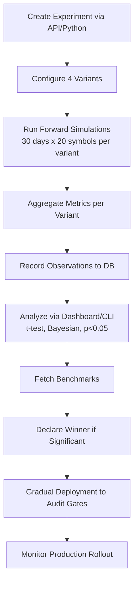

# AB Testing Blueprint for Portfolio Validation Gates

## Overview

This blueprint outlines a comprehensive A/B testing plan using the [`ab_testing_agent`](ab_testing_agent/) framework to forward-test 4 variants of validation gates on trading portfolios. 

**Key Parameters:**
- **Horizon**: 30-day forward test period
- **Scope**: 20 symbols per portfolio (selected from high-liquidity assets in alpha_engine, e.g., top cryptos/majors)
- **Portfolios**: Draw from [`alpha_engine`](alpha_engine/) strategies (e.g., advanced_strategies.py, audit_hub_systems_final.py outputs)
- **Metrics**: PNL, Max Drawdown (DD), Sharpe Ratio, Win Rate (WR), Profit Factor
- **Target Metric**: Risk-adjusted PNL (Sharpe * PNL) or configurable
- **Success Criteria**: Winner beats baseline by ≥20% PNL improvement, ≤10% higher DD, Sharpe >1.5, beats benchmarks by 5%

**Workflow**:


## Variants Configurations

Use these JSON snippets to create the experiment:

```json
{
  "name": "Validation Gates A/B Test",
  "description": "Forward-test validation gate variants on portfolios",
  "variants": [
    {
      "name": "baseline",
      "traffic_percentage": 25,
      "config": {
        "MAX_SYMBOL": 2,
        "MIN_SCORE": 0.7,
        "MAX_DD": 0.15,
        "standard_gates": true
      }
    },
    {
      "name": "relaxed_gates",
      "traffic_percentage": 25,
      "config": {
        "MAX_SYMBOL": 3,
        "MIN_SCORE": 0.5,
        "exceptions": ["copytraders", "ml_enhanced"],
        "standard_gates": true
      }
    },
    {
      "name": "atr_dynamic",
      "traffic_percentage": 25,
      "config": {
        "tp_sl_mode": "atr_dynamic",
        "atr_mult_tp": 2.5,
        "atr_mult_sl": 1.5,
        "standard_gates": false
      }
    },
    {
      "name": "score_bypass",
      "traffic_percentage": 25,
      "config": {
        "score_bypass_wr_threshold": 0.65,
        "standard_gates": true
      }
    }
  ],
  "metrics": ["total_pnl", "max_dd", "sharpe_ratio", "win_rate", "profit_factor"],
  "target_metric": "sharpe_ratio"
}
```

**Notes**: `config` field is custom extension; parse in forward tester.

## Modifications Needed to ab_testing_agent/

1. **`experiment_manager.py`**: 
   - Extend `create_experiment` to store variant configs as JSON.
   - Add `run_forward_test(experiment_id)` method: For each variant, invoke external forward tester (e.g., alpha_engine forward sim), aggregate results, call `record_observation`.
   - Update `analyze_experiment` for multi-variant (beyond A/B), trading metrics.

2. **`statistics.py`**:
   - Add trading-specific stats: `calculate_sharpe(returns)`, `max_drawdown(pnl_series)`, `profit_factor(wins/losses)`.
   - Multi-variant t-tests (ANOVA-like).
   - Benchmark adjustment: `adjusted_sharpe = sharpe - benchmark_sharpe`.

3. **New `forward_tester.py`** (in ab_testing_agent/):
   - Load portfolios/symbols from alpha_engine (e.g., via audit scripts).
   - Simulate 30-day forward using historical data shifted (or live if API).
   - Apply variant config to gates/TP/SL.
   - Output aggregated metrics dict.

4. **`config.py`**:
   - Add `FORWARD_HORIZON=30`, `SYMBOLS_PER_PORT=20`, `PORTFOLIO_SOURCES=['alpha_engine/strategies']`.

5. **`dashboard.py`** / templates:
   - Add trading charts (PNL curves, DD), benchmark comparisons.

6. **`database.py`**:
   - Extend Observation schema for `pnl_series` (JSON), variant_config.

## Benchmark Integration

**Fetchers** (add `benchmark_fetcher.py`):

1. **Polymarket BTC/ETH**:
   - Endpoint: `https://gamma.api.polymarket.com/markets?active=true&limit=10&slug_contains=bitcoin` (parse odds/prices).
   - Metrics: BTC/ETH price change over test period.
   - Code: `requests.get(...) -> extract returns`.

2. **Hedge Fund Benchmarks**:
   - HFR Index: `https://www.hfr.com/family-indices/hfri/` (scrape or Yahoo `^HFRI`).
   - Eurekahedge: `https://www.eurekahedge.com/Indices` (scrape top quant).
   - Yahoo Finance API: `yf.download('^HFRI', period='1mo')` for returns.
   - Integrate in `analyze_experiment`: Fetch period returns, compute `benchmark_return`, compare `alpha = portfolio_return - benchmark_return`.

**Usage**: Call in analysis: `benchmarks = fetch_benchmarks(start_date, end_date)`.

## Deployment Steps

1. **Prep**:
   - Implement mods (switch to code mode).
   - Select 20 symbols (e.g., BTC,ETH,top alts from alpha_engine/backfill_new_symbols.py).
   - Define portfolios (e.g., top from audit_comprehensive_report.py).

2. **Launch**:
   ```bash
   cd ab_testing_agent
   python main.py api  # Background
   curl -X POST /api/experiments -d @experiment.json
   python -c "from ab_testing_agent import agent; agent.run_forward_test(exp_id)"
   ```

3. **Monitor**:
   - Dashboard: http://localhost:5001/experiments/1
   - Metrics update every batch (daily?).

4. **Analyze**:
   - `curl /api/experiments/1/analyze`
   - Check p<0.05, winner prob>95%.

5. **Deploy Winner**:
   ```bash
   curl -X POST /api/experiments/1/deploy -d '{"winner": "atr_dynamic"}'
   ```
   - Updates alpha_engine/config.py gates.
   - Gradual: Test on 10% live symbols first.

6. **Post-Deploy**:
   - Update [`DEEP_DIVE_VALIDATION.md`](DEEP_DIVE_VALIDATION.md) with results.
   - Rollback if DD spikes.

## Analysis & Success Criteria

- **Statistical**: p<0.05 (t-test), Prob(winner>baseline)>90% (Bayesian).
- **Trading**: 
  | Metric | Baseline Threshold | Success |
  |--------|--------------------|---------|
  | PNL | - | +20% |
  | Max DD | 15% | ≤ baseline |
  | Sharpe | 1.0 | >1.5 |
  | WR | 55% | >60% |
  | vs Benchmarks | 0% alpha | >5% |
- **Narrowing**: Top 2 variants → production gates merge.

## Next Steps

- [ ] Review/approve this blueprint.
- [ ] Switch to code mode for file mods.
- [ ] Run experiment.
- [ ] Update DEEP_DIVE_VALIDATION.md with results.
