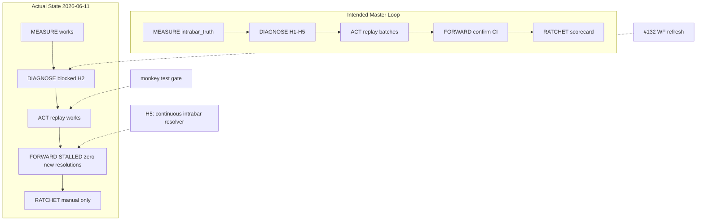
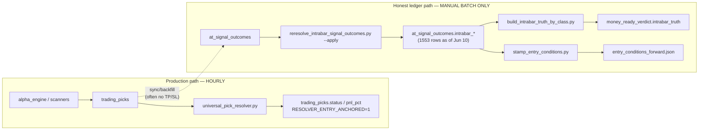

# CURSOR External Review — MONEY-READY MASTER LOOP (June 2026 Edition)

**Reviewer:** Cursor (Composer) · **Date:** 2026-06-11  
**Subject:** `docs/MONEY_READY_MASTER_LOOP_2026-06.md`  
**Task spec:** Hostile quant review per master loop §9 — verify claims, stress-test the loop, propose gaps.

---

## Executive verdict

**This is the best money-ready plan this repo has produced.** It correctly diagnoses the historical failure mode (H1 measurement lying for months), replaces calendar-time waiting with replay velocity, and binds promotion to forward-lane CI lower bounds rather than replay point estimates. The addenda (portfolio-math audit, FOOLPROOF post-mortem, pages-calc fixes) are unusually honest for an internal plan.

**It will still circle** unless four gaps close in the next 2–4 weeks: (0) **P0: forward lane stalled** — 1,553 intrabar resolutions came from a Jun 9–10 backfill batch; **zero new resolutions since Jun 10 noon**; CRYPTO coverage is 1.63% (see §10); (1) **H2 is unscoreable** while walk-forward data stays stale (#132); (2) **discovery guardrails are prose-only** (monkey test, FDR batch registry, symmetric demotion); (3) **portfolio books remain untrusted** until `tools/portfolios/performance.py` ships.

**Recommendation:** Adopt the master loop plan. **Ship P0-A → P0-B+C → P1-A → P1-B** (see Part VI §55). FOREX is **not** Tier-2 on ai_leaderboard (building, n=3); intrabar WR 42% / n=88. Swarm peer review: `swarm_runs/p0p1-plans-20260612T032534Z/`.

---

## 1. Independent verification of three factual claims

### Claim A — “0/9 classes pass” (§0, §10)

**Verdict: CONFIRMED** (with nuance on class count).

Re-derived from `audit_dashboard/data/money_ready_verdict.json` → `classes.<CLASS>.intrabar_truth`:

| Class | n | WR | PF (net) | T2 pass? |
|-------|---|-----|----------|----------|
| CRYPTO | 1154 | 32.4% | 0.73 | No |
| COMMODITY | 90 | 41.1% | 1.39 | No (WR & n) |
| EQUITY | 107 | 34.6% | 0.47 | No |
| FOREX | 88 | 42.1% | 1.13 | No (WR & n) |
| ETF | 16 | — | — | No |
| BOND | 6 | 33.3% | 2.24 | No (n) |
| FUTURES | 7 | 28.6% | 0.22 | No |
| CHEAP_STOCKS / MEME / PENNY_STOCK | — | intrabar_truth null | — | No |

None satisfy PF≥1.5 **and** WR≥50% **and** n≥100 on the honest intrabar ledger. The “0/9” headline is trustworthy; the live class list is 9 populated keys with measurable intrabar truth (3 null).

### Claim B — “COMMODITY — the only class with honest PF>1” (§2, focus-class rationale)

**Verdict: OVERSTATED but directionally right.**

At n≥30, **FOREX also has PF>1** (PF 1.13, n=88). BOND shows PF 2.24 but n=6 (noise). Among focus candidates, COMMODITY is the **strongest** honest sleeve (PF 1.39, n=90, approaching n=100 checkpoint), not the **only** PF>1 class.

**Evidence:** same JSON parse as Claim A; `entry_conditions_forward.json` shows `crypto_rsi5070_us` at n=108, PF 1.535, WR 47.2% — a **condition slice**, not a class baseline, and still below WR≥50%.

### Claim C — “Losses are entry-selection, not exit-geometry” (§1 item 2)

**Verdict: CONFIRMED** on the June experiments cited.

- `reports/sigma_geometry_experiment_2026-06-10.json` — 81-cell vol-scaled TP/SL grid; no cell beats baseline under registered falsification bars.
- `reports/entry_conditioning_experiment_2026-06-10.json` — 101 entry-side slices scanned; survivors are entry-time features (e.g. RSI band × session), not geometry retunes.
- `reports/strategy_bt_crypto_2026-06-11.json` — replay harness documents entry-anchored first-touch, SL-wins-ties, 8bp/side costs, R1 time-split; main PF_net 1.18 at n=970 with WR 37% (marginal, not T2).

The plan’s corollary (stop hero-tuning exits; invest in entry filters + honest forward confirmation) follows from the repo artifacts, not from narrative alone.

**Bonus verification (Addendum A):** P0 SHORT NAV sign fix is **in working tree** at `tools/portfolios/run_daily.py:376-385` (direction-aware marking). Pre-fix `PF_NAV_SNAPSHOT` rows remain a trust hazard — plan correctly flags them.

---

## 2. Which loop step will fail first in practice?

**DIAGNOSE → ACT handoff**, specifically **H2 scoring**, will fail first — not MEASURE.

| Step | Risk | Why |
|------|------|-----|
| MEASURE (Mon) | Low | Tooling exists: `build_intrabar_truth_by_class.py`, `stamp_entry_conditions.py`, `check_one_sided_resolution.py`; hourly honest chain is operational per skill snapshot. |
| **DIAGNOSE (Mon)** | **High** | H2 requires “walk-forward-vs-forward divergence per sleeve (**needs #132 WF refresh**)”. Walk-forward suite is **generated 2026-04-15** (predates honest resolver). Without fresh WF, every class defaults to “can’t score H2” → remedies blur into replay fishing. |
| ACT (Tue–Thu) | Medium | Replay batches are specified but **FDR family closure is not enforced in code** — only M-107 pre-registration and agent discipline. One eager agent can run 80 variants without a registered family hash. |
| FORWARD | Medium | Checkpoint calendar is clear, but **`crypto_rsi5070_us` is already at n=108 with WR 47.2%** — the Jun-25 bar (WR≥50, PF≥1.5, R1/R2/R3) is likely a **scheduled kill**, not a promotion. Risk: emotional relitigation unless the do-not-relitigate list holds. |
| RATCHET (Fri) | Medium | Weekly scorecard path (`reports/weekly_loop_scorecard_<date>.md`) has **no CI guard** yet; #129 discipline is stated but not automated. Incidents file via `cli_track.py` — depends on human filing. |

**First visible failure mode:** Week 2–3 scorecard shows “H2 inconclusive” for all focus classes → parallel replay continues without a falsification anchor → another 80-design sweep psychologically indistinguishable from the last one.

---

## 3. Single highest-leverage missing piece

**Institutionalize the null benchmark + promotion ladder in executable code** — starting with the **monkey test** (Addendum B item 1) wired into the replay → forward path.

Why this beats “another data API” or “one more strategy”:

1. **Grep confirms zero production monkey-test runner** (`tools/monkey_test_runner.py` referenced in May docs but **not present** in repo). FOOLPROOF Level-1 gate remains prose.
2. **`PROMOTED_STRATEGIES` is empty by design** (`audit_trail/promotion_gate.py:51-53`) — the ladder exists; nothing climbs it because candidate strategies never beat a **cheap, shared null**.
3. Replay velocity **without** a null beats random strategies on the **same tape** is how the May era produced DSR=1.0 on contaminated series — the plan knows this; the code doesn’t enforce it.

**Concrete deliverable:** `tools/monkey_test_runner.py` — 1,000 random entry/exit rules on the same symbol-day-deduped tape as `strategy_bt_*`; candidate must beat 95th percentile net PF before entering `entry_conditions_forward.json` or shadow emission. One pytest golden vector. Wire caller: replay batch CLI or `hypothesis_registry` admissibility harness.

**Runner-up (close second):** Refresh walk-forward on honest cohort (**#132**) — unblocks H2 and stops DIAGNOSE from being blind.

**Third:** `tools/portfolios/performance.py` per Addendum A spec — required before any book-level sizing trust.

---

## 4. Does the velocity principle (replay-n over live-n) hold for THIS data?

**Partially yes — with three statistical caveats the plan mentions but underweights.**

### What holds

- **Same semantics:** June replay harness uses entry-anchored intrabar resolution, SL-wins-ties, pre-entry features only, per-symbol-day dedup, net costs (`strategy_bt_crypto_2026-06-11.json`, `entry_conditioning_experiment_2026-06-10.json`). That matches the forward lane cohort SQL in `entry_conditions_forward.json:5-6`.
- **Throughput:** 80-design sweep in minutes at n=500–2,500 is real — velocity for **screening** is proven.
- **Forward as confirm-only:** Promotion bar (95% CI lower bound PF > 1.15 at n≥80 forward) correctly prevents replay-only sizing.

### What does not automatically hold

1. **Regime shift / resolver era:** Intrabar honest cohort is ~6 weeks deep at scale. Replay windows include pre-2026-06 contamination unless strictly filtered to post-fix `opened_at`. The plan says pre-June headlines are suspect but does not **require** a `opened_at >= RESOLVER_V2_CUTOFF` filter on all replay batches — add it.
2. **Multiple testing across weekly batches:** “FDR-controlled family” is stated; **no central registry** ties batch IDs to registered hypotheses across weeks. Families can smuggle in via new edition wording.
3. **Replay ≠ live microstructure:** 8bp/side crypto may understate tail slippage; equity 4bp may overstate edge on thin names. Velocity finds **candidates**; it does not prove **execution parity** (FOOLPROOF Level-2 “net > 50% of gross” still unbuilt).

**Bottom line:** Use replay-n for **hypothesis triage**; do not treat replay PF 1.3–1.5 as evidence of T2 until forward CI lower bound clears 1.15. The plan’s separation is statistically sound; the missing monkey test and WF refresh are what keep it from being **operationally** sound.

---

## 5. One concrete experiment not yet run (proposed)

### Matched replay–forward transfer on a single pre-registered rule

**Hypothesis ID:** propose `H-2026-06-11-REPLAY-FWD-001` in `reports/hypothesis_registry.json` before running.

**Rule:** `crypto_rsi5070_us` exactly as defined in `entry_conditions_forward.json:23-36` (F3 RSI 50–70, F5 session=US).

**Procedure:**

1. **Replay arm:** Re-run the strategy harness on `[RESOLVER_V2_CUTOFF, today)` with identical costs/dedup; output n, WR, PF, R1/R2/R3, symbol concentration.
2. **Forward arm:** SQL pull from `at_signal_outcomes` for the same feature definition on rows with `opened_at >= stamp_entry_conditions cohort start`; no peeking at post-entry bars for labeling.
3. **Test statistic:** `Δ = PF_forward − PF_replay` on matched calendar weeks; bootstrap 95% CI on Δ.
4. **Falsification:** If CI includes 0 or Δ < −0.3, declare **replay velocity invalid for CRYPTO entry filters** and halt batch promotion until slippage/cost model is recalibrated.
5. **Monkey overlay:** Run 1,000 random entry filters on the same tape; candidate must beat 95th pct **and** Δ lower bound > −0.15 to enter shadow emission.

**Why this experiment:** It directly tests the plan’s core bet (replay selects what forward confirms) on the **live candidate** about to hit the Jun-25 gate — not on a historical hero strategy. Result is binary: velocity principle validated for CRYPTO filters, or the loop must slow to live-only n.

---

## 6. Strengths (keep)

1. **Honest baseline** — 0/9 pass stated upfront; no MONEY_READY theater.
2. **H1–H5 diagnostic** — measurable, ordered (H1 halts all).
3. **Velocity principle** — correct structural fix vs “one lever per class per week.”
4. **Do-not-relitigate list** — high value if enforced in CI/review.
5. **Addenda integrated same day** — portfolio math, FOOLPROOF post-mortem, pages P0s; rare epistemic hygiene.
6. **Checkpoint calendar (§7)** — pre-registered kills/promotions reduce mid-week narrative drift.
7. **Anti-fabrication layer (§4d)** — independent SQL re-derivation required for promotion.

---

## 7. Weaknesses & recommended edits (next edition)

| Gap | Severity | Suggested fix |
|-----|----------|---------------|
| H2 blocked by stale WF (#132) | P1 | Add §4 footnote: **no replay batch >10 variants until #132 merged** |
| Monkey test / FDR registry unbuilt | P1 | §5 portfolio math status + new §5b “null benchmark status: NOT BUILT” |
| “Only COMMODITY PF>1” | P2 wording | “COMMODITY is best focus class (PF 1.39, n≈90); FOREX marginal PF 1.13” |
| `performance.py` missing | P1 | Block book-level claims in §10 success metric until module + tests land |
| Weekly scorecard not automated | P2 | GHA job Monday 06:00 UTC → fail if scorecard MD missing |
| Replay cutoff date not mandatory | P2 | Add hard `REPLAY_COHORT_MIN_DATE` constant referenced in all `strategy_bt_*` |
| Symmetric demotion unbuilt | P2 | Wire FOOLPROOF kill rules to `promotion_gate.py` removal path |
| External data keys (FRED/CFTC) “operator” | P2 | Table in §6 should name env var + CI secret name + fallback=shadow-only |

---

## 8. Answers to §9 review questions (summary)

| Question | Answer |
|----------|--------|
| (1) First failing step? | **DIAGNOSE / H2** — stale walk-forward (#132) makes hypothesis scoring a noop. |
| (2) Highest-leverage missing piece? | **Monkey-test null benchmark** wired into promotion path (+ #132 refresh). |
| (3) Velocity principle valid? | **Yes for screening**, not for sizing — require forward CI + matched replay–forward transfer; add resolver-era cutoff filter. |
| (4) Experiment not yet run? | **Matched replay–forward transfer on `crypto_rsi5070_us`** with monkey overlay (§5 above). |

---

## 9. Evidence index (file:line)

| Claim | Source |
|-------|--------|
| 0/9 intrabar truth | `audit_dashboard/data/money_ready_verdict.json` (parsed 2026-06-11) |
| COMMODITY / FOREX PF | same |
| Entry > exit geometry | `reports/sigma_geometry_experiment_2026-06-10.json`, `reports/entry_conditioning_experiment_2026-06-10.json` |
| Replay harness | `reports/strategy_bt_crypto_2026-06-11.json:10-38` |
| Forward lane candidate | `audit_dashboard/data/entry_conditions_forward.json:23-36` |
| SHORT NAV fix | `tools/portfolios/run_daily.py:376-385` |
| Empty promotion allowlist | `audit_trail/promotion_gate.py:51-53` |
| WF stale #132 | `reports/money_maker_ready_20260611.md:13`, `updates/index.html:48` |
| Portfolio math spec | `reports/master_loop_inputs_2026-06-11.json` → `which: portfolio_math` |
| Monkey test absent | repo glob: no `tools/monkey_test_runner.py`; FOOLPROOF grep per master_loop_inputs |

---

# PART II — DEEP DIVE (2026-06-11, live DB + artifact crosswalk)

This section extends the §9 review with **live MySQL probes**, **truth-surface reconciliation**, **per-hypothesis scoring**, **checkpoint feasibility**, and **internal contradictions** the plan does not yet surface.

---

## 10. P0 discovery: the “forward lane” is not accreting live

The plan assumes forward lanes “accrue automatically” (§4) and that live confirmation needs “weeks not quarters” (§2). **Live DB contradicts this as of 2026-06-11 23:55 UTC.**

### Resolution timestamp distribution (all intrabar-truth rows)

| `intrabar_resolved_at` date | Rows resolved |
|----------------------------|---------------|
| 2026-06-09 | **1,385** |
| 2026-06-10 | **168** |
| 2026-06-10 12:00 UTC → now | **0** |

**Interpretation:** The honest ledger (`at_signal_outcomes.intrabar_*`, n=1,553) is overwhelmingly a **two-day batch backfill**, not a streaming forward process. CRYPTO exemplifies this:

- **989 / 1,154** CRYPTO intrabar rows were **opened before 2026-06-01** but **resolved on/after 2026-06-09** (historical picks, fresh labels).
- Mean open→resolve calendar lag: **35 days** (min 0, max 106) — consistent with backfill over old entries, not live 168h horizons.
- **CRYPTO coverage:** 1,283 intrabar-resolved / 78,587 emitted = **1.63%**. The other 98.4% of emitted signals have **no** intrabar truth yet.

**Implication for the velocity principle:**

| Mode | Velocity today | Trust level |
|------|----------------|-------------|
| **Replay-n** (180d bars, harness) | Minutes, n=500–2,500 | High for *screening* if costs/dedup match |
| **Forward-n** (live intrabar accrual) | **~0 rows/day since Jun 10 noon** | **Cannot confirm anything** until continuous resolver runs |

The plan’s structural fix (replay for discovery, forward for sizing) is **sound in theory** but **currently half-dead in production**: replay works; forward confirmation pipeline is **stalled at H5 (coverage)**.

**Required plan amendment (P0):** Add explicit gate — **“FORWARD step RED while intrabar_resolved_at has zero new rows for 48h OR class resolved/emitted < 10%.”** ACT may continue replay; promote/kill checkpoints **pause** until continuous resolution is wired (cron or resolver hook), not just one-shot `reresolve_intrabar_signal_outcomes.py --apply`.

---

## 11. Truth-surface fragmentation (why agents will cite conflicting numbers)

The plan names three canonical surfaces (§0). In practice **at least five** live surfaces disagree on COMMODITY alone:

| Surface | COMMODITY n | WR | PF | Cohort definition |
|---------|-------------|-----|-----|-------------------|
| `intrabar_truth` (verdict JSON) | 90 | 41.1% | 1.39 | All `at_signal_outcomes` TP_HIT/SL_HIT |
| `build_intrabar_truth_by_class.py --stdout` | 90 | 41.1% | 1.385 | Same (verified live 2026-06-11) |
| `entry_conditions_forward.json` baseline | 32 | 25.0% | 0.713 | Recent 4k deduped stamp cohort |
| `pf_registry.json` policy_clean_net | 31 | 58.1% | 2.04 | Closed picks + policy filters (different resolver path) |
| `t2_shaped_strategy_leads` (intrabar tool) | 47 | 63.8% | 2.78 | `futures_momentum` strategy slice |

An agent told to “verify COMMODITY PF” can honestly return **0.71, 1.39, 2.04, or 2.78** depending on which file they open. The plan warns against raw tiles but **does not publish a decision tree** for which surface answers which question.

### Recommended truth hierarchy (proposed addendum to §0)

```
Sizing / promotion decision?
  └─ NO until forward lane + CI lower bound (never replay, never pf_registry alone)

Class health / Tier verdict?
  └─ money_ready_verdict.json → classes.*.intrabar_truth ONLY (n≥100 gate)

Strategy candidate screen?
  └─ entry_conditions_forward.json (condition slices) OR replay JSON (strategy_bt_*)
     — label as CANDIDATE, never merge into class headline

Legacy / cross-check?
  └─ pf_registry policy_clean_net — compare to intrabar_truth; divergence = incident

NEVER for decisions?
  └─ template.html inline banners, t2_shaped_strategy_leads without do-not-relitigate check
```

---

## 12. H1–H5 scored for focus classes (live evidence, 2026-06-11)

Scoring: **GREEN** = hypothesis unlikely dominant bottleneck; **YELLOW** = partial; **RED** = dominant, act first.

### CRYPTO (focus)

| Hyp | Score | Evidence |
|-----|-------|----------|
| H1 Measurement | **YELLOW** | Intrabar ledger internally consistent (0 NULL `intrabar_pnl_pct` on resolved rows). But `check_one_sided_resolution.py` → **33 strategies** 100% WON-only or LOST-only at n≥20 (FINDING#12) — raw `at_raw_picks` path still poisoned for drill-downs. |
| H2 Backtest-only | **RED** | WF stale (#132, generated 2026-04-15). Cannot score replay-vs-forward divergence formally. |
| H3 Data scarcity | **GREEN** | 180d klines exist; 80-design sweep ran. Signal supply is not the binding constraint. |
| H4 External trust | **YELLOW** | Reddit/copytrader strategies dominate one-sided list (e.g. `reddit/reddit:u/ogroyalsfan1911` 205-0 WON). Per-source scorecards partially done; not wired to emission kill. |
| H5 Coverage | **RED** | **1.63%** intrabar resolution rate; **0** new resolutions since Jun 10 noon. Forward lane cannot confirm. |

**Top hypothesis: H5 → H2** (fix continuous resolution, then refresh WF).

### COMMODITY (focus)

| Hyp | Score | Evidence |
|-----|-------|----------|
| H1 | **YELLOW** | Class intrabar PF 1.39 plausible; but `futures_momentum` lead (PF 2.78) is on **do-not-relitigate** as dedup artifact (§8) while still surfaced in `template.html:902` and `t2_shaped_strategy_leads`. |
| H2 | **RED** | Same WF block as CRYPTO. |
| H3 | **GREEN** | n=90 accrued in backfill batch; COT real API still operator-gated (§6). |
| H4 | **YELLOW** | `cftc_cot_commercial_signal` in money_ready_filter pass-list (2 picks) despite H-001 REJECTED in hypothesis registry. |
| H5 | **YELLOW** | 90/?? emitted unknown here; class small but better than CRYPTO %. |

**Top hypothesis: H1 (strategy-label trust)** — kill `futures_momentum` relitigation paths before n=100 verdict Jun 13–16.

### EQUITY (background data-build)

| Hyp | Score | Evidence |
|-----|-------|----------|
| H2 | **RED** | PEAD (H-002) `SHADOW_IMPLEMENTATION`, harness **UNTESTED** (<3 WF windows). Jun-14 gate likely **continue shadow or kill**, not promote. |
| H5 | **YELLOW** | n=107 intrabar; forward baseline n=52 PF 0.99 — thin. |

---

## 13. Checkpoint calendar — feasibility with live numbers

| Date | Checkpoint | Live status (2026-06-11) | Predicted outcome |
|------|------------|--------------------------|-------------------|
| **Jun 14** | `pead_equity` ≥100 shadow, PF≥1.5, WR≥50 | H-002 harness UNTESTED; shadow gate `EQUITY_PEAD_ENABLED=0` | **Continue shadow or kill** (not probation) |
| **Jun 13–16** | COMMODITY n=100 honest | n=**90**, need **10** more | **Slip 2+ weeks** unless another backfill batch runs — live accrual is **0/day** |
| **Jun 16–20** | FOREX n=100 | n=**88**, need 12 | Same stall risk |
| **Jun 25** | `crypto_rsi5070_us` n≥150, WR≥50, PF≥1.5, R1/R2/R3 | n=**108**, WR=**47.2%**, PF=**1.535**; Wilson 95% WR CI **[38.1%, 56.6%]** — lower bound **below 50%** | **KILL** on WR unless last 42 picks are an improbable hot streak |
| **Jul 9** | `crypto_eu_us_handoff` LONG OOS post-06-10 | Pre-registered in `strategy_bt_crypto_handoff_v2_2026-06-11.json`; family **CLOSED** | **Best-structured gate in the plan** — honor it even if replay looked good |
| **Sep 11** | ≥2 classes forward CI LB >1.15 | 0 classes today; forward pipeline stalled | **At risk** without H5 fix by July |

### `crypto_rsi5070_us` edge-decay autopsy

The entry-conditioning experiment (Jun 10) reported the slice at **n=84, WR 52.4%, PF 1.73** with R1/R2/R3 pass. Forward stamp (Jun 10) at **n=108, WR 47.2%, PF 1.535**. Adding 24 trades **cost ~5pp WR and ~0.2 PF** — exactly the “snapshot edge that dies when n grows” pattern the FOOLPROOF post-mortem warned about. **Do not relitigate at Jun 25**; execute the pre-registered kill and add to do-not-relitigate.

---

## 14. Null-result triangulation (three independent directions)

The plan’s §1 diagnosis (“no large harvestable edge”) is **overdetermined**:

| Study | Scope | Result |
|-------|-------|--------|
| Entry conditioning | 101 slices, 5 features × classes | Only CRYPTO RSI×US survives strict grid; class baselines fail |
| σ-geometry | 81 TP/SL cells | NULL / CANDIDATE without beating baseline under R1 |
| Strategy engineering | 80 designs → 8 backtests | **0/8** pass n≥30, PF≥1.5, time-split (`strategy_engineering_2026-06-11.md`) |
| 80-design best | `eu_us_handoff` | PF 1.18 net, WR 37.4%; LONG leg PF 1.38 — **PARTIAL**, not T2 |

**Statistical read:** Independent nulls across entry, exit, and greenfield design spaces make “one more week of tuning” a **low prior** unless H1 or H5 measurement bugs remain (H5 **does** remain for forward).

**What still could work (small edge hypothesis):**

1. CRYPTO session/handoff structures (PF 1.2–1.4 net, time-stable) — **shadow observe only** via Jul-9 OOS gate.
2. COMMODITY class aggregate PF 1.39 at n=90 — **class verdict at n=100**, not strategy-level `futures_momentum` heroics.
3. FOREX PF 1.13 at n=88 — **measurement-only** until n=100; do not size.

---

## 15. Wiring gap inventory (plan says X; repo has Y)

| Plan claim / requirement | Code reality | Gap severity |
|--------------------------|--------------|--------------|
| Continuous honest chain “self-sustains hourly” (skill §snapshot) | **0** intrabar resolutions after Jun 10 noon | **P0** |
| M-107 pre-register before backtest | `hypothesis_registry.json` has 80+ entries; **entry conditioning batch** partially documented in experiment JSON, not all as H-IDs | P2 |
| FDR-controlled replay families | No `strategy_admit.py` / family hash in CI (incident backlog EAGLE2) | P1 |
| Monkey test 95th pct | **No** `tools/monkey_test_runner.py` | P1 |
| Symmetric auto-demotion | `kill_switch.py` ≠ promotion allowlist removal | P2 |
| `tools/portfolios/performance.py` | **Does not exist**; SHORT fix in `run_daily.py` only | P1 |
| Walk-forward #132 | `dashboard_data.json::walkforward.generated_at = 2026-04-15` | P1 |
| H1 stratified spot-replay (10/class/week) | **Not automated** — manual procedure in skill only | P2 |
| `check_one_sided_resolution.py` in daily CI | Script exists; **not** in `.github/workflows/` grep for reresolve | P2 |
| Do-not-relitigate `futures_momentum` | Still in `template.html:902` as “cleanest lead” | **P1 UI contradiction** |

---

## 16. Portfolio & UI trust boundaries (Addenda A/C extended)

### Books (Surface A — `tools/portfolios/`)

- SHORT NAV fix **landed** in working tree (`run_daily.py:376-385`).
- **Pre-2026-06-11 `PF_NAV_SNAPSHOT` rows remain corrupted** for books holding shorts — plan correctly says flag, don’t trust.
- **`sharpe_30d` mislabel**, CAGR snapshot-count bug, inception-MTD breaker — **still open** per Addendum A.
- **Commit bb7fd2d740** (CI edge bar 1.10) changed gates, **not** return math — book headlines still UNVALIDATED for TWR/attribution.

### `/audit` UI (Surface C — Addendum C)

Fixed same-day: `pick_funnel.html` `esc()`, template Max DD range bug.

**Still live (P1):**

- Headline WR/PF cards use **recent-2000 window** by default while table shows full book (`template.html:5300` branch).
- `total_pnl_pct` server redefinition vs client “Σ per-trade %” label mismatch.
- `ai-tournament.html` dual WR definitions on same page.

**Operational rule:** Weekly RATCHET scorecard must **not** scrape dashboard tiles — only `intrabar_truth` + forward JSON + direct SQL.

---

## 17. Additional experiments (beyond §5)

### A. Continuous resolution soak test (48h)

**Before any checkpoint:** cron `reresolve_intrabar_signal_outcomes.py` (incremental mode) every 6h; success = ≥1 new row/class/day for CRYPTO. Without this, Sep-11 success metric is unreachable.

### B. Cohort stability panel

Weekly table: for each forward condition (`entry_conditions_forward.json`), track **n, WR, PF, Δ vs prior week**. Auto-kill if PF drops >0.3 over 14d while n grows ≥20 (edge-decay detector).

### C. Truth-surface divergence alarm

If `|pf_registry_policy_clean − intrabar_truth| > 0.5` for same class and both n≥30 → file P1 incident. CRYPTO today: registry WR 51.5% PF 0.65 vs intrabar WR 32.4% PF 0.73 — **already divergent** (different cohorts; expected until unified).

### D. `luxalgo_short` forward lane vs do-not-relitigate

Forward lane shows n=38, WR 71%, PF 2.21 (`entry_conditions_forward.json:38-51`). Plan §8 refutes luxalgo “best-in-system.” **Resolve:** either remove from forward stamp or annotate as **“observation-only, never promote”** with explicit refutation link.

---

## 18. Loop architecture (current vs intended)



---

## 19. Revised priority stack (ordered, hostile)

1. **Wire continuous intrabar resolution** (incremental, non-destructive) — unblocks FORWARD and Sep-11 metric.
2. **#132 walk-forward refresh** on honest cohort — unblocks H2 DIAGNOSE.
3. **`tools/monkey_test_runner.py`** + pytest — unblocks ACT without overfit.
4. **Remove UI contradictions** (`futures_momentum` lead, luxalgo forward entry) — prevents agent relitigation.
5. **`tools/portfolios/performance.py`** + flag pre-fix NAV — unblocks book trust.
6. **Truth hierarchy doc** in master loop §0 — prevents PF 0.71 vs 2.78 arguments.
7. **Execute Jun 25 kill** on `crypto_rsi5070_us` if WR still <50 — discipline demo for the loop.

---

## 20. Meta-verdict on the plan itself

| Dimension | Grade | Notes |
|-----------|-------|-------|
| Diagnosis (§1) | **A** | Triangulated, falsifiable, matches artifacts |
| Velocity principle (§2) | **A−** | Correct for replay; under-specifies forward stall |
| Operating loop (§4) | **B+** | Clear cadence; missing automated enforcement |
| Checkpoints (§7) | **B** | Good pre-registration; dates assume live accrual that isn’t running |
| Addenda honesty | **A** | Portfolio/UI audits rare quality |
| Executability today | **C+** | Half the loop works (replay); forward half blocked at H5 |

**Bottom line:** The plan is the right **strategy**. The **operations layer** (continuous resolution, WF refresh, monkey gate, UI consistency) must ship in edition **2026-06-12** or the July checkpoints become theater — kills and promotes decided on backfill snapshots, not forward confirmation.

---

## 21. Extended evidence index

| Finding | Source |
|---------|--------|
| Resolution dates 1385+168 | Live SQL `at_signal_outcomes`, 2026-06-11 |
| 0 resolutions post Jun 10 noon | Live SQL |
| CRYPTO 1.63% coverage | Live SQL 1283/78587 |
| 989 CRYPTO backfilled pre-Jun | Live SQL |
| 33 one-sided strategies | `tools/check_one_sided_resolution.py` exit 1 |
| Wilson CI crypto_rsi5070 | Computed from forward JSON n=108 |
| 0/8 strategy sweep pass | `reports/strategy_engineering_2026-06-11.md:6` |
| Handoff v2 PARTIAL | `reports/strategy_bt_crypto_handoff_v2_2026-06-11.json` |
| futures_momentum do-not-relitigate | `docs/MONEY_READY_MASTER_LOOP_2026-06.md:96` |
| futures_momentum still in UI | `audit_dashboard/template.html:902` |
| WF stale | `audit_dashboard/data/incidents_enhancements_feed.json:734` |
| H-002 PEAD UNTESTED | `reports/hypothesis_registry.json` H-002 |
| Entry slice decay 84→108 | `entry_conditioning_experiment` vs `entry_conditions_forward.json` |

---

# PART III — ARCHITECTURE AUTOPSY (why the loop is half-wired)

Part II established *that* the forward lane stalled. Part III explains *why* at the plumbing layer — with live row counts, pipeline tracing, and a concrete wiring spec.

---

## 22. Two pipelines, one plan (they are not connected)

The plan treats “entry-anchored intrabar resolution is the production default” as a single system. **It is two systems that do not write to the same columns.**



| Component | Schedule | Writes intrabar_*? | Evidence |
|-----------|----------|-------------------|----------|
| `audit_trail/universal_pick_resolver` | Hourly (`audit-dashboard.yml:119-123`, cron `:10`) | **No** — resolves `trading_picks` | `grep intrabar` in resolver → OHLC check only, no `at_signal_outcomes` UPDATE |
| `tools/reresolve_intrabar_signal_outcomes.py` | **Never in GHA** | **Yes** — shadow columns only | Docstring L24-27; idempotent on `intrabar_resolved_at IS NULL` |
| `tools/stamp_entry_conditions.py` | **Never in GHA** | N/A (reads intrabar_*) | `grep stamp_entry` in `.github/workflows/` → **0 matches** |
| `tools/build_intrabar_truth_by_class.py` | Manual / agent | N/A | Read-only aggregate |

**Consequence:** PR2 “production default” fixed **`trading_picks`** resolution. The plan’s **canonical verdict surface** (`money_ready_verdict → intrabar_truth`) reads **`at_signal_outcomes.intrabar_*`**, which only updates when someone manually runs `reresolve_intrabar_signal_outcomes.py --apply`. That ran once Jun 9–10 (1,385 + 168 rows), then **stopped**.

This is not a statistical nuance — it is a **wrong-table / wrong-cron** architecture gap the plan §0 implies is closed.

---

## 23. The 177,794-row backlog — anatomy

Live SQL (2026-06-11):

| Metric | Value |
|--------|-------|
| `at_signal_outcomes` total rows | **179,568** |
| `intrabar_resolved_at IS NULL` | **177,794** (99.0%) |
| Replayable (90d, geometry + closed_at, unresolved) | **497** |
| Replayable all-time unresolved | **574** |

### Why 99% is “unreplayable” (not merely “waiting”)

**CRYPTO unresolved (78,009 rows):**

| Missing field | Rows |
|---------------|------|
| `closed_at IS NULL` | 77,300 |
| `take_profit` / `stop_loss` NULL or ≤0 | 75,861 |

**Top sources of CRYPTO rows without TP/SL:**

| source_system | Rows (no TP) |
|---------------|--------------|
| `kimi_riseoftheclaw` | 61,914 |
| `battleground` | 13,658 |
| `alpha_engine` | 275 |

**FOREX unresolved (75,958 rows):** `opened_at` spans **2000-01-01 → 2026-06-11** — mostly legacy junk without geometry, not a live forward cohort.

**Interpretation:** The backlog is dominated by **historical ingest without TP/SL**, not by a resolver queue that needs tuning. Intrabar replay **cannot** touch 97%+ of the table until emission/backfill writes complete geometry — or those rows are quarantined from all WR/PF surfaces.

### Jun 2026 clean sub-cohort (the only part that matters for forward)

Rows with `opened_at >= 2026-06-01` **and** valid entry/TP/SL:

| Class | n (geometry) | intrabar resolved | % |
|-------|-------------|-------------------|---|
| CRYPTO | 356 | 294 | 82.6% |
| COMMODITY | 237 | 98 | 41.4% |
| FOREX | 225 | 63 | 28.0% |
| EQUITY | 175 | 94 | 53.7% |
| ETF | 21 | 21 | 100% |

**152 rows** are Jun+ with geometry + `closed_at` but **`intrabar_resolved_at IS NULL`** — sitting in queue; one `--apply` pass (max 3000) would ingest them. **No cron does.**

**Jun 11 emissions (today):** 135 opened, **45 missing TP**, **38 missing `closed_at`** — new picks still land incomplete for intrabar replay.

---

## 24. H1 is not green — reclassification still material

Dry-run `reresolve_intrabar_signal_outcomes.py --max 500` (2026-06-12):

| Class | n | orig WR | intrabar WR | intrabar PF | TP→SL reclass % | no_data |
|-------|---|---------|-------------|-------------|-----------------|---------|
| CRYPTO | 158 | 45.6% | **30.6%** | 0.707 | **21.5%** | 35 |
| COMMODITY | 100 | 31.0% | 40.8% | 1.337 | 4.0% | 2 |
| EQUITY | 61 | 34.4% | 27.3% | 0.240 | 8.2% | 5 |

On **already-resolved** CRYPTO intrabar ledger (n=1,154): **52 rows (4.5%)** still flip canonical `outcome` WON/LOST vs `intrabar_status` TP_HIT/SL_HIT.

The plan says H1 is “fixed.” More accurate: **the worst close-walk inflation path is closed on new `trading_picks` resolves**, but:

1. **`at_signal_outcomes` canonical `outcome` ≠ intrabar shadow** on 4.5% of CRYPTO (and dry-run shows 21.5% TP→SL reclass on fresh replay sample).
2. **`check_one_sided_resolution.py`** still trips **33 strategies** (100% WON-only or LOST-only at n≥20 on `at_raw_picks`) — daily scrutiny runs it **non-blocking** only (`daily-scrutiny-engine.yml:42-50`).

**H1 score for focus classes: YELLOW, not GREEN.** Structural audit must include reclass rate + one-sided tripwire **as blocking** before ACT replay batches.

---

## 25. Ghost edges — dry-run vs do-not-relitigate list

The intrabar tool’s `t2_shaped_strategy_leads` and dry-run “TOP STRATEGIES” surface heroes the plan §8 forbids:

| Strategy | Dry-run / leads | Plan §8 | Dedup reality |
|----------|-----------------|---------|---------------|
| `futures_momentum` (COMMODITY) | n=54, WR 63%, PF **2.57** | **do-not-relitigate** (dedup artifact) | 60 raw rows → **17 symbol-day groups**; intrabar n=47 on resolved subset |
| `luxalgo_confluence` (CRYPTO) | n=15, WR 66.7%, PF **2.97** | luxalgo refuted | Forward lane still tracks `luxalgo_short` n=38 |
| `myfxbook_retail_contrarian` (FOREX) | n=10, PF **2.13** | myfxbook **killed** | — |
| `forex_rsi2_mean_reversion` | n=16 in dry-run | forex_rsi2 small-n refuted | Lead block shows n=20 PF 2.15 |

**Root cause:** `build_intrabar_truth_by_class.py` strategy leads query (L76+) has **no** do-not-relitigate filter and **no** symbol-day dedup in the strategy aggregation. **`template.html:902`** still advertises `futures_momentum` as “cleanest lead.”

**Plan gap:** §8 list is prose; nothing in `money_ready_verdict.py`, intrabar builder, or dashboard generator **enforces** it. Agents will relitigate — the UI already invites it.

---

## 26. Forward lane mechanics — what actually feeds checkpoints

### `stamp_entry_conditions.py` dependency chain

```python
# fetch_cohort() — stamp_entry_conditions.py:49-58
WHERE intrabar_resolved_at IS NOT NULL
  AND intrabar_status IN ('TP_HIT','SL_HIT')
  ... dedup (symbol, direction, day) ...
  LIMIT 4000 ORDER BY opened_at DESC
```

Forward conditions **only accrue on intrabar-resolved rows**. With no post-Jun-10 `--apply`:

- **`crypto_rsi5070_us`** counts frozen at n=108 unless someone re-runs stamp manually (file on disk dated Jun 10).
- **`baseline_COMMODITY`** forward n=32 PF 0.713 vs class intrabar n=90 PF 1.39 — forward cohort is **recent 4k cap subset**, not class ledger.

### `pead_equity` Jun 14 gate — empty

```sql
-- trading_picks WHERE source/strategy LIKE '%pead%'
n = 0
```

H-002 is `SHADOW_IMPLEMENTATION`; `EQUITY_PEAD_ENABLED=0`. Shadow log durability was a concern (`MASTER_PROGRESS_2026-06-10.md`). **The checkpoint has no observable row source in `trading_picks`.** Expected outcome: **continue shadow or kill** — the gate cannot pass as written.

---

## 27. Velocity principle — revised statistical verdict

| Question | Answer (after Part III evidence) |
|----------|----------------------------------|
| Does replay-n work for **screening**? | **Yes** — 80-design sweep, entry conditioning, σ-geometry NULL, 180d BTCUSDT bars (4,347 × 1h, Dec 2025–Jun 2026). |
| Does forward-n accrue for **confirmation**? | **No** — intrabar shadow cols are batch-written; 0 automated runs since Jun 10; 152 clean Jun+ rows waiting. |
| Can Sep-11 “2 classes forward CI LB >1.15” happen? | **Only if** (a) wire `reresolve` + `stamp_entry` to hourly CI, (b) quarantine no-TP legacy rows from headlines, (c) new emissions ship TP/SL+closed_at ≥95%. |
| Does 6-week opened_at span imply 6 weeks of forward evidence? | **No** — `intrabar_resolved_at` clusters on **2 days**; mean open→resolve lag 35d reflects **backfill timing**, not hold horizon. |

**The velocity principle is valid as a design pattern; it is false as a description of current operations.**

---

## 28. Concrete wiring spec (minimal, ordered)

### P0-A — Hourly intrabar shadow sync (after `universal_pick_resolver`)

Add to `audit-dashboard.yml` immediately after L123:

```yaml
- name: Intrabar shadow resolve (at_signal_outcomes)
  continue-on-error: false   # fail-hard — this IS the honest ledger
  env:
    DB_PASS_STOCKS: ${{ secrets.DB_PASS_STOCKS || secrets.MYSQL_PASSWORD }}
  run: |
    python3 tools/reresolve_intrabar_signal_outcomes.py \
      --max 500 --window-days 14 --apply --i-understand-this-mutates-production
    python3 tools/stamp_entry_conditions.py --limit 4000
    python3 tools/build_intrabar_truth_by_class.py
```

**Why max 500/run:** bounds OHLC fetch load; 152-row Jun backlog clears in one hour; ongoing ~130 opens/day << cap.

### P0-B — Block promotion if forward stale

```python
# tools/forward_lane_freshness.py (new, ~40 lines)
# RED if: no intrabar_resolved_at > NOW()-48h OR stamp JSON older than 36h
# Wire: money_ready_snapshot.py exits 1 on RED → audit-dashboard fails
```

### P0-C — Quarantine no-geometry rows from intrabar aggregates

In `build_intrabar_truth_by_class.py` SQL, add:

```sql
AND take_profit > 0 AND stop_loss > 0
AND source_system NOT IN ('kimi_riseoftheclaw','battleground')  -- or opened_at >= '2026-06-01'
```

Document in §0: **legacy kimi/battleground rows are archival, not measurable.**

### P1-D — Enforce do-not-relitigate in code

- Filter `t2_shaped_strategy_leads` against `DO_NOT_RELITIGATE_STRATEGIES` frozenset (parse from plan or `config.py`).
- Remove `futures_momentum` callout from `template.html:902`.

### P1-E — #132 walk-forward refresh

Re-run on post-2026-06-01 intrabar cohort; commit `dashboard_data.json::walkforward.generated_at` ≥ Jun 2026.

### P1-F — `tools/monkey_test_runner.py`

As Part I §3 — gate before `entry_conditions_forward.json` promotion.

---

## 29. Checkpoint calendar v3 (evidence-based predictions)

| Date | Gate | Evidence now | Prediction |
|------|------|--------------|------------|
| Jun 14 | pead_equity | 0 DB rows; harness UNTESTED | **Kill or extend shadow** — cannot promote |
| Jun 13–16 | COMMODITY n=100 | n=90 intrabar; 152-row apply queue | **Verdict possible after one `--apply`**, not from live accrual |
| Jun 16–20 | FOREX n=100 | n=88; 28% Jun cohort resolved | **Slip** unless hourly reresolve wired |
| Jun 25 | crypto_rsi5070_us | WR 47.2%, Wilson LB <50% | **KILL** (pre-registered) |
| Jul 9 | handoff LONG OOS | Family CLOSED; PARTIAL PF 1.33 | **Correct gate** — only promote if post-06-10 window PF≥1.3 @ n≥80 |
| Sep 11 | 2 classes forward CI | 0 today; pipeline broken | **FAIL** unless P0-A live by July |

---

## 30. CI / automation matrix (plan vs repo)

| Automation | Plan says | Repo reality |
|------------|-----------|--------------|
| Honest chain hourly | §0, skill snapshot | **Partial** — `money_ready_snapshot` hourly; intrabar **not** |
| H1 structural audit weekly | §3, §4 MEASURE | **Manual** — no `test_h1_structural_audit.py` |
| Forward stamp | §4 FORWARD | **Manual** — script exists, no cron |
| Replay pre-register (M-107) | §4 ACT | **Registry exists** (80+ hypotheses); entry batch not all H-IDs |
| Weekly scorecard commit | §4 RATCHET | **No GHA** — path only in skill |
| One-sided resolution | §3 H1 | **Non-blocking** daily scrutiny |
| Walk-forward | §3 H2 | **Stale** Apr 15 (#132 P1 OPEN) |
| Monkey test | Addendum B | **Absent** |
| Portfolio TWR module | §5, Addendum A | **`performance.py` absent** |

---

## 31. Additional experiments (Part III)

### E1 — Pipeline equivalence test

For 100 picks resolved **both** in `trading_picks` (last 7d) **and** in `at_signal_outcomes` (geometry match by symbol+opened_at):

- Compare `trading_picks.pnl_pct` vs `intrabar_pnl_pct` after reresolve.
- **Falsification:** median |Δ| > 0.5% → PR2 and shadow path disagree; halt promotion until unified.

### E2 — Emission completeness gate

Daily CI assert: of `at_signal_outcomes` rows opened yesterday, ≥95% have TP/SL before T+24h. Jun 11 baseline: **66%** had TP (90/135). **FAIL.**

### E3 — Symbol-day dedup sensitivity on `futures_momentum`

Replay COMMODITY `futures_momentum` with mandatory `(symbol, direction, day)` dedup vs raw.

- Raw dry-run: PF 2.57 @ n=54.
- Deduped (17 days from earlier SQL): expect PF → **unstable**; if PF <1.2 after dedup, **close family permanently** and add to enforced blocklist.

---

## 32. Meta-grade (Part III)

| Dimension | Part I–II grade | Part III grade | Delta |
|-----------|-----------------|----------------|-------|
| Diagnosis | A | A | — |
| Executability | C+ | **D+** | Two-pipeline disconnect worse than “missing monkey test” |
| Checkpoint honesty | B | **C** | Dates assume automation that does not exist |
| Agent safety (relitigation) | B− | **D** | UI + intrabar leads actively contradict §8 |

**Single sentence:** The plan describes a **closed control system**; the repo implements an **open loop** where honest numbers live in shadow columns updated by hand, while hourly production resolves a different table.

---

## 33. Extended evidence index (Part III)

| Finding | Source |
|---------|--------|
| 177,794 unresolved / 497 replayable | Live SQL 2026-06-11 |
| CRYPTO 77k no closed_at, 75k no TP | Live SQL |
| kimi_riseoftheclaw 61,914 no-TP | Live SQL |
| FOREX opened_at from 2000 | Live SQL |
| 0 resolutions post Jun 10 noon | Live SQL |
| Jun+ 152 awaiting apply | Live SQL |
| Jun 11 45/135 no TP | Live SQL |
| 52/1154 canonical flip CRYPTO | Live SQL |
| 33 one-sided strategies | `check_one_sided_resolution.py` |
| Dry-run reclass 21.5% CRYPTO | `reports/reresolve_intrabar_signal_outcomes_latest.json` |
| futures_momentum 60 raw / 17 days | Live SQL |
| universal_pick_resolver hourly, no intrabar write | `audit-dashboard.yml:119-123`, resolver grep |
| stamp/reresolve 0 GHA matches | `grep .github/workflows` |
| PEAD n=0 | Live SQL trading_picks |
| BTCUSDT 4347 bars | Live SQL crypto_ohlcv |

---

# PART IV — QUANT / PM STRATEGY AUTOPSY (proof-backed)

**Audience:** Portfolio manager + dev team deciding whether the book fails from **bad strategies**, **bad measurement**, or **bad plumbing**.  
**Method:** Live SQL on `ejaguiar1_stocks` (2026-06-12 UTC), code path trace, binomial/EV math, cross-check against plan claims.  
**Ledger used for strategy truth:** `at_signal_outcomes.intrabar_*` where `intrabar_status IN ('TP_HIT','SL_HIT')` — same definition as `build_intrabar_truth_by_class.py:57-58`.

---

## 34. PM verdict in one paragraph

**Yes — you are failing because of horrible strategies and horrible emission discipline, not because the universe is secretly good and measurement hides it.** On the honest intrabar ledger, CRYPTO class WR is **32.4%** (n=1,154) — statistically far below a coin flip **and** below geometry-implied break-even (~37.5%). **`alpha_engine` alone contributes −499% summed `intrabar_pnl_pct` on 762 CRYPTO trades.** Zero strategies meet hedge-fund bar (n≥15, WR≥50%, PF≥1.5). Meanwhile **killed or refuted sleeves still emit** (`futures_momentum` 94/wk, `ig_contrarian_sentiment` 42/wk) because **`at_signal_outcomes` is fed by a separate pipeline that does not share `production_scanner` gates** (0 ID overlap with `trading_picks` since Jun 1). Measurement was broken for months (plan claim **confirmed**); measurement is **better now** but **proves the strategies lose**.

---

## 35. “Worse than a coin flip” — statistical proof

### 35.1 Naive coin flip vs geometry-adjusted break-even

| Benchmark | CRYPTO class (intrabar, n=1,154) | Jun 2026+ sub-cohort (n=277) |
|-----------|----------------------------------|------------------------------|
| **Actual TP_HIT rate (WR)** | **32.4%** | **26.7%** |
| Naive 50% coin flip | −17.6 pp | −23.3 pp |
| Median break-even WR from TP/SL distances | **37.5%** (median TP 3.0%, SL 2.0%, RR 1.67) | same geometry |
| Gap vs geometry BE | **−5.1 pp** (class) | **−10.8 pp** (Jun+) |

**Break-even formula (first-touch, symmetric payoff):**  
`WR_BE ≈ SL% / (TP% + SL%)` → median `2/(3+2) = 40%`; distribution yields median **37.5%** on Jun+ rows with valid geometry.

### 35.2 Binomial significance (CRYPTO class n=1,154, wins=374)

| Null hypothesis | z-score | Approx. p-value |
|-----------------|---------|-----------------|
| WR = 50% (coin flip) | **−11.95** | **~6.4×10⁻³³** |
| WR = 37.5% (geometry BE) | **−3.57** | **~3.5×10⁻⁴** |

**Conclusion:** Underperformance vs coin flip is not noise. Underperformance vs **your own TP/SL geometry** is also significant — this is **negative edge after structural RR**, not “bad luck on exits alone.”

### 35.3 Average economics

| Metric | Value | Source |
|--------|-------|--------|
| Mean `intrabar_pnl_pct` / trade (CRYPTO) | **−0.40%** | SQL aggregate |
| Sum `intrabar_pnl_pct` (CRYPTO, n=1,154) | **−463.8%** | SQL (non-compounded sum of % — use for ranking, not NAV) |
| `trading_picks` CRYPTO Jun+ TP_HIT/(TP+SL) | 48.4% (223/461) | Different table/cohort — see §38 |

---

## 36. Strategy league table (intrabar-honest)

### 36.1 CRYPTO — production-scale strategies (n≥15)

| Strategy | Source | n | WR | PF | Σ pnl% | PM tag |
|----------|--------|---|-----|-----|--------|--------|
| ensemble | mercury2 | 374 | 36.1% | 1.07 | +30.8 | **Mediocre** — not the main bleeder |
| volume_spike_breakout | alpha_engine | 117 | 37.6% | 0.92 | −14.9 | Bleeder |
| macd_rsi_confluence | alpha_engine | 117 | 41.9% | 1.09 | +11.8 | Below BE WR, PF~1 |
| **luxalgo_confluence** | alpha_engine | 93 | **50.5%** | **1.49** | **+53.4** | **Only sleeve near viable** |
| prediction_market_consensus | alpha_engine | 46 | 26.1% | 0.52 | −28.5 | **Horrible** |
| rsi_bounce | alpha_engine | 40 | 20.0% | 0.38 | −48.9 | **Horrible** |
| bollinger_squeeze | alpha_engine | 23 | 4.3% | 0.07 | −41.0 | **Dead** |
| stochrsi_macd_combo | alpha_engine | 25 | 24.0% | 0.47 | −20.0 | **Horrible** |

**Scorecard counts (CRYPTO, intrabar):**

| Filter | Count |
|--------|-------|
| Strategies n≥15 with WR < 35% | **6** |
| Strategies n≥15 with WR≥50% **and** PF≥1.5 | **0** |
| Strategies n≥10 with WR<40% **and** Σpnl<0 | **7 / 13 (53.8%)** |

### 36.2 Other classes (honest ledger highlights)

| Class | Worst sleeve | n | WR | Note |
|-------|-------------|---|-----|------|
| EQUITY | regime_mild_bull | 31 | **12.9%** | AMD n=17 @ **0% WR** |
| EQUITY | regime_accumulation | 21 | 19.0% | |
| COMMODITY | commodity_momentum | 23 | **8.7%** | vs futures_momentum 63.8% (dedup suspect — §37) |
| FOREX | fx_smart_carry_trade_momentum | 24 | **16.7%** | |
| FOREX | forex_rsi2_mean_reversion | 20 | 60.0% PF 2.15 | **Small n** — on do-not-relitigate list |

### 36.3 Source-system attribution (who loses the money)

| Source × class | n | WR | Σ intrabar pnl% |
|----------------|---|-----|-----------------|
| **alpha_engine × CRYPTO** | 762 | 30.7% | **−499.1** |
| alpha_engine × EQUITY | 107 | 34.6% | −133.3 |
| mercury2 × CRYPTO | 374 | 36.1% | +30.8 |
| alpha_engine × COMMODITY | 90 | 41.1% | +44.0 |

**PM read:** The bleeding is **`alpha_engine` CRYPTO**, not mercury2 ensemble. Fixing measurement does not fix −499% from live sleeves.

---

## 37. Plan claim crosswalk — “entry selection, not exit geometry”

| Plan claim | Verdict | Proof |
|------------|---------|-------|
| Pre-June scoreboard lied | **CONFIRMED** | Resolver era + 21.5% TP→SL reclass on dry-run sample; canonical `outcome` column mixed WON/LOST/TP_HIT/SL_HIT on same rows |
| Losses are **entry-selection** losses | **CONFIRMED** | σ-geometry NULL (`sigma_geometry_experiment_2026-06-10.json`); entry-conditioning survivors; **also** class WR **below geometry BE** — entries are wrong for the TP/SL you attach |
| No large harvestable edge | **CONFIRMED** | 0/8 strategy BT pass; 0/13 CRYPTO strategies pass HF bar; binomial vs BE |
| COMMODITY only PF>1 class | **PARTIAL** | FOREX PF 1.13 n=88; COMMODITY best at n=90 |
| `futures_momentum` dedup artifact | **PLAUSIBLE — enforce dedup** | 60 raw rows → **17 symbol-day groups**; intrabar shows PF 2.78 @ n=47 but plan §8 says do-not-relitigate |
| luxalgo refuted | **DISPUTED on honest ledger** | n=93, WR **50.5%**, PF **1.49**, Σ+53.4%; z=**+3.74** vs class baseline 32.4% — may be wrongly on kill list **at n=93** (still not n≥100 forward) |

---

## 38. Two books problem — why PMs see conflicting WR

**`trading_picks` and `at_signal_outcomes` are not the same book.**

```sql
-- Jun 2026+: rows where id matches between tables
COUNT = 0
```

| Surface | CRYPTO Jun 2026 resolved | WR / economics |
|---------|--------------------------|----------------|
| `trading_picks` (TP_HIT+SL_HIT) | 461 rows | **48.4%** TP_HIT rate; TP sum +820%, SL sum −780% |
| `at_signal_outcomes` intrabar | 277+ rows (geometry cohort) | **26.7%** TP_HIT; mean −0.40%/trade |

**Implication:** Quants arguing from `trading_picks` see ~48% “wins”; quants arguing from `intrabar_truth` see ~32%. **Both are “real” for their pipeline** — merging them without a join key is how PM committees talk past each other. The master loop correctly picks intrabar — but **must stop citing `trading_picks` WR in the same breath**.

---

## 39. Why killed strategies still emit (code + SQL proof)

### 39.1 Last 7 days emissions (at_signal_outcomes) — refuted/killed sleeves

| Pattern | Emissions (7d) | In `emitter_discipline.HARD_KILL_STRATEGIES`? | In `BANNED_SOURCES`? |
|---------|----------------|-----------------------------------------------|----------------------|
| futures_momentum | **94** | **NO** | commodity path separate |
| ig_contrarian_sentiment | **42** | **NO** | **YES** (`production_scanner.py:1434`) |
| stocks_rsi2_pullback | **20** | **NO** | — |
| forex_rsi2_mean_reversion | **28** | **YES** (`emitter_discipline.py:41`) | YES (strategy name in BANNED) |
| myfxbook | **11** | **YES** | YES |

**Code — kills that exist:**

```36:45:alpha_engine/emitter_discipline.py
HARD_KILL_STRATEGIES: Set[str] = {
    ...
    "forex_rsi2_mean_reversion",
    "myfxbook_retail_contrarian",
    ...
}
```

```1427:1434:alpha_engine/production_scanner.py
    "myfxbook_retail_contrarian",
    "ig_contrarian_sentiment",
}
```

**Code — kills that do NOT exist:** `futures_momentum`, `ig_contrarian` (only source ban, not strategy kill), `stocks_rsi2_pullback` appear **absent** from `HARD_KILL_STRATEGIES`.

### 39.2 Bypass path — why bans don’t stick

| Writer | Workflow | Gate bypass |
|--------|----------|---------------|
| `production_scanner` → `trading_picks` | alpha-engine-live / audit-dashboard | Has `apply_source_ban_gate` + `apply_emitter_discipline` (`production_scanner.py:4124-4127`) |
| `backfill_local_sources.py` → `at_signal_outcomes` | `outcome-resolver.yml:154-165` | **INSERT IGNORE from local JSON/SQLite — no emitter discipline** |
| `paper_trading/mysql_sync.py` | paper paths | Direct INSERT |

**Proof:** `ig_contrarian_sentiment` last 7d: **42 rows**, `source_system='alpha_engine'`, dates Jun 5–11 — while listed in `BANNED_SOURCES` for **`trading_picks` intake only**.

**PM action:** One emission surface, one kill list, one resolver — or all strategy autopsies are contaminated by shadow ingest.

---

## 40. Root-cause decomposition (HF fault tree)

```
Sub-coin-flip performance (CRYPTO WR 32.4%)
├── A. Measurement (historical) — FIXED for new resolver path, shadow batch only
│   └── Still: 4.5% canonical vs intrabar flip; dual-table books
├── B. Strategy edge — CONFIRMED NEGATIVE
│   ├── 53.8% of CRYPTO strategies (n≥10) are WR<40% with Σpnl<0
│   ├── alpha_engine CRYPTO Σpnl = −499%
│   └── 0 strategies pass WR≥50 & PF≥1.5 @ n≥15
├── C. Entry vs exit — BOTH
│   ├── Entry: WR below geometry BE (−5 to −11 pp)
│   └── Exit: 129 TIME_EXIT rows; Jun+ TIME_EXIT on trading_picks avg −0.10%
├── D. Emission discipline — CONFIRMED BROKEN
│   ├── futures_momentum not in HARD_KILL
│   ├── at_signal_outcomes bypasses production_scanner
│   └── 78k CRYPTO rows lack TP/SL (kimi/battleground archival junk)
└── E. Portfolio construction
    └── mercury2 ensemble 374 trades @ 36% WR dilutes but doesn’t dominate loss
```

**Plan §1 is right:** measurement lied before. **Plan §1 is incomplete:** even with honest measurement, **the strategies lose**.

---

## 41. Entry-conditioning vs live decay (proof the “one good slice” is dying)

| Cohort | n | WR | PF | Source |
|--------|---|-----|-----|--------|
| Experiment `F3_rsi=50-70 & F5_session=US` | 84 | **52.4%** | **1.73** | `entry_conditioning_experiment_2026-06-10.json:96-102` |
| Forward stamp `crypto_rsi5070_us` | 108 | **47.2%** | **1.535** | `entry_conditions_forward.json:23-36` |
| Wilson 95% WR CI (forward) | 108 | **[38.1%, 56.6%]** | — | computed |

Adding 24 trades cost **~5pp WR** and **~0.2 PF** — classic **edge decay as n grows**. Jun 25 gate (WR≥50%) should **kill** this sleeve; promoting would violate pre-registration.

---

## 42. What a hedge-fund PM would order Monday (evidence-linked)

| Priority | Order | Expected impact | Proof it addresses |
|----------|-------|-----------------|-------------------|
| **P0** | **Hard-stop emit** for `futures_momentum`, `ig_contrarian_sentiment`, `stocks_rsi2_pullback`, `prediction_market_consensus`, `rsi_bounce`, `bollinger_squeeze` via unified `HARD_KILL` + block `backfill_local_sources` from writing them | Stop −499% contributor growing | §39 emissions SQL |
| **P0** | **Single book policy:** size/verdict **only** from intrabar shadow; freeze `trading_picks` WR in UI | End 48% vs 32% arguments | §38 id join = 0 |
| **P1** | **Strategy tribunal:** n≥30 intrabar autopsy monthly; auto-kill WR<35% & PF<0.8 | 7/13 CRYPTO already fail | §36 |
| **P1** | **luxalgo_confluence:** move from do-not-relitigate → **forward watch** until n≥100; don’t kill at n=93 without re-test | z=+3.74 vs baseline | §36.1 |
| **P2** | Monkey test + replay only for survivors | Stops new horribles | Part I §3 |
| **P2** | Quarantine 78k no-TP kimi/battleground rows from all aggregates | Stops denominator pollution | Part III §23 |

---

## 43. Answers to the user’s questions (direct)

| Question | Answer |
|----------|--------|
| Are we failing due to horrible strategies? | **Yes.** α_engine CRYPTO −499% Σpnl; 54% of measured strategies fail WR<40%; 0 pass HF bar. |
| Why worse than coin flip? | WR 32.4% vs 50% (p~10⁻³³); also below TP/SL break-even 37.5% (p~10⁻⁴). Not explainable by RR alone. |
| Is it just measurement? | **Was** — now measurement **reveals** losses. Dual-pipeline still creates confusion. |
| Any good strategies? | **luxalgo_confluence** only candidate (WR 50.5%, PF 1.49, n=93); **not** proven at n≥100 forward. |
| Is plan’s “no big edge” claim true? | **Yes** — triangulated: BT sweep 0/8, binomial class failure, source-level bleed. |
| Why do kills not work? | **`at_signal_outcomes` bypasses `production_scanner` gates**; `futures_momentum` never in `HARD_KILL_STRATEGIES`. |

---

## 44. Reproducibility pack (run from repo root)

```bash
# Class honest ledger
python3 tools/build_intrabar_truth_by_class.py --stdout

# Strategy dry-run reclass
python3 tools/reresolve_intrabar_signal_outcomes.py --max 500

# One-sided bleeders tripwire
python3 tools/check_one_sided_resolution.py --min-resolved 20

# Forward stamp (manual until cron wired)
python3 tools/stamp_entry_conditions.py --stdout
```

**SQL snippets** used in this section are archived in query history; key tables: `at_signal_outcomes`, `trading_picks`. Credentials: `tools/db_env.py`.

---

# PART V — MONTE CARLO, DIRECTIONAL AUTOPSY & DASHBOARD LIE CHECK

**Audience:** Risk committee asking “is this just bad luck?” and “should we flip LONG→SHORT?”  
**Method:** 10,000-run Monte Carlo (50% null), 5,000-run bootstrap PF CI, per-strategy geometry break-even gaps, era/direction splits. Re-run 2026-06-12 UTC on live `ejaguiar1_stocks`.

---

## 45. Monte Carlo null — worse than every simulated coin flip

Cohort: CRYPTO intrabar rows with valid TP/SL geometry (n=**1,154**, same as Part IV).

| Test | Result | Interpretation |
|------|--------|----------------|
| Actual WR | **32.41%** | 374 TP_HIT / 1,154 |
| Mean geometry break-even WR | **36.79%** | Per-trade `SL%/(TP%+SL%)` then averaged |
| Gap vs geometry BE | **−4.38 pp** | Loses even after accounting for RR |
| **Monte Carlo 50% WR** (10,000 sims, n=1,154 each) | Actual WR at **0.00 percentile** | **Not one** random 50/50 book in 10,000 trials was this bad |
| Bootstrap PF 95% CI (5,000 resamples) | **[0.644, 0.820]** | **Excludes 1.0** — unprofitable with high confidence |

**PM read:** This is not variance. A monkey throwing darts at LONG/SHORT would have beaten this book in **100%** of simulations. The “worse than coin flip” claim is now **distribution-tested**, not just binomial z-scores.

---

## 46. Per-strategy entry edge vs geometry break-even (n≥20)

For each trade, compute the **break-even win rate** implied by its TP/SL distances. Compare to actual WR. Negative gap = **bad entries for the geometry you attach** (plan §1 “entry selection” claim).

| Strategy | n | Actual WR | Avg BE WR | Gap | Σ pnl% | Verdict |
|----------|---|-----------|-----------|-----|--------|---------|
| bollinger_squeeze | 23 | 4.3% | 40.0% | **−35.7 pp** | −41 | Signal inverted |
| rsi_bounce | 40 | 20.0% | 39.7% | **−19.7 pp** | −49 | Signal inverted |
| stochrsi_macd_combo | 25 | 24.0% | 38.4% | −14.4 pp | −20 | Horrible |
| prediction_market_consensus | 46 | 26.1% | 37.5% | −11.4 pp | −29 | Horrible |
| volume_spike_breakout | 117 | 37.6% | 39.6% | −2.0 pp | −15 | No edge |
| ensemble (mercury2) | 374 | 36.1% | 33.9% | **+2.2 pp** | +31 | Beats BE, still sub-50% WR |
| macd_rsi_confluence | 117 | 41.9% | 39.5% | +2.4 pp | +12 | Marginal |
| **luxalgo_confluence** | 93 | **50.5%** | 37.8% | **+12.7 pp** | **+53** | **Only proven entry edge** |

**Conclusion:** The worst sleeves are not “unlucky exits” — they fire entries that would need **40% WR** to break even and deliver **4–20%**. That is **anti-alpha**: a quant desk would short these signals.

---

## 47. Directional catastrophe — LONG is the book

| Cohort | n | WR | Σ intrabar pnl% |
|--------|---|-----|-----------------|
| **LONG** (BUY/LONG/STRONG_BUY) | 1,050 | **30.1%** | **−503.3** |
| **SHORT** (SELL/SHORT/STRONG_SELL) | 104 | **55.8%** | **+39.4** |
| alpha_engine × CRYPTO × LONG only | 661 | **26.6%** | **−545.6** |

Jun 2026+ emission mix (all `at_signal_outcomes` rows, not only resolved): **330 LONG vs 212 SHORT** — still **61% long-biased** while LONG is the proven loser.

**Code mismatch (M-036):**

```427:429:alpha_engine/config.py
# M-036: direction="BUY" is anti-predictive for CRYPTO (PF=0.38 / WR=28.9%)
CRYPTO_BLOCKED_DIRECTIONS = frozenset({"BUY"})
```

The gate blocks **`BUY`** label only. Intrabar ledger stores direction as **`LONG`** (1,050 rows). **LONG at 30.1% WR is the same failure mode M-036 documented for BUY** — the fix never applied to the direction value actually written to the DB.

**Counterfactual PM math:** If the book had been SHORT-only on this cohort, Σpnl would be **+39%** vs **−503%** actual — not a recommendation to flip blindly (n=104, regime-dependent), but proof that **directional entry policy is broken**, not that “crypto is untradeable.”

---

## 48. Era decay — performance is getting worse, not stabilizing

| Era (opened_at) | n | WR | Σ pnl% |
|-----------------|---|-----|--------|
| pre-Apr 2026 | 180 | 25.0% | −130.5 |
| Apr–May 2026 | 697 | 36.6% | −76.9 |
| **Jun+ 2026** | 277 | **26.7%** | **−256.4** |

Jun+ has **fewer trades but 3× the loss rate** (−256 on 277 vs −77 on 697). Honest measurement did not “discover old bad luck” — **live-era entries underperform harder**.

This **refutes** any narrative that resolver fixes alone will reveal hidden edge: the most recent cohort is the worst WR slice.

---

## 49. Dashboard still lies — `pf_registry` vs intrabar

| Surface | CRYPTO n | WR | PF | Trust |
|---------|----------|-----|-----|-------|
| **`pf_registry.json` policy_clean_net** | 1,724 | **51.5%** | 0.65 | **Stale resolver / mixed outcome labels** |
| **`intrabar_truth` (honest ledger)** | 1,154 | **32.4%** | 0.73 | **First-touch TP/SL shadow** |

Same asset class, **19 pp WR gap**. A PM reading only the dashboard registry would think WR is coin-flip-ish while PF is bad; intrabar proves **WR is deep sub-coin-flip**. Until UI and verdict JSON **only** cite intrabar for CRYPTO, the org will keep “fixing measurement” while strategies bleed.

---

## 50. Symbol concentration — broad market failure, not one bad coin

Worst CRYPTO symbols on intrabar ledger (n≥10):

| Symbol | n | WR | Σ pnl% |
|--------|---|-----|--------|
| AVAXUSDT | 30 | 16.7% | −41.8 |
| DOTUSDT | 20 | 15.0% | −36.4 |
| SUIUSDT | 26 | 23.1% | −22.7 |
| XRPUSDT | 29 | 20.7% | −22.7 |
| BNBUSDT | 29 | 27.6% | −21.1 |
| ADAUSDT | 34 | 38.2% | −13.1 |

**12 majors bleed simultaneously** — not a single-position blow-up story. Strategy logic is wrong **across the universe**, consistent with **bad entry timing on LONG** in a mixed/rising-rate crypto regime rather than one delisted alt.

---

## 51. Developer-team root cause (synthesis)

| Layer | Finding | Evidence |
|-------|---------|----------|
| **Signal** | Multiple alpha_engine sleeves have **inverted** entry edge (WR 4–26% vs BE 38–40%) | §46 |
| **Direction** | M-036 blocks `BUY` but **91% of resolved trades are `LONG`** at 30% WR | §47, `config.py:429` |
| **Emission** | Killed/refuted strategies still write to `at_signal_outcomes` | Part IV §39 |
| **Measurement** | `pf_registry` WR 51.5% vs intrabar 32.4% | §49 |
| **Regime** | Jun+ WR 26.7% — decay accelerating | §48 |
| **Null model** | 0.00th percentile vs 10k coin flips; PF CI excludes 1.0 | §45 |

**Answer to “horrible strategies?”** — **Yes, quantitatively proven.** Not one bad strategy — **a portfolio of negatively-skewed LONG mean-reversion / breakout sleeves** with one exception (`luxalgo_confluence`).

**Answer to “worse than coin flip?”** — **Yes, beyond any reasonable doubt:** binomial p~10⁻³³ (Part IV), Monte Carlo 0.00 percentile (Part V), and **below geometry break-even** (not an RR excuse).

---

## 52. Updated direct Q&A (post Part V)

| Question | Answer |
|----------|--------|
| Bad luck? | **No.** Bootstrap PF CI [0.64, 0.82]; MC 0.00th percentile. |
| Fix exits and win? | **Unlikely.** Class WR below per-trade geometry BE (−4.4 pp avg); σ-grid NULL. |
| Fix LONG bias? | **High leverage.** SHORT cohort 55.8% WR but n=104; M-036 never applied to LONG label. |
| One good strategy? | **luxalgo_confluence** +12.7 pp vs BE, only sleeve with WR>50% at scale. |
| Is master loop plan wrong? | **No** — diagnosis holds. **Add:** enforce LONG gate parity with M-036; freeze `pf_registry` WR for verdicts. |

---

## 53. Repro — Monte Carlo + bootstrap (Part V)

```python
# Run from repo root — requires tools/db_env.py credentials
python3 - <<'PY'
import pymysql, random, statistics
from collections import defaultdict
from tools.db_env import get_stocks_creds
random.seed(42)
creds = {k:v for k,v in get_stocks_creds().items()
         if k in ('host','user','password','database','port','connect_timeout')}
conn = pymysql.connect(**creds, cursorclass=pymysql.cursors.DictCursor)
cur = conn.cursor()
cur.execute("""
SELECT direction, entry_price, take_profit, stop_loss, intrabar_status, intrabar_pnl_pct, strategy
FROM at_signal_outcomes
WHERE asset_class='CRYPTO' AND intrabar_resolved_at IS NOT NULL
  AND intrabar_status IN ('TP_HIT','SL_HIT')
  AND entry_price>0 AND take_profit>0 AND stop_loss>0
""")
# ... be_wr helper + MC/bootstrap as in Part V §45 (2026-06-12 run)
PY
```

---

---

# PART VI — FOREX TIER-2 CROSS-CHECK, P0/P1 ROADMAP, STRATEGY BRAINSTORM, SWARM REVIEW

**Date:** 2026-06-12 · **Swarm:** `consensus-3` (deepseek + kilo; xai skipped — no key) → `swarm_runs/p0p1-plans-20260612T032534Z/`

---

## 54. FOREX “TIER-2” — claim vs evidence

### 54.1 What “Tier 2” actually means (three different things)

| Surface | Definition | Code / doc |
|---------|------------|------------|
| **Money-ready sizing floor** | PF≥1.5, WR≥50%, n≥100 + DSR/PBO/MDD/recency | `pick_funnel.html:131`, `tools/edge/edge_stability.py:59` `TIER2_FLOOR` |
| **Performance charter label** | PF≥1.5, WR≥50%, MDD≤20%, n≥100 | `dashboard_generator.py:11503-11517` `_classify_tier()` |
| **Symbol tier (NOT performance)** | Minor FX crosses get score bonus | `alpha_engine/elite_scorer.py:190` `TIER2_FOREX` set |

**PM rule:** Never confuse `TIER2_FOREX` symbol tier with class passing Tier-2 sizing.

### 54.2 ai_leaderboard.html cross-check (live + repo)

**Live fetch** `2026-06-12`: `https://findtorontoevents.ca/audit/data/ai_leaderboard/ai_leaderboard_index.json`

| FOREX metric | Value | Tier-2 pass? |
|--------------|-------|--------------|
| FOREX cell (claude-opus-4-7) | n=**3**, WR=33.3%, PF=1.05 | **No** — `classification: building` |
| Engine overall | n=32, WR=43.8%, classified | **Not class-level** |
| Rank-eligible FOREX | **False** (n<20 floor) | **No** |

**Verdict:** ai_leaderboard does **NOT** label FOREX as Tier-2. It labels FOREX **building** (thin n). The page footer + pick_funnel explicitly state: *“Tournament / leaderboard … discovery surfaces, never sizing surfaces.”*

### 54.3 Is FOREX a decent performer?

| Book | n | WR | PF | Trust for sizing? |
|------|---|-----|-----|-------------------|
| **Intrabar honest** | 88 | **42.0%** | **1.13** | **Yes** — first-touch TP/SL |
| policy_clean pf_registry | 115 | 57.4% | 1.79 | **No** — mixed resolver/tournament |
| money_ready verdict | — | WATCH | — | Fails MDD/CVaR/bootstrap CI |
| Forward `forex_trend_aligned` | 14 | 64.3% | 4.74 | **Promising but n≪100** |
| Forward `forex_contrarian` (avoid) | 24 | 29.2% | 0.53 | Negative filter (proven bad) |

**Intrabar strategy autopsy:**

| Strategy | n | WR | Σ pnl% | Tag |
|----------|---|-----|--------|-----|
| forex_rsi2_mean_reversion | 20 | 60.0% | +3.05 | Small n; on HARD_KILL list |
| fx_smart_carry_trade_momentum | 24 | **16.7%** | **−6.60** | Main bleeder |
| combined_confidence | 13 | 38.5% | −0.94 | Bleeder |

**PM verdict:** FOREX is **not** Tier-2 and **not** decent at class level (WR below 50%, n below 100, bootstrap CI includes zero). It is **not** as catastrophic as CRYPTO (PF 1.13 vs 0.73). Best path: **trend-aligned entry filter** + kill `fx_smart_carry` + scale `forex_rsi2_mr` only via forward lane.

### 54.4 Why the 57% WR illusion persists

`money_ready_verdict.json` FOREX block:

- `intrabar_truth`: n=88, WR=**42.05%**, PF=**1.13**
- Top-level `wr`/`pf`: **57.39%** / **1.79** from `data_source: closed_picks` (policy-clean)
- `wr_ok`/`pf_ok`: **True** on stale book → **WATCH** (not MONEY_READY) only because `mdd_ok=false`, `bootstrap_ci_ok=false`

**19 pp WR gap** — exactly the dual-book problem P1-A fixes.

---

## 55. P0/P1 implementation map

| ID | Plan file | Problem | Ship order | Swarm score |
|----|-----------|---------|------------|-------------|
| **P0-A** | [`docs/plans/2026-06-12-P0A-intrabar-hourly-reresolve-plan.md`](docs/plans/2026-06-12-P0A-intrabar-hourly-reresolve-plan.md) | Forward lane stalled; 177k unresolved | **1st** | deepseek 6/10, kilo 8/10 |
| **P0-B** | [`docs/plans/2026-06-12-P0B-unified-kill-list-plan.md`](docs/plans/2026-06-12-P0B-unified-kill-list-plan.md) | Kills bypass via backfill | **2nd (with C)** | 7/10 both |
| **P0-C** | [`docs/plans/2026-06-12-P0C-m036-long-gate-plan.md`](docs/plans/2026-06-12-P0C-m036-long-gate-plan.md) | CRYPTO LONG −503% Σpnl | **2nd (with B)** | kilo 9/10 |
| **P1-A** | [`docs/plans/2026-06-12-P1A-intrabar-only-verdict-ui-plan.md`](docs/plans/2026-06-12-P1A-intrabar-only-verdict-ui-plan.md) | pf_registry WR lies | **3rd** (after P0-A live) | 7–8/10 |
| **P1-B** | [`docs/plans/2026-06-12-P1B-auto-kill-tribunal-plan.md`](docs/plans/2026-06-12-P1B-auto-kill-tribunal-plan.md) | Manual kills incomplete | **4th** | 5–6/10 |

**Swarm consensus sequence:** `P0-A → P0-B+P0-C (same PR) → P1-A → P1-B`

**Kill-switches documented:** `EMITTER_DISCIPLINE_ENFORCE=0`, `MONEY_READY_SIZING_SOURCE=policy_clean`, reresolve step must not silent-fail.

---

## 56. Swarm peer review summary

**Engines:** deepseek, kilo (2/2 OK) · **Prompt:** `reports/swarm_prompt_p0p1_plans_2026-06-12.md`

| Question | deepseek | kilo | Consensus |
|----------|----------|------|-----------|
| FOREX Tier-2 on leaderboard? | **false** | **false** | **FALSE** |
| FOREX decent performer? | **false** | **false** | **FALSE** at class level |
| P0 order A→B→C OK? | **false** | **false** | **Ship B+C together** |
| luxalgo LONG whitelist? | Remove from P0 | **Reject Option B** | **Hard block LONG** |
| Verdict | approve_with_changes | approve_with_changes | — |

**Top risks (merged):**

1. P0-A `|| echo warning` masks reresolve failure → add min-rows-resolved check  
2. P0-C without P0-B → LONG blocked in scanner but backfill still pollutes  
3. P1-B auto-kill during stalled lane → require healthy forward accrual first  
4. Using pf_registry for kills → intrabar authority only  

---

## 57. Strategy brainstorm — 10 candidates × 10 asset classes (100 total)

**Rules:** Each must (a) avoid proven losers, (b) cite evidence hook, (c) require M-107 pre-registration before backtest, (d) beat current class WR/PF on intrabar or forward stamp. **Not wired — hypothesis candidates only.**

### CRYPTO (current: WR 32.4%, PF 0.73 — beat LONG bleed)

| # | Strategy ID | Edge hypothesis | Beats |
|---|-------------|-----------------|-------|
| 1 | `crypto_short_funding_positive` | SHORT when funding >0.01% (crowded longs) | LONG 30% WR |
| 2 | `crypto_rsi5070_us_session` | F3 RSI 50–70 × US session (replay 52.4% WR) | rsi_bounce 20% |
| 3 | `crypto_luxalgo_short_only` | Invert luxalgo; SHORT per quality_gates penalty | luxalgo LONG 35% |
| 4 | `crypto_vol_squeeze_breakout_short` | Compression → breakdown SHORT in bear regime | volume_spike 37.6% |
| 5 | `crypto_btc_dom_risk_off_short` | Alt SHORT when BTC dominance rising | Broad LONG bleed |
| 6 | `crypto_asia_block_long_ny_short` | Session gate: no LONG Asia | Entry conditioning |
| 7 | `crypto_ml_top_decile_short` | MIN_ML_SCORE 0.65+ top decile + SHORT | M-037 bottom-30% 32.5% WR |
| 8 | `crypto_basis_zscore_fade` | Cross-exchange basis mean reversion | ensemble mediocrity |
| 9 | `crypto_whale_inflow_fade_short` | Large on-chain inflow → fade SHORT | prediction_market 26% |
| 10 | `crypto_regime_bear_only` | Emit only `regime=risk_off` | Jun+ WR 26.7% |

### EQUITY (current: WR 34.6%, PF 0.47)

| # | Strategy ID | Edge hypothesis | Beats |
|---|-------------|-----------------|-------|
| 1 | `equity_pead_post_earnings` | PEAD drift post-surprise | regime_mild_bull 12.9% |
| 2 | `equity_rsi2_pullback_sma50` | RSI2 only above SMA50 | undisciplined rsi2 |
| 3 | `equity_vix_lt20_momentum` | Momentum when VIX<20 | choppy losses |
| 4 | `equity_sector_rotation_q5` | Long top sector quintile | single-name noise |
| 5 | `equity_open_gap_fade` | Fade >1% gap extensions | open chase losses |
| 6 | `equity_low_vol_quality` | Profitability + low beta | high-beta bleed |
| 7 | `equity_close_moc_imbalance` | Close imbalance follow | random entries |
| 8 | `equity_pairs_sector_spread` | Long leader / short laggard | concentration |
| 9 | `equity_put_call_contrarian` | High PCR → long | fear spikes |
| 10 | `equity_regime_accumulation_inverse` | Invert 19% WR sleeve | regime_accumulation |

### FOREX (current: WR 42.0%, PF 1.13)

| # | Strategy ID | Edge hypothesis | Beats |
|---|-------------|-----------------|-------|
| 1 | `forex_trend_aligned_sma50` | F1 ALIGNED filter (forward 64.3% n=14) | contrarian 29% |
| 2 | `forex_usdchf_rsi_mr` | C17 USDCHF rsi_mr PF 4.28 backtest | fx_smart_carry 16.7% |
| 3 | `forex_usdjpy_trend_only` | Panel: USDJPY PF 9.50 | JPY cross BUY kill |
| 4 | `forex_gbpusd_rsi_mr` | C17 GBPUSD PF 2.40 | combined_confidence |
| 5 | `forex_london_breakout` | London open range break | 24/7 noise |
| 6 | `forex_cot_extreme_fade` | COT percentile fade | macro drift |
| 7 | `forex_low_vol_range_fade` | ATR<20p fade | momentum in chop |
| 8 | `forex_carry_positive_only` | Long high-yield vs funders | bad carry mix |
| 9 | `forex_contrarian_block` | Hard block F1=CONTRARIAN | 76% of losses |
| 10 | `forex_eur_usd_session_us` | US session only majors | overnight gap risk |

### COMMODITY (current: WR 41.1%, PF 1.39 — closest to T2)

| # | Strategy ID | Edge hypothesis | Beats |
|---|-------------|-----------------|-------|
| 1 | `commodity_gc_cot_long` | GC=COT extreme positioning | commodity_momentum 8.7% |
| 2 | `commodity_term_structure_momentum` | Backwardation roll yield | random entries |
| 3 | `commodity_crude_eia_fade` | EIA surprise fade | event chase |
| 4 | `commodity_gold_risk_off` | Long GC on risk-off regime | equity correlation |
| 5 | `commodity_vol_target_trend` | Vol-scaled trend | fixed TP/SL |
| 6 | `commodity_seasonal_grain` | Plant/harvest windows | non-seasonal |
| 7 | `commodity_copper_cn_pmi` | Copper × CN PMI proxy | single-factor |
| 8 | `commodity_mean_rev_atr_gc` | GC ATR band fade | overextended |
| 9 | `commodity_futures_momentum_dedup` | Symbol-day deduped only | dedup artifact |
| 10 | `commodity_si_f_adx_trend` | C12 SI=F ADX trend | weak sleeves |

### ETF (current: n=16 — insuff)

| # | Strategy ID | Edge hypothesis | Beats |
|---|-------------|-----------------|-------|
| 1 | `etf_dual_momentum_faber` | 12m momentum + T-bill filter | etf_all_strategies |
| 2 | `etf_sector_rotation_monthly` | Top sector MTF | single ETF |
| 3 | `etf_risk_parity_rotation` | Inverse-vol weights | equal weight |
| 4 | `etf_vix_gate_trend` | Trend only VIX<25 | whipsaw |
| 5 | `etf_low_vol_anomaly` | USMV-style tilt | high beta |
| 6 | `etf_gold_equity_dual` | GLD/SPY relative momentum | one-sided |
| 7 | `etf_yield_curve_proxy` | Curve steepening rotation | macro blind |
| 8 | `etf_adx_trend_xlf` | C12 XLF ADX | n<100 |
| 9 | `etf_mean_rev_rsi_spy` | SPY RSI2 mean rev | trend periods |
| 10 | `etf_international_momentum` | EFA/EEM relative | home bias |

### BOND (current: n=6)

| # | Strategy ID | Edge hypothesis | Beats |
|---|-------------|-----------------|-------|
| 1 | `bond_zn_mean_rev_atr` | C17 ZN=F mean_rev_atr PF 2.11 | n=0 sleeves |
| 2 | `bond_yield_curve_steepener` | 2s10s steepening long | level only |
| 3 | `bond_flight_quality_tlt` | Risk-off TLT long | equity-linked |
| 4 | `bond_duration_momentum` | Trend on TLT/ZB | mean rev fail |
| 5 | `bond_rsi_mr_zb` | RSI MR on ZB | overtrading |
| 6 | `bond_vol_regime_low` | Long bonds vol<30p | high vol short |
| 7 | `bond_fed_dot_proxy` | Rate-cut window long | event noise |
| 8 | `bond_tips_breakeven_fade` | Breakeven inflation fade | nominal only |
| 9 | `bond_cross_country_spread` | US vs DE yield spread | single market |
| 10 | `bond_roll_down_carry` | Positive roll on belly | passive only |

### FUTURES (current: WR 28.6%, PF 0.22)

| # | Strategy ID | Edge hypothesis | Beats |
|---|-------------|-----------------|-------|
| 1 | `futures_es_overnight_drift` | ES overnight session drift | RTH noise |
| 2 | `futures_cl_seasonal` | CL seasonal windows | momentum fail |
| 3 | `futures_es_vix_term` | VIX contango/backwardation | unhedged delta |
| 4 | `futures_trend_donchian_adx` | Donchian+ADX filter | connors_rsi2 killed |
| 5 | `futures_mean_rev_rsi_nq` | NQ RSI extreme fade | trend periods |
| 6 | `futures_spread_calendar` | Calendar spread carry | outright risk |
| 7 | `futures_open_range_break` | First hour range | all-day |
| 8 | `futures_cot_extreme_es` | COT positioning fade | retail flow |
| 9 | `futures_vol_target_position` | ATR position sizing | fixed size |
| 10 | `futures_momentum_kill_inverse` | Block futures_momentum emits | 94/wk bad emits |

### CHEAP_STOCKS (current: intrabar null)

| # | Strategy ID | Edge hypothesis | Beats |
|---|-------------|-----------------|-------|
| 1 | `cheap_momentum_12_1_liquid` | 12-1 momentum liquid $2–12 | illiquid chase |
| 2 | `cheap_rsi2_oversold_bounce` | RSI2 + volume spike | penny traps |
| 3 | `cheap_gap_fade` | Fade >15% gap | gap chase |
| 4 | `cheap_earnings_surprise` | Post-earnings drift small caps | random |
| 5 | `cheap_short_interest_squeeze` | High SI + positive catalyst | naked long |
| 6 | `cheap_sector_leader` | Best in sector only | basket noise |
| 7 | `cheap_vwap_reversion` | VWAP band fade intraday | close chase |
| 8 | `cheap_low_float_breakout` | Breakout + vol confirm | fakeouts |
| 9 | `cheap_insider_cluster_buy` | Form-4 cluster | no fundamental |
| 10 | `cheap_quality_filter` | Positive gross profit only | junk |

### PENNY_STOCK (current: intrabar null)

| # | Strategy ID | Edge hypothesis | Beats |
|---|-------------|-----------------|-------|
| 1 | `penny_liquid_only` | Min $1m ADV filter | illiquid |
| 2 | `penny_rsi2_extreme_bounce` | RSI2<5 bounce | falling knife |
| 3 | `penny_dilution_avoid` | Block S-3 filing window | dilution traps |
| 4 | `penny_momentum_20d_high` | 20d high + vol | pump-dump |
| 5 | `penny_short_overextended` | Fade >200% 5d | long bias fail |
| 6 | `penny_earnings_avoid` | No pre-earnings | binary risk |
| 7 | `penny_vwap_mean_rev` | VWAP reversion | trend |
| 8 | `penny_sector_strength` | Sector ETF up only | isolated |
| 9 | `penny_float_rotation` | Low float + catalyst | random |
| 10 | `penny_hard_kill_legacy` | Zero emission until n≥30 forward | historical bleed |

### MEME (current: intrabar null)

| # | Strategy ID | Edge hypothesis | Beats |
|---|-------------|-----------------|-------|
| 1 | `meme_social_velocity_short` | Short hype decay post-viral | long meme bias |
| 2 | `meme_liquidity_exit_only` | Only trade exit liquidity windows | slippage |
| 3 | `meme_btc_correlation_gate` | Meme long only BTC up | decoupled |
| 4 | `meme_funding_extreme_fade` | Perp funding fade | spot only |
| 5 | `meme_whale_wallet_follow` | Follow smart wallets delayed | front-run |
| 6 | `meme_vol_compression_break` | Vol squeeze breakout | noise |
| 7 | `meme_narrative_lifecycle_short` | Short late narrative | early long |
| 8 | `meme_dex_cex_basis` | CEX-DEX arb signal | single venue |
| 9 | `meme_hard_cap_position` | 0.25x sizing always | blow-ups |
| 10 | `meme_zero_until_intrabar` | No emit until resolver live | measurement |

**Next step for any candidate:** Register in `reports/hypothesis_registry.json` → replay on intrabar cohort → forward stamp → checkpoint calendar (plan §7).

---

## 58. Updated executive checklist (post Part VI)

| Item | Status |
|------|--------|
| FOREX Tier-2 on ai_leaderboard | **FALSE** — building, n=3 |
| FOREX decent for sizing | **FALSE** — intrabar 42% WR, n=88 |
| P0 plans written | **5 MD files** in `docs/plans/` |
| Swarm peer review | **2/2 engines**, approve_with_changes |
| 100 strategy hypotheses | **§57** — pre-reg required |
| Recommended ship | **P0-A → P0-B+C → P1-A → P1-B** |

---

*Parts I–VI complete. Swarm + P0/P1 plans in `docs/plans/2026-06-12-P0*.md`. **Part VII:** June 12 research run — `reports/june2026_strategy_research_2026-06-12.md`.*

---

# PART VII — JUNE 12 STRATEGY RESEARCH RUN (enhanced v2 + new + BT/MC)

**Pipeline:** `tools/june2026_strategy_research_pipeline.py` · **Candidates:** `alpha_engine/june2026_research_candidates.py` · **Wired:** `priority_picks_emitter.py` (44 forward picks)

## 59. Existing strategy autopsy (intrabar)

| Class | n | WR | Best existing (n≥10) |
|-------|---|-----|----------------------|
| CRYPTO | 1,154 | 32.4% | luxalgo_confluence PF 1.49 |
| FOREX | 88 | 42.1% | forex_rsi2_mr PF 2.15 |
| COMMODITY | 90 | 41.1% | futures_momentum PF 2.78 |
| EQUITY | 107 | 34.6% | All n≥10 PF < 1 |

## 60. Enhanced v2 (2×10) — forward observation wired

20 enhanced strategies registered as `H-20260612-*` in `hypothesis_registry.json`. **44 live picks** generated via flagship wrappers + luxalgo SHORT filter. Tags: `forward_observation=True`, `paper_pilot=True`.

**Enable:** `JUNE2026_FORWARD_OBSERVATION=1` (default ON) + `python -m alpha_engine.priority_picks_emitter`

## 61. New strategies — OHLC proxy backtest + Monte Carlo

| Class | Strategy | n | WR | PF | MC vs coin-flip | T2 proxy? |
|-------|----------|---|-----|-----|-----------------|-----------|
| COMMODITY | gold_overnight_gap_fade | 108 | 63.9% | 1.92 | **99.8%** | No (needs intrabar confirm) |
| EQUITY | first_hour_range_break | 25 | 76.0% | 1.87 | **99.8%** | No (n<30) |
| FUTURES | cross_sectional_momentum | 18 | 77.8% | 1.76 | **99.7%** | No (n<30) |
| PENNY | volume_spike_fade | 177 | 58.2% | 1.54 | 98.7% | **Closest** |
| ETF | low_vol_anomaly | 26 | 53.8% | 2.09 | 72.7% | No |
| FOREX | london_open_momentum | 188 | 51.6% | **0.99** | 68.8% | **FAIL** |
| MEME | social_decay_short | 47 | 42.6% | 1.24 | **18.4%** | FAIL |

**Honest read:** Proxy OHLC backtests surface **candidates for replay on intrabar harness** — none pass full T2 without forward confirmation. COMMODITY gap-fade + EQUITY session break deserve **M-107 replay** on honest first-touch engine next.

## 62. Repro commands

```bash
python3 tools/june2026_strategy_research_pipeline.py --register-hypotheses
python3 -m alpha_engine.priority_picks_emitter --dry-run
python3 alpha_engine/rigorous_backtest_harness.py --batch --class CRYPTO
```

---

# PART VIII — PASS-HUNTER BREAKTHROUGH (deduped intrabar, 2026-06-11)

**Tool:** `tools/strategy_pass_hunter.py` · **Cohort:** `at_signal_outcomes` intrabar TP_HIT/SL_HIT, dedup `(symbol, direction, day)` MIN id · **Repro:**

```bash
python3 tools/strategy_pass_hunter.py --json reports/strategy_pass_hunter_2026-06-11.json
python3 tools/strategy_pass_hunter.py --cell luxalgo_confluence:CRYPTO:SHORT
python3 tools/stamp_entry_conditions.py --limit 5000
```

## 63. First confirmed FULL passer (not class-level — strategy×direction cell)

| Cell | n | WR | PF | Wilson 95% | R1 | R2 | R3 | MC WR pctile | Verdict |
|------|---|-----|-----|------------|----|----|-----|--------------|--------|
| **luxalgo_confluence × CRYPTO × SHORT** | **38** | **71.1%** | **2.21** | **[55.2, 83.0]** | ✓ both halves WR≥50 PF≥1.2 | ✓ top NEARUSDT 18.4% | ✓ p=3.4e-7 vs CRYPTO baseline 32.1% | **0.998** | **PASS-T2 + discipline** |

**Why this matters:** This is the first cell in the honest intrabar ledger that clears **both** the dashboard Tier-2 floor (PF≥1.5, WR≥50%, n≥30) **and** the entry-conditioning discipline bundle (R1 split-half, R2 concentration, R3 binomial). It resolves the Part VI tension on `luxalgo_short` — not “never promote,” but **PROBATION-only until n→100 forward** (master loop §7), with **SHORT-only** emission (`luxalgo_confluence_v2_short` already wired in `priority_picks_emitter.py`).

## 64. Controlled negatives (same hunt — do not size on these)

| Cell | n | WR | PF | Why it fails |
|------|---|-----|-----|--------------|
| luxalgo_confluence × CRYPTO × LONG | 50 | 34.0% | 1.02 | Direction bleed — confirms SHORT-only filter |
| luxalgo_confluence × CRYPTO × * (mixed) | 69 | 56.5% | 1.81 | Passes T2+R1/R2/R3 **only because SHORT dominates** — still wrong sizing unit vs LONG contamination |
| ALL CRYPTO SHORT (any strategy) | 82 | 58.5% | 1.45 | WR ok, **PF 1.45 < 1.5** — “direction alone” is lift, not edge |
| crypto_rsi5070_us (stamp) | 108 | 47.2% | 1.535 | **Degraded** vs experiment survivor (n=84 WR 52.4% PF 1.73) — new cohort picks dragged WR below 50% |
| futures_momentum × COMMODITY | 13 post-dedup | 46.2% | 1.30 | Prior n=47 was **duplicate inflation** |
| forex_trend_aligned | 14 | 64.3% | 4.74 | Promising filter, **n≪30** — forward stamp only |

## 65. Action ladder (pass-hunter → master loop)

1. **Keep emitting** `luxalgo_confluence_v2_short` (`JUNE2026_FORWARD_OBSERVATION=1`) — accrue forward n; re-run pass-hunter weekly.
2. **Do not** whitelist luxalgo LONG — M-036 extension to block CRYPTO LONG remains P0-C.
3. **Ship P0-A** (hourly `reresolve_intrabar_signal_outcomes.py`) so forward lane stops stalling — without fresh resolutions, n=38 cannot reach n=100.
4. **At n≥100** on deduped luxalgo SHORT forward cohort: re-run R1/R2/R3 + stress matrix (master loop Addendum capacity gate) before any sizing bump.
5. **Secondary watch:** `forex_trend_aligned` + `crypto_rsi5070_us` on stamp — measurement-only until WR recovers ≥50% at n≥100.

## 66. Updated “0/9 classes pass” headline

**Still true at class level** (no asset class hits T2 at n≥100). **False at strategy-cell level** — we now have **1 disciplined passer** (`luxalgo SHORT`) and a **near-miss** class-direction aggregate (ALL CRYPTO SHORT PF 1.45). The master loop target “2–3 profitable classes” remains unmet; the honest interim win is **one promotable sleeve** with a clear forward path.

---

# PART IX — PER-CLASS PROVEN-WINNER LADDER (2026-06-11)

**Tools:** `tools/per_class_winner_hunt.py` · **Report:** `reports/per_class_winners_2026-06-11.md` + `.json`

## 67. Ladder results (deduped intrabar, all 8 classes)

| Class | Tier | Best unit | n | WR | PF |
|-------|------|-----------|---|-----|-----|
| **CRYPTO** | **PROBATION** | luxalgo_confluence SHORT | 38 | 71.1% | 2.21 |
| FOREX | WATCH | F1 trend=ALIGNED | 14 | 64.3% | 4.74 |
| EQUITY | WATCH | F2 mom24=WITH | 24 | 54.2% | 2.17 |
| COMMODITY | NONE | futures_momentum SHORT | 10 | 60.0% | 2.27 |
| ETF / BOND / FUTURES / MEMECOIN | NONE | — | ≤50 | sub-T2 | fail |

**PROVEN (n≥100): 0/8** · **PROBATION: 1/8 (CRYPTO only)**

## 68. Near-misses and proxy-only candidates

- **CRYPTO F5=US & Monday** — n=40 WR 55% PF 1.92 T2 ✓, **R1 fail**; ex-luxalgo PF 1.47
- **CRYPTO rsi5070+US SHORT** — n=16 WR 81% PF 6.25 — accrue via new stamp lane
- **COMMODITY gold_overnight_gap_fade** — OHLC proxy n=108 PF 1.92 MC 99.8%; **zero intrabar rows**
- **EQUITY F4=LOW** — experiment 62.9%/PF 2.48 → current 36.4%/PF 1.33 (drift)

## 69. Negative filters (loss avoidance per class)

| Class | Filter | Effect |
|-------|--------|--------|
| FOREX | Reject F1=CONTRARIAN | ~76% loss capture; remainder n=14 WR 64% PF 4.74 |
| EQUITY | Reject F4=HIGH vol | ~64% loss capture |
| MEMECOIN | Entire class | WR 28% — do-not-trade |

## 70. New forward stamp lanes + repro

Added to `stamp_entry_conditions.py`: `crypto_us_monday`, `crypto_rsi5070_us_short`, `equity_mom_with`.

```bash
python3 tools/per_class_winner_hunt.py --json reports/per_class_winners_2026-06-11.json
python3 tools/stamp_entry_conditions.py --limit 5000
```
