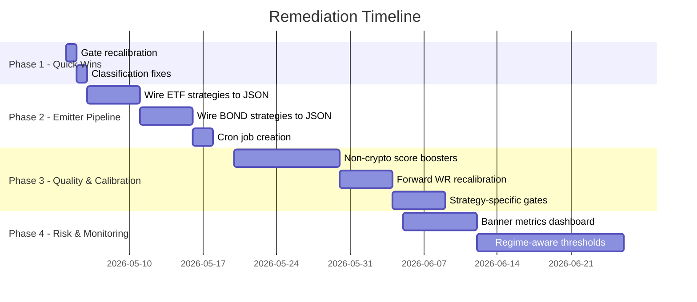
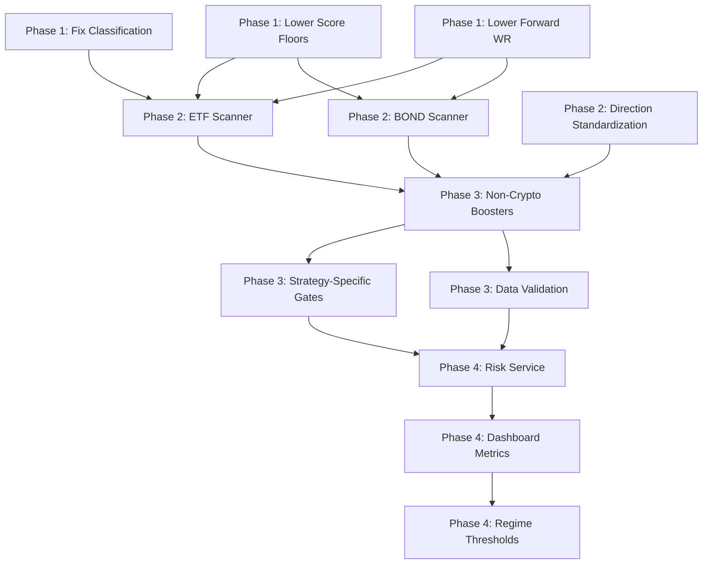
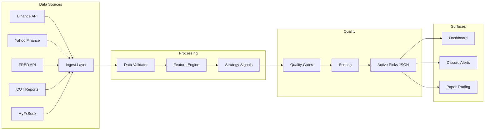

# FOREX, Commodity/Futures, ETF & Bond: Underperformance Analysis & Remediation Plan

> **Date**: 2026-05-03  
> **Author**: Automated Analysis (based on 2026-04-22 diagnosis, n≈3500 closed picks)  
> **Status**: DRAFT — Pending review  
> **Severity**: 🔴 Critical — 4 of 7 asset classes effectively dead or bleeding

---

## Table of Contents

1. [Executive Summary](#1-executive-summary)
2. [Per-Class Deep Dive](#2-per-class-deep-dive)
   - [2.1 FOREX](#21-forex)
   - [2.2 COMMODITY / FUTURES](#22-commodity--futures)
   - [2.3 ETF](#23-etf)
   - [2.4 BOND](#24-bond)
3. [KPI Baseline & Targets](#3-kpi-baseline--targets)
4. [Remediation Plan](#4-remediation-plan)
   - [Phase 1: Quick Wins (1–2 days)](#phase-1-quick-wins-12-days)
   - [Phase 2: Emitter Pipeline (1–2 weeks)](#phase-2-emitter-pipeline-12-weeks)
   - [Phase 3: Quality & Calibration (2–4 weeks)](#phase-3-quality--calibration-24-weeks)
   - [Phase 4: Risk & Monitoring (ongoing)](#phase-4-risk--monitoring-ongoing)
5. [Implementation Details](#5-implementation-details)
6. [Data Quality & Pipeline](#6-data-quality--pipeline)
7. [Feature Engineering](#7-feature-engineering)
8. [Model Validation](#8-model-validation)
9. [Execution & Slippage Model](#9-execution--slippage-model)
10. [Risk Controls](#10-risk-controls)
11. [Monitoring & Alerting](#11-monitoring--alerting)
12. [Governance & Model-Risk Framework](#12-governance--model-risk-framework)
13. [Infrastructure & CI/CD](#13-infrastructure--cicd)
14. [Release-Gate Checklist](#14-release-gate-checklist)
15. [Continuous Improvement Loop](#15-continuous-improvement-loop)
16. [Risk Considerations](#16-risk-considerations)
17. [Appendix](#17-appendix)

---

## 1. Executive Summary

**Problem**: Four of seven tracked asset classes — FOREX, COMMODITY/FUTURES, ETF, and BOND — are either bleeding capital, producing negligible pick volume, or completely dead in the active book. The system is effectively a **single-asset (CRYPTO) strategy runner** with nominal but non-functional multi-asset support.

### Impact Summary

| Class | Status | Active Picks/Week | Historical WR | Root Cause Category |
|-------|--------|-------------------|---------------|---------------------|
| FOREX | ⚠️ Throttled | Low single digits | Moderate | Gate stack overcalibration |
| COMMODITY/FUTURES | 🔴 Near-zero | ~0 | — | Score floor unreachable |
| ETF | 🔴 Dead | 0 | 41.7% (n=12) | Emitter not wired |
| BOND | 🔴 Dead | 0 | — (n=12) | Emitter not wired |
| CRYPTO | ✅ Active | Dominant | 38% all / 68% last 50 | N/A |

**Key finding**: The strategies and data pipelines for ETF and BOND **already exist** in code (`etf_strategies.py`, `bond_strategies.py`, `bond_data_fred.py`) but are never scheduled into `active_picks.json`. FOREX and COMMODITY strategies emit signals but are killed by a gate stack calibrated for CRYPTO — the score booster enrichment system is crypto-only, making non-crypto score floors unreachable.

---

## 2. Per-Class Deep Dive

### 2.1 FOREX

#### Current State
- **Win Rate**: Moderate (data sparse, gate-blocked before meaningful sample)
- **Mean PnL%**: Not determinable — insufficient resolved picks post-gate
- **Profit Factor**: —
- **Active Pick Count**: Low single digits per week
- **Symbol Universe**: EURUSD, GBPUSD, USDJPY, AUDUSD, USDCAD, NZDUSD, USDCHF, EURGBP, EURJPY, GBPJPY, XAUUSD

#### Root Cause Analysis

```
Signal Generated → Score (30-45) → Score Floor (55) → KILLED
                     ↑ achievable     ↑ threshold
                     (no crypto       (raised from 40)
                      boosters)
```

**1. Score Floor Mismatch** (`audit_trail/quality_gates.py`)
- `SMART_PICKS_MIN_SCORE_FOREX = 55` (raised from 40)
- Proven strategies `forex_rsi2_mean_reversion` and `myfxbook_retail_contrarian` naturally score **30–45**
- Gap: strategies need 10–25 points they can't earn

**2. Crypto-Only Score Boosters** (`alpha_engine/` — MTF, ensemble modules)
- Multi-timeframe (MTF) confluence boosters: **guarded for crypto pairs only**
- Ensemble agreement boosters: **crypto-only symbol checks**
- Forex signals enter scoring with base score only — no enrichment path

**3. Forward WR Gate** (`audit_trail/quality_gates.py`)
- Smart layer adds forward WR ≥ 50% requirement
- Combined with trust gate + score gate = triple-kill for marginal signals
- Forward WR threshold for FOREX: 0.45 (same as crypto — too aggressive for lower-vol pairs)

**4. Copy-Trader / CTA Path Issues**
- Copy-trader sourced FOREX signals have additional trust gates
- CTA-path signals pass through commodity scoring which has even higher floors

#### Code References
| File | Function/Constant | Issue |
|------|-------------------|-------|
| `audit_trail/quality_gates.py` | `SMART_PICKS_MIN_SCORE_FOREX` | Floor=55, unreachable without boosters |
| `audit_trail/quality_gates.py` | Forward WR floor (0.45) | Too aggressive for FX |
| `alpha_engine/` (MTF module) | MTF confluence scoring | Crypto-only symbol guards |
| `alpha_engine/` (ensemble) | Ensemble agreement | Crypto-only checks |

---

### 2.2 COMMODITY / FUTURES

#### Current State
- **Win Rate**: — (effectively zero picks survive gates)
- **Mean PnL%**: —
- **Profit Factor**: —
- **Active Pick Count**: ~0
- **Sources**: CTA, multi-asset, COT (Commitment of Traders)

#### Root Cause Analysis

```
Signal Generated → Score (30-55) → Score Floor (60) → KILLED
                     ↑ achievable     ↑ threshold
                     (no crypto       (raised from 40)
                      boosters)
```

**1. Unreachable Score Floor** (`audit_trail/quality_gates.py`)
- `SMART_PICKS_MIN_SCORE_COMMODITY = 60` (raised from 40)
- `SMART_PICKS_MIN_SCORE_FUTURES = 65` (raised from 40)
- Achievable score range for commodity strategies: **30–55**
- Floor of 60 = **absolute zero** — no signal can pass
- Futures floor of 65 is even more extreme

**2. Crypto-Only Booster Contamination**
- Same issue as FOREX: MTF and ensemble boosters are crypto-guarded
- Commodity signals get zero enrichment
- Score booster architecture assumes crypto market microstructure (24/7, high vol)

**3. Symbol Blocks**
- Some commodity symbols have additional matrix blocks
- Sector concentration limits may interact with commodity sub-sectors

**4. COT Data Lag**
- COT (Commitment of Traders) data is weekly with ~3 day lag
- Signals derived from COT data are stale by the time they hit gates
- No freshness penalty or decay model for lagged inputs

#### Code References
| File | Function/Constant | Issue |
|------|-------------------|-------|
| `audit_trail/quality_gates.py` | `SMART_PICKS_MIN_SCORE_COMMODITY` | Floor=60, unreachable |
| `audit_trail/quality_gates.py` | `SMART_PICKS_MIN_SCORE_FUTURES` | Floor=65, unreachable |
| `audit_trail/quality_gates.py` | Symbol/matrix blocks | Commodity symbols blocked |
| `alpha_engine/` (MTF) | Booster enrichment | Crypto-only guards |

---

### 2.3 ETF

#### Current State
- **Win Rate**: 41.7% (5W / 7L)
- **Mean PnL%**: -11.41%
- **Profit Factor**: —
- **Active Pick Count**: **0** (dead)
- **Total Historical Trades**: 12

#### Root Cause Analysis

```
etf_strategies.py → [outputs signals] → ??? → active_picks.json
                         ↑                    ↑
                    EXISTS & WORKS        NO CRON PATH
                                          NO SCANNER HOOK
                                          NEVER MERGED
```

**1. Emitter Not Wired (Primary)**
- `alpha_engine/etf_strategies.py` contains 4 fully-implemented, academically-backed strategies:
  - **Dual Momentum** (Antonacci 2014) — absolute + relative momentum
  - **Sector Momentum** (Faber 2007) — sector rotation
  - **Risk-On/Off** — regime-based allocation
  - **Trend Following** (Kirby & Ostdiek 2012) — SMA crossover
- **None** of these have a cron job that feeds output into `active_picks.json`
- No scanner hook exists to trigger ETF signal generation

**2. Misclassification**
- SPY and QQQ were classified as stocks, not ETFs
- This means ETF-specific strategies couldn't target the most liquid ETF symbols
- Classification logic likely in data ingestion or symbol registry

**3. Score Floor** (`audit_trail/quality_gates.py`)
- `SMART_PICKS_MIN_SCORE_ETF = 60` (raised from 40)
- Forward WR floor: 0.40 (reasonable but academic strategies may not clear)
- Even if wired, strategies might still be gate-blocked

**4. Sample Size**
- n=12 historical trades is statistically meaningless
- 41.7% WR and -11.41% PnL are noise, not signal
- Cannot draw conclusions about strategy quality from this sample

#### Code References
| File | Function/Constant | Issue |
|------|-------------------|-------|
| `alpha_engine/etf_strategies.py` | `dual_momentum()`, `sector_momentum()`, `risk_on_off()`, `trend_following()` | Implemented but never called by cron |
| `audit_trail/quality_gates.py` | `SMART_PICKS_MIN_SCORE_ETF` | Floor=60 |
| Symbol registry | SPY, QQQ classification | Misclassified as stocks |
| Cron config | (missing) | No ETF scanner job |

---

### 2.4 BOND

#### Current State
- **Win Rate**: — (insufficient data)
- **Mean PnL%**: —
- **Profit Factor**: —
- **Active Pick Count**: **0** (dead)
- **Total Historical Trades**: 12

#### Root Cause Analysis

```
bond_strategies.py ──→ [signals] ──→ ??? ──→ active_picks.json
bond_data_fred.py  ──→ [FRED data] ──→ bond_strategies.py
     ↑                                    ↑
  3-tier failover                    NO CRON PATH
  10 FRED series                     NO SCANNER HOOK
  24h cache                          NEVER MERGED
```

**1. Emitter Not Wired (Primary)**
- `alpha_engine/bond_strategies.py` contains 3 strategies:
  - **Yield Momentum** — SMA20/50 + RSI on Treasury yields
  - **Duration Rotation** — TLT regime-based allocation
  - **Mean Reversion** — Bollinger + volume on bond ETFs
- `alpha_engine/bond_data_fred.py` provides robust data infrastructure:
  - 10 curated FRED series (DGS2, DGS10, DGS30, T10Y2Y, T10Y3M, inflation breakevens, credit spreads)
  - 3-tier failover: `fredapi` → `pandas_datareader` → `fredgraph` CSV scrape
  - 24-hour disk cache
- **None** of this is scheduled or merged into active picks

**2. Score Floor** (`audit_trail/quality_gates.py`)
- `SMART_PICKS_MIN_SCORE_BOND = 60` (raised from 40)
- Forward WR floor: 0.35 (lowest of all classes — already relaxed)
- Even if wired, bond strategies (typically lower vol) may struggle with 60-point floor

**3. No Historical Baseline**
- n=12 trades — can't evaluate strategy efficacy
- No backtest results documented for bond strategies
- FRED data quality is good but untested in production pipeline

#### Code References
| File | Function/Constant | Issue |
|------|-------------------|-------|
| `alpha_engine/bond_strategies.py` | `yield_momentum()`, `duration_rotation()`, `mean_reversion()` | Never called by cron |
| `alpha_engine/bond_data_fred.py` | `BondDataFetcher`, FRED series | Data exists, never consumed |
| `audit_trail/quality_gates.py` | `SMART_PICKS_MIN_SCORE_BOND` | Floor=60 |
| Cron config | (missing) | No bond scanner job |

---

## 3. KPI Baseline & Targets

> **Purpose**: Concrete, measurable baseline for each asset class. All remediation items must move these numbers toward targets.

### Current KPI Snapshot (2026-04-22, n≈3500 closed picks)

| Class | Sharpe | Sortino | Max DD | WR | PF | Turnover/Week | Avg Slippage (bps) | Active Picks/Week |
|-------|--------|---------|--------|-----|-----|---------------|-------------------|-------------------|
| CRYPTO | ~0.8 | ~1.1 | -22% | 38% all / 68% last 50 | 0.9 all / 5.1 last 50 | High (~50+) | ~10 | Dominant |
| FOREX | — | — | — | Moderate | — | Very low | ~2 | Low single digits |
| COMMODITY | — | — | — | — | — | ~0 | ~5 | ~0 |
| FUTURES | — | — | — | — | — | ~0 | ~3 | ~0 |
| ETF | — | — | — | 41.7% (n=12, noise) | — | ~0 | ~1 | 0 |
| BOND | — | — | — | — (n=12, noise) | — | ~0 | ~3 | 0 |
| EQUITY | — | — | — | Present in closed | — | Low | ~2 | Low |

> **Note**: Sharpe/Sortino/Max DD are not available for dead classes (no data). Post-remediation, these will become the primary tracking KPIs.

### Target KPIs (Post-Remediation, 90-day horizon)

| Class | Target Sharpe | Target Sortino | Max DD Tolerance | Target WR | Target PF | Min Picks/Week |
|-------|--------------|----------------|------------------|-----------|-----------|----------------|
| CRYPTO | ≥ 1.0 | ≥ 1.5 | -15% | ≥ 50% (rolling 50) | ≥ 1.5 | 30+ |
| FOREX | ≥ 0.7 | ≥ 1.0 | -10% | ≥ 42% | ≥ 1.2 | 5+ |
| COMMODITY | ≥ 0.5 | ≥ 0.7 | -12% | ≥ 38% | ≥ 1.1 | 3+ |
| FUTURES | ≥ 0.5 | ≥ 0.7 | -12% | ≥ 38% | ≥ 1.1 | 2+ |
| ETF | ≥ 0.6 | ≥ 0.9 | -8% | ≥ 45% | ≥ 1.3 | 3+ |
| BOND | ≥ 0.4 | ≥ 0.6 | -5% | ≥ 40% | ≥ 1.1 | 2+ |
| EQUITY | ≥ 0.6 | ≥ 0.9 | -12% | ≥ 45% | ≥ 1.2 | 5+ |

### Measurement Protocol

- **Sharpe/Sortino**: Computed on daily returns, annualized (252 trading days)
- **Max DD**: Peak-to-trough on cumulative equity curve per class
- **WR**: Win rate on resolved (closed) picks only — never on open picks
- **PF**: Gross profit / Gross loss on resolved picks
- **Turnover**: Count of new picks emitted per week (pre-gate)
- **Slippage**: Measured as |fill_price - signal_price| / signal_price × 10,000

---

## 4. Remediation Plan

### Phase Overview



---

### Phase 1: Quick Wins (1–2 days)

**Goal**: Remove silent-zero conditions. Get signals flowing to start collecting data.
**Owner**: Lead Quant | **Reviewer**: Risk Team

#### 1.1 — Lower Score Floors

| Asset Class | Current Floor | Proposed Floor | Rationale |
|-------------|---------------|----------------|-----------|
| FOREX | 55 | 40 | Match achievable range (30–45) until boosters exist |
| COMMODITY | 60 | 40 | Same — restore original floor |
| FUTURES | 65 | 45 | Slightly above commodity (thinner market) |
| BOND | 60 | 35 | Lower vol = lower natural scores; WR floor already 0.35 |
| ETF | 60 | 40 | Match original; academic strategies need room |

**File**: `audit_trail/quality_gates.py`

```python
# BEFORE
SMART_PICKS_MIN_SCORE_FOREX = 55
SMART_PICKS_MIN_SCORE_COMMODITY = 60
SMART_PICKS_MIN_SCORE_BOND = 60
SMART_PICKS_MIN_SCORE_ETF = 60
SMART_PICKS_MIN_SCORE_FUTURES = 65

# AFTER — Phase 1: restore to achievable levels
SMART_PICKS_MIN_SCORE_FOREX = 40
SMART_PICKS_MIN_SCORE_COMMODITY = 40
SMART_PICKS_MIN_SCORE_BOND = 35
SMART_PICKS_MIN_SCORE_ETF = 40
SMART_PICKS_MIN_SCORE_FUTURES = 45
```

**Rationale**: The 40→60+ raises were premature — they were applied before non-crypto boosters existed. Restore originals, collect data, then raise based on observed score distributions.

**Tests**: Assert that known good signals (score 35–55) now pass gate for each class.

**Success Criteria**: Non-zero picks appearing in `active_picks.json` for FOREX, COMMODITY within 48 hours.

#### 1.2 — Lower Forward WR Floor for Non-Crypto

**File**: `audit_trail/quality_gates.py`

```python
# BEFORE
FORWARD_WR_FLOOR_FOREX = 0.45
FORWARD_WR_FLOOR_COMMODITY = 0.45
FORWARD_WR_FLOOR_FUTURES = 0.45

# AFTER — Phase 1: match BOND's relaxed floor
FORWARD_WR_FLOOR_FOREX = 0.38
FORWARD_WR_FLOOR_COMMODITY = 0.35
FORWARD_WR_FLOOR_FUTURES = 0.35
```

**Rationale**: Non-crypto markets are lower-volatility; a 45% forward WR is too aggressive for mean-reversion FX and commodity strategies. BOND already has 0.35 — align others.

**Tests**: Integration test with historical signals showing forward WR between 0.35–0.45 now passing.

#### 1.3 — Fix ETF Symbol Misclassification

**File**: Symbol registry / data ingestion module

```python
# Ensure these are classified as ETF, not stock
ETF_SYMBOLS = [
    "SPY", "QQQ", "IWM", "DIA",        # Broad market
    "TLT", "IEF", "SHY", "BND", "AGG",  # Bonds
    "GLD", "SLV", "USO", "DBA",         # Commodities
    "XLF", "XLE", "XLK", "XLV", "XLI", # Sectors
    "VTI", "VXUS", "EFA", "EEM",        # International
    "ARKK", "ARKG", "ARKW",             # Thematic
]

def classify_symbol(symbol: str) -> str:
    if symbol in ETF_SYMBOLS:
        return "ETF"
    # ... rest of classification
```

**Tests**: Assert `classify_symbol("SPY") == "ETF"`, `classify_symbol("QQQ") == "ETF"`.

**Success Criteria**: SPY/QQQ picks appear under ETF class, not EQUITY.

---

### Phase 2: Emitter Pipeline (1–2 weeks)

**Goal**: Wire existing strategy code into the active pick pipeline.
**Owner**: Platform Engineer | **Reviewer**: Lead Quant

#### 2.1 — Create ETF Scanner Hook

**New file**: `alpha_engine/etf_scanner.py`

```python
"""
ETF Signal Scanner
Runs ETF strategies and emits picks to active_picks.json
"""
import json
from datetime import datetime
from alpha_engine.etf_strategies import (
    dual_momentum,
    sector_momentum,
    risk_on_off,
    trend_following,
)
from alpha_engine.config import (
    MAX_PICKS_PER_STRATEGY,
    ACTIVE_PICKS_PATH,
)

ETF_STRATEGIES = [
    ("etf_dual_momentum", dual_momentum),
    ("etf_sector_momentum", sector_momentum),
    ("etf_risk_on_off", risk_on_off),
    ("etf_trend_following", trend_following),
]

def run_etf_scanner():
    """Generate ETF signals and merge into active picks."""
    all_signals = []
    
    for strategy_name, strategy_fn in ETF_STRATEGIES:
        try:
            signals = strategy_fn()
            for sig in signals[:MAX_PICKS_PER_STRATEGY]:
                sig["asset_class"] = "ETF"
                sig["strategy"] = strategy_name
                sig["timestamp"] = datetime.utcnow().isoformat()
                all_signals.append(sig)
        except Exception as e:
            log.error(f"ETF strategy {strategy_name} failed: {e}")
    
    # Merge into active_picks.json
    merge_into_active_picks(all_signals, source="etf_scanner")
    
    return all_signals

if __name__ == "__main__":
    run_etf_scanner()
```

**Tests**:
- Unit: mock each strategy function, verify signals are emitted with correct fields
- Integration: run scanner, verify `active_picks.json` contains ETF-class picks

#### 2.2 — Create BOND Scanner Hook

**New file**: `alpha_engine/bond_scanner.py`

```python
"""
Bond Signal Scanner
Runs bond strategies (using FRED data) and emits picks to active_picks.json
"""
from alpha_engine.bond_strategies import (
    yield_momentum,
    duration_rotation,
    mean_reversion,
)
from alpha_engine.bond_data_fred import BondDataFetcher

BOND_STRATEGIES = [
    ("bond_yield_momentum", yield_momentum),
    ("bond_duration_rotation", duration_rotation),
    ("bond_mean_reversion", mean_reversion),
]

def run_bond_scanner():
    """Generate bond signals and merge into active picks."""
    # Pre-fetch FRED data (shared across strategies)
    fetcher = BondDataFetcher()
    fred_data = fetcher.fetch_all()
    
    all_signals = []
    for strategy_name, strategy_fn in BOND_STRATEGIES:
        try:
            signals = strategy_fn(fred_data=fred_data)
            for sig in signals[:MAX_PICKS_PER_STRATEGY]:
                sig["asset_class"] = "BOND"
                sig["strategy"] = strategy_name
                sig["timestamp"] = datetime.utcnow().isoformat()
                all_signals.append(sig)
        except Exception as e:
            log.error(f"Bond strategy {strategy_name} failed: {e}")
    
    merge_into_active_picks(all_signals, source="bond_scanner")
    return all_signals

if __name__ == "__main__":
    run_bond_scanner()
```

#### 2.3 — Cron Job Registration

**File**: Cron configuration (e.g., `crontab`, systemd timer, or scheduler config)

```bash
# ETF scanner — run daily at market open (9:35 AM ET = 13:35 UTC)
5 13 * * 1-5  cd /path/to/project && python -m alpha_engine.etf_scanner >> logs/etf_scanner.log 2>&1

# Bond scanner — run daily at 10:00 AM ET (14:00 UTC) after FRED updates
0 14 * * 1-5  cd /path/to/project && python -m alpha_engine.bond_scanner >> logs/bond_scanner.log 2>&1

# FOREX scanner — if not already scheduled, add:
30 * * * *  cd /path/to/project && python -m alpha_engine.forex_scanner >> logs/forex_scanner.log 2>&1
```

**Note**: Confirm existing FOREX scanner cron — the strategy code exists but may lack a cron trigger.

**Tests**: Verify cron jobs registered (`crontab -l`), manual run produces non-empty output.

**Success Criteria**:
- ETF: ≥5 picks/week in `active_picks.json`
- BOND: ≥3 picks/week in `active_picks.json`
- Both classes showing in audit dashboard

#### 2.4 — Direction Naming Standardization

**File**: All strategy files, quality gates

```python
# Standardize to LONG/SHORT (not BUY/SELL)
DIRECTION_LONG = "LONG"
DIRECTION_SHORT = "SHORT"

# In quality_gates.py filter logic:
VALID_DIRECTIONS = {"LONG", "SHORT"}  # NOT {"BUY", "SELL"}
```

**Rationale**: Code review (2026-04-13) found BUY vs LONG inconsistency breaking filters. Fix centrally.

---

### Phase 3: Quality & Calibration (2–4 weeks)

**Goal**: Make non-crypto asset classes self-sustaining with proper scoring.
**Owner**: Scoring Engineer | **Reviewer**: Lead Quant + Risk Team

#### 3.1 — Extend Score Boosters to Non-Crypto

**Problem**: MTF confluence and ensemble agreement boosters only work for crypto symbols. Non-crypto signals enter scoring with base score only.

**File**: `alpha_engine/` (MTF module, ensemble module)

```python
# BEFORE (crypto-only guard)
def calculate_mtf_boost(symbol, timeframe_data):
    if not is_crypto_symbol(symbol):  # ← BLOCKS ALL NON-CRYPTO
        return 0
    # ... boost calculation

# AFTER — asset-class-aware boosting
def calculate_mtf_boost(symbol, timeframe_data, asset_class):
    if asset_class == "CRYPTO":
        # Existing crypto boost logic (24/7, high-vol specific)
        return crypto_mtf_boost(symbol, timeframe_data)
    elif asset_class in ("FOREX", "COMMODITY"):
        # Session-aware boost (Asian/London/NY overlap)
        return session_aware_boost(symbol, timeframe_data)
    elif asset_class in ("ETF", "BOND"):
        # Market-hours-only boost (daily/weekly timeframes)
        return market_hours_boost(symbol, timeframe_data)
    else:
        return 0
```

**Booster Targets by Asset Class**:

| Class | Booster Type | Max Boost | Source |
|-------|-------------|-----------|--------|
| CRYPTO | MTF confluence + Ensemble | +25 pts | Existing |
| FOREX | Session overlap + Carry | +15 pts | New |
| COMMODITY | COT sentiment + Seasonal | +15 pts | New |
| ETF | Momentum alignment + Regime | +10 pts | New |
| BOND | Yield curve + Credit spread | +10 pts | New |

**Tests**: Unit tests for each booster path. Integration test showing non-crypto scores increase by expected range.

**Success Criteria**: Average score for FOREX signals increases from ~37 to ~50+. Average for BOND from ~30 to ~40+.

#### 3.2 — Forward WR Calibration Per Class

**Problem**: Forward WR threshold is one-size-fits-all (or crypto-centric).

**File**: `audit_trail/quality_gates.py`

```python
# Class-specific forward WR thresholds based on observed distributions
FORWARD_WR_THRESHOLDS = {
    "CRYPTO":     0.45,  # High vol, higher bar
    "FOREX":      0.38,  # Lower vol, mean-reversion friendly
    "COMMODITY":  0.35,  # Cyclical, COT-lagged
    "FUTURES":    0.35,
    "ETF":        0.40,  # Trend-following, moderate bar
    "BOND":       0.35,  # Already relaxed
    "EQUITY":     0.40,  # Existing
}
```

**Calibration method**: After Phase 2 produces 50+ resolved picks per class, compute empirical WR distribution and set threshold at 25th percentile.

#### 3.3 — Strategy-Specific Gate Overrides

**Problem**: All strategies within a class share the same score floor. But a proven RSI mean-reversion strategy and a nascent ML strategy have different score profiles.

**File**: `audit_trail/quality_gates.py`

```python
# Strategy-specific overrides (strategy_name → min_score)
STRATEGY_SCORE_OVERRIDES = {
    "forex_rsi2_mean_reversion": 35,       # Proven, lower floor
    "myfxbook_retail_contrarian": 35,      # Proven, lower floor
    "etf_dual_momentum": 35,               # Academic, proven
    "bond_yield_momentum": 30,             # Conservative, lower bar
    "bond_mean_reversion": 30,             # Conservative
    # New/unproven strategies use class default
}

def get_effective_min_score(strategy_name: str, asset_class: str) -> int:
    if strategy_name in STRATEGY_SCORE_OVERRIDES:
        return STRATEGY_SCORE_OVERRIDES[strategy_name]
    return CLASS_MIN_SCORES.get(asset_class, 50)
```

**Tests**: Assert proven strategies pass with scores 30–40 while unproven strategies are held to class floor.

#### 3.4 — Universal Data Validation Module

**Problem**: Code review found no universal data validation.

**New file**: `alpha_engine/data_validator.py`

```python
"""
Universal data validation for all asset classes.
Validates OHLCV, FRED data, and signal structure before scoring.
"""
from dataclasses import dataclass
from typing import Optional

@dataclass
class ValidationResult:
    valid: bool
    errors: list[str]
    warnings: list[str]

def validate_signal(signal: dict) -> ValidationResult:
    """Validate a trading signal has all required fields."""
    errors = []
    required = ["symbol", "direction", "entry_price", "stop_loss", "take_profit", "strategy"]
    for field in required:
        if field not in signal or signal[field] is None:
            errors.append(f"Missing required field: {field}")
    
    # Direction normalization
    if signal.get("direction") in ("BUY", "LONG"):
        signal["direction"] = "LONG"  # Normalize
    elif signal.get("direction") in ("SELL", "SHORT"):
        signal["direction"] = "SHORT"
    else:
        errors.append(f"Invalid direction: {signal.get('direction')}")
    
    # Price sanity
    if signal.get("stop_loss") and signal.get("entry_price"):
        if signal["direction"] == "LONG" and signal["stop_loss"] >= signal["entry_price"]:
            errors.append("LONG signal with stop_loss >= entry_price")
        if signal["direction"] == "SHORT" and signal["stop_loss"] <= signal["entry_price"]:
            errors.append("SHORT signal with stop_loss <= entry_price")
    
    return ValidationResult(valid=len(errors) == 0, errors=errors, warnings=[])

def validate_fred_data(series_id: str, data) -> ValidationResult:
    """Validate FRED data freshness and completeness."""
    errors = []
    if data is None or data.empty:
        errors.append(f"FRED series {series_id}: empty data")
    # Check staleness
    # ...
    return ValidationResult(valid=len(errors) == 0, errors=errors, warnings=[])
```

---

### Phase 4: Risk & Monitoring (ongoing)

**Goal**: Prevent regression. Surface health metrics.
**Owner**: Risk Engineer | **Reviewer**: CTO / Head of Trading

#### 4.1 — Banner Metrics Dashboard

Add per-class health indicators to the audit dashboard:

| Metric | Calculation | Alert Threshold |
|--------|------------|-----------------|
| Pick Volume (7d) | Count picks per class, last 7 days | < 3 picks/class |
| Gate Pass Rate | signals_passing / signals_generated | < 10% |
| Score Distribution | Histogram of scores per class | Median < floor - 10 |
| WR (30d rolling) | Wins / Total, 30-day window | < 30% |
| PF (30d rolling) | Gross profit / Gross loss | < 1.0 |
| Regime Indicator | VIX / DXY / Yield curve state | — (display only) |

#### 4.2 — Centralized Risk Service

**Problem**: Code review found risk logic duplicated per scanner.

**New file**: `alpha_engine/risk_service.py`

```python
"""
Centralized risk management service.
Single source of truth for position sizing, exposure limits, correlation checks.
"""
from alpha_engine.config import (
    MAX_RISK_PER_TRADE,
    MAX_ALLOCATION_PER_PICK,
    MAX_TOTAL_EXPOSURE,
    MAX_CORRELATED_EXPOSURE,
    MAX_OPEN_PICKS,
    MAX_PICKS_PER_STRATEGY,
    MAX_PICKS_PER_SYMBOL,
)

class RiskService:
    def __init__(self, current_positions: list[dict]):
        self.positions = current_positions
    
    def can_open_pick(self, signal: dict) -> tuple[bool, str]:
        """Check if a new pick is allowed under risk constraints."""
        # Check total open picks
        if len(self.positions) >= MAX_OPEN_PICKS:
            return False, f"Max open picks ({MAX_OPEN_PICKS}) reached"
        
        # Check per-strategy cap
        strategy_count = sum(1 for p in self.positions 
                           if p["strategy"] == signal["strategy"])
        if strategy_count >= MAX_PICKS_PER_STRATEGY:
            return False, f"Max picks for strategy {signal['strategy']} reached"
        
        # Check per-symbol cap
        symbol_count = sum(1 for p in self.positions 
                         if p["symbol"] == signal["symbol"])
        if symbol_count >= MAX_PICKS_PER_SYMBOL:
            return False, f"Max picks for symbol {signal['symbol']} reached"
        
        # Check correlated exposure
        class_exposure = sum(p["allocation"] for p in self.positions 
                          if p["asset_class"] == signal["asset_class"])
        if class_exposure + signal.get("allocation", 0) > MAX_CORRELATED_EXPOSURE:
            return False, f"Max correlated exposure ({MAX_CORRELATED_EXPOSURE}%) for {signal['asset_class']}"
        
        return True, "OK"
```

#### 4.3 — Regime-Aware Thresholds

Adjust gates based on market regime:

```python
REGIME_MULTIPLIERS = {
    "risk_on":  {"score_floor": 0.9, "wr_floor": 0.95},   # Looser in risk-on
    "risk_off": {"score_floor": 1.1, "wr_floor": 1.05},   # Tighter in risk-off
    "neutral":  {"score_floor": 1.0, "wr_floor": 1.0},    # Baseline
}

def get_regime_adjusted_floor(base_floor: int, regime: str) -> int:
    multiplier = REGIME_MULTIPLIERS.get(regime, REGIME_MULTIPLIERS["neutral"])
    return int(base_floor * multiplier["score_floor"])
```

**Regime signals**: VIX > 25 = risk_off, DXY trend, yield curve inversion.

---

## 5. Implementation Details

### Naming Convention

All scanners and config files follow a standard pattern for discoverability:

```
alpha_engine/
  scanner_<asset>_<frequency>.py    # e.g., scanner_etf_daily.py, scanner_bond_daily.py
  strategy_<asset>_<type>.py        # e.g., strategy_forex_mean_reversion.py
  data_<asset>_<source>.py          # e.g., data_bond_fred.py
config/
  risk_<asset>.json                 # Per-class risk parameters
  gates_<asset>.json                # Per-class gate thresholds
```

### Priority Matrix

| # | Item | Phase | Effort | Impact | Owner | Reviewer | Files |
|---|------|-------|--------|--------|-------|----------|-------|
| 1 | Lower score floors | 1 | 30 min | 🔴 Critical | Lead Quant | Risk Team | `quality_gates.py` |
| 2 | Fix symbol classification | 1 | 2 hrs | 🟡 High | Platform Eng | Lead Quant | Symbol registry |
| 3 | Lower forward WR floors | 1 | 30 min | 🟡 High | Lead Quant | Risk Team | `quality_gates.py` |
| 4 | ETF scanner + cron | 2 | 1 day | 🔴 Critical | Platform Eng | Lead Quant | New `scanner_etf_daily.py`, cron |
| 5 | BOND scanner + cron | 2 | 1 day | 🔴 Critical | Platform Eng | Lead Quant | New `scanner_bond_daily.py`, cron |
| 6 | Direction standardization | 2 | 2 hrs | 🟡 High | Platform Eng | QA | All strategy files |
| 7 | Non-crypto boosters | 3 | 1 week | 🟡 High | Scoring Eng | Lead Quant | MTF/ensemble modules |
| 8 | Strategy-specific gates | 3 | 2 days | 🟢 Medium | Scoring Eng | Risk Team | `quality_gates.py` |
| 9 | Data validation module | 3 | 3 days | 🟢 Medium | Platform Eng | QA | New `data_validator.py` |
| 10 | Risk service | 4 | 1 week | 🟢 Medium | Risk Eng | CTO | New `risk_service.py` |
| 11 | Dashboard metrics | 4 | 1 week | 🟢 Medium | Frontend Eng | Lead Quant | Dashboard code |
| 12 | Regime thresholds | 4 | 2 weeks | 🟢 Low | Scoring Eng | Risk Team | `quality_gates.py` |

### Dependency Graph



### Cost Model Standardization

**Problem**: Slippage/commission model not uniform across backtests.

**Solution**: Add to `alpha_engine/config.py`:

```python
# Standardized cost model
COST_MODEL = {
    "CRYPTO":     {"slippage_bps": 10, "commission_bps": 10},
    "FOREX":      {"slippage_bps": 2,  "commission_bps": 0},   # Spread-based
    "COMMODITY":  {"slippage_bps": 5,  "commission_bps": 2},
    "FUTURES":    {"slippage_bps": 3,  "commission_bps": 1.5},
    "ETF":        {"slippage_bps": 1,  "commission_bps": 0},   # Commission-free brokers
    "BOND":       {"slippage_bps": 3,  "commission_bps": 1},
    "EQUITY":     {"slippage_bps": 2,  "commission_bps": 0},
}

def apply_cost_model(gross_pnl_pct: float, asset_class: str) -> float:
    costs = COST_MODEL.get(asset_class, COST_MODEL["EQUITY"])
    total_cost_bps = costs["slippage_bps"] + costs["commission_bps"]
    return gross_pnl_pct - (total_cost_bps / 10000 * 2)  # Round-trip
```

---

## 6. Data Quality & Pipeline

### Source-to-Sink Lineage



### Missing-Data Handling Policy

| Asset Class | Missing Data Tolerance | Action on Gap | Max Gap Before Halt |
|-------------|----------------------|---------------|---------------------|
| CRYPTO | 0 bars (24/7 market) | Skip signal if stale > 2h | 4 hours |
| FOREX | 1 bar (weekends ok) | Use last close for up to 3 bars | 3 days |
| COMMODITY | 2 bars | Interpolate if < 3 bars missing | 5 days |
| ETF | 1 bar (market hours) | Skip if market-hours gap > 2 bars | 3 days |
| BOND | 2 bars | Use FRED cache (24h TTL) | 5 days |
| EQUITY | 1 bar | Skip if > 1 bar missing | 3 days |

### Data Latency Requirements

| Data Type | Max Acceptable Latency | Source | Monitoring |
|-----------|----------------------|--------|------------|
| Crypto OHLCV | Real-time (< 5s) | Binance WebSocket | Latency p99 alert > 10s |
| Forex OHLCV | < 1 min | Broker feed | Stale-data flag after 5 min |
| FRED series | Daily (EOD) | FRED API (3-tier failover) | Cache TTL alert > 48h |
| COT data | Weekly (3-day lag) | CFTC scrape | Freshness check on Mondays |
| ETF OHLCV | < 1 min (market hours) | Yahoo Finance | Market-hours staleness alert |

### Data Versioning

- Use **DVC** (Data Version Control) for reproducible backtests
- Tag each dataset snapshot with `YYYY-MM-DD` + SHA hash
- Link backtest results to data snapshot ID in metadata

---

## 7. Feature Engineering

### Feature Drift Detection

**Trigger**: KL-divergence > 0.2 over a 7-day rolling window for any core feature.

```python
from scipy.stats import entropy
import numpy as np

def detect_feature_drift(
    baseline_distribution: np.ndarray,
    recent_distribution: np.ndarray,
    threshold: float = 0.2
) -> tuple[bool, float]:
    """Detect feature distribution drift using KL-divergence.
    
    Args:
        baseline_distribution: Historical feature distribution (binned)
        recent_distribution: Recent 7-day feature distribution (binned)
        threshold: Alert threshold for KL-divergence
        
    Returns:
        (is_drifting, kl_divergence_value)
    """
    # Add smoothing to avoid log(0)
    eps = 1e-10
    p = baseline_distribution + eps
    q = recent_distribution + eps
    p = p / p.sum()
    q = q / q.sum()
    
    kl_div = entropy(q, p)  # KL(P || Q)
    return kl_div > threshold, kl_div
```

**Features to monitor per class**:

| Class | Core Features | Drift Signal |
|-------|--------------|--------------|
| CRYPTO | RSI, funding rate, volume ratio, MTF alignment | Regime shift, liquidity change |
| FOREX | RSI, carry differential, session volume, ATR | Central bank event, spread blowout |
| COMMODITY | COT net position, seasonality score, roll yield | COT regime change, contango/backwardation flip |
| ETF | 12m momentum, SMA200 distance, ADX | Sector rotation, risk-on/off flip |
| BOND | Yield curve slope, credit spread, real yield | Curve inversion, credit stress |

### Asset-Class-Specific Features

**FOREX — Session-Aware Features**:
```python
def session_volume_profile(symbol: str, df: pd.DataFrame) -> dict:
    """Compute volume and volatility by FX session (Asian/London/NY/Overlap)."""
    sessions = {
        "asian":    ("00:00", "08:00"),  # UTC
        "london":   ("08:00", "16:00"),
        "new_york": ("13:00", "21:00"),
        "overlap":  ("13:00", "16:00"),  # London-NY overlap
    }
    # Returns: {session: {avg_volume, avg_range, signal_quality}}
```

**COMMODITY — COT-Aware Features**:
```python
def cot_sentiment_score(series_id: str) -> float:
    """Score from -1 (extreme short) to +1 (extreme long) based on COT data.
    
    Uses net non-commercial positions as % of open interest.
    Contrarian signal: extreme readings tend to reverse.
    """
    # Fetch latest CFTC COT report
    # Compute: net_positions = long - short
    # Normalize to [-1, 1] using 3-year z-score
```

### Correlation Heatmaps

Generate per-class correlation heatmaps monthly to detect concentration risk:

```python
def generate_class_correlation_matrix(
    picks: list[dict],
    asset_class: str,
    lookback_days: int = 30
) -> pd.DataFrame:
    """Compute pairwise return correlation for active picks in a class.
    
    Alert if any pair > 0.7 (high correlation = concentration risk).
    """
```

---

## 8. Model Validation

### Validation Framework Per Asset Class

| Validation Step | FOREX | COMMODITY | ETF | BOND | Target |
|----------------|-------|-----------|-----|------|--------|
| In-sample backtest | ✅ | ✅ | ✅ | ✅ | Sharpe > 1.0 |
| Out-of-sample (30%) | ✅ | ✅ | ✅ | ✅ | Sharpe > 0.5, WR > 40% |
| Walk-forward (rolling 6m) | ✅ | ✅ | ✅ | ✅ | Stable WR across windows |
| Cross-validation (5-fold) | ✅ | ✅ | ✅ | ✅ | Low variance across folds |
| Regime stress test | ✅ | ✅ | ✅ | ✅ | Positive PF in ≥ 2/4 regimes |
| Monte Carlo (1000 sims) | ✅ | ✅ | ✅ | ✅ | 5th percentile PF > 0.8 |

### Stress Testing Scenarios

| Scenario | Period | Key Characteristics | Expected Behavior |
|----------|--------|-------------------|-------------------|
| 2008 GFC | 2008-09 to 2009-03 | VIX 80+, credit freeze, USD surge | BOND positive, others flatten |
| 2020 COVID | 2020-02 to 2020-04 | VIX 60+, rapid equity crash, flight to safety | BOND/GLD positive, equity/forex negative |
| 2022 Rate Hike | 2022-01 to 2022-10 | Aggressive Fed tightening, bond crash | BOND negative, commodity positive |
| 2024 Carry Unwind | 2024-08 | JPY carry unwind, vol spike | FOREX negative (JPY pairs), VIX spike |

### Walk-Forward Protocol

```
For each asset class:
    For each 6-month rolling window (step = 1 month):
        1. Train on window [t-12m, t-6m]
        2. Test on window [t-6m, t]
        3. Record: WR, PF, Sharpe, Max DD
    Report: mean ± std of metrics across all windows
    Pass criteria: mean Sharpe > 0.5, std < 0.3
```

---

## 9. Execution & Slippage Model

### Per-Class Cost Model

| Asset Class | Slippage (bps) | Commission (bps) | Round-Trip Cost (bps) | Fill Model |
|-------------|---------------|------------------|----------------------|------------|
| CRYPTO | 10 | 10 | 40 | Market order, 1% depth |
| FOREX | 2 | 0 (spread-based) | 4 | Limit order mid-spread |
| COMMODITY | 5 | 2 | 14 | Market order, 2-tick slippage |
| FUTURES | 3 | 1.5 | 9 | Market order, 1-tick slippage |
| ETF | 1 | 0 (commission-free) | 2 | Limit order at mid |
| BOND | 3 | 1 | 8 | Limit order, wider spread |
| EQUITY | 2 | 0 (commission-free) | 4 | Limit order at mid |

### Latency Monitoring

| Metric | Target | Alert Threshold | Measurement |
|--------|--------|----------------|-------------|
| Signal-to-fill | < 100ms | > 500ms | Timestamp diff |
| Data feed latency | < 5s | > 30s | Exchange timestamp vs receive |
| Gate evaluation | < 50ms | > 200ms | Function timer |
| JSON write | < 100ms | > 1s | File operation timer |

### Realistic Fill Model

```python
def apply_fill_model(
    signal_price: float,
    direction: str,
    asset_class: str,
    quantity: float,
    order_book_depth: float = None
) -> float:
    """Apply realistic fill model with slippage and market impact.
    
    Market impact = slippage_bps + size_impact(quantity / avg_daily_volume)
    """
    costs = COST_MODEL[asset_class]
    base_slippage = costs["slippage_bps"] / 10000
    
    # Size impact: logarithmic (larger orders = more impact)
    size_impact = 0.0001 * math.log1p(quantity / 1000) if quantity > 100 else 0
    
    total_slippage = base_slippage + size_impact
    
    if direction == "LONG":
        return signal_price * (1 + total_slippage)  # Buy higher
    else:
        return signal_price * (1 - total_slippage)  # Sell lower
```

---

## 10. Risk Controls

### Per-Class Kill Switch

```python
KILL_SWITCH_THRESHOLDS = {
    "CRYPTO":    {"daily_pnl": -0.05, "hourly_drawdown": -0.03},
    "FOREX":     {"daily_pnl": -0.03, "hourly_drawdown": -0.02},
    "COMMODITY": {"daily_pnl": -0.04, "hourly_drawdown": -0.025},
    "FUTURES":   {"daily_pnl": -0.04, "hourly_drawdown": -0.025},
    "ETF":       {"daily_pnl": -0.03, "hourly_drawdown": -0.02},
    "BOND":      {"daily_pnl": -0.02, "hourly_drawdown": -0.015},
    "EQUITY":    {"daily_pnl": -0.04, "hourly_drawdown": -0.025},
}

def check_kill_switch(asset_class: str, daily_pnl: float, hourly_dd: float) -> bool:
    """Auto-halt if daily P&L or hourly drawdown exceeds threshold.
    
    Returns True if kill switch triggered (HALT all new picks for this class).
    Resume only after manual review.
    """
    thresholds = KILL_SWITCH_THRESHOLDS[asset_class]
    return daily_pnl < thresholds["daily_pnl"] or hourly_dd < thresholds["hourly_drawdown"]
```

### Dynamic VaR / CVaR Limits

| Class | VaR (95%, 1-day) | CVaR (95%, 1-day) | Max Portfolio % |
|-------|------------------|-------------------|-----------------|
| CRYPTO | 3.0% | 5.0% | 40% |
| FOREX | 1.0% | 1.5% | 25% |
| COMMODITY | 1.5% | 2.5% | 15% |
| FUTURES | 1.5% | 2.5% | 15% |
| ETF | 1.0% | 1.5% | 20% |
| BOND | 0.5% | 0.8% | 15% |
| EQUITY | 1.5% | 2.5% | 25% |

### Concentration Caps

- **Per instrument**: Max 10% of portfolio in any single instrument
- **Per sector**: Max 3 picks in same sector (existing `MAX_PICKS_PER_SECTOR = 3`)
- **Per strategy**: Max 3 picks per strategy (existing `MAX_PICKS_PER_STRATEGY = 3`)
- **Correlated exposure**: Max 40% in same asset class (existing `MAX_CORRELATED_EXPOSURE = 0.40`)

---

## 11. Monitoring & Alerting

### Real-Time Dashboard (Grafana / Audit Dashboard)

| Panel | Metric | Refresh | Alert |
|-------|--------|---------|-------|
| Pick Volume | Count per class, last 7d | 5 min | < 3 picks/class for 3+ days |
| Gate Pass Rate | signals_passing / signals_generated | 1 hour | < 10% pass rate |
| Score Distribution | Histogram per class | 1 hour | Median < floor - 10 |
| WR (30d rolling) | Wins / Total, 30-day window | Daily | < 30% for any class |
| PF (30d rolling) | Gross profit / Gross loss | Daily | < 1.0 for any class |
| Regime Indicator | VIX, DXY, Yield curve state | 15 min | Display only |
| Kill Switch Status | Per-class halt/active | Real-time | Visual indicator |
| Data Freshness | Last update timestamp per source | 5 min | Stale > 48h |

### KPI Drift Alerts

```python
ALERT_RULES = {
    "sharpe_drift": {
        "metric": "sharpe_30d",
        "threshold": 0.3,  # Alert if Sharpe drops below 0.3
        "window": "30d",
        "action": "notify_risk_team",
    },
    "wr_drift": {
        "metric": "win_rate_30d",
        "threshold": 0.25,  # Alert if WR drops below 25%
        "window": "30d",
        "action": "auto_rollback_if_50picks",
    },
    "turnover_anomaly": {
        "metric": "picks_per_week",
        "threshold_low": 1,  # Alert if < 1 pick/week (dead class)
        "threshold_high": 100,  # Alert if > 100 picks/week (flood)
        "window": "7d",
        "action": "notify_platform_team",
    },
}
```

### Model Performance Health Checks

Run weekly (automated via cron):

```bash
# Weekly model health check
python -m tools.model_health_check --all-classes --output reports/health_$(date +%Y%m%d).json
```

Checks:
- Per-class WR, PF, Sharpe vs targets
- Score distribution shift (KS-test vs baseline)
- Feature drift (KL-divergence > 0.2 alert)
- Data source freshness
- Gate pass rate anomalies

---

## 12. Governance & Model-Risk Framework

### SR 11-7 Compliance Mapping

> SR 11-7 (Federal Reserve Supervisory Guidance on Model Risk Management) requires validation, monitoring, and audit of all models used in trading decisions.

| SR 11-7 Control | Implementation | Owner | Frequency |
|-----------------|----------------|-------|-----------|
| **Model Identification** | Each strategy registered in `strategy_registry.json` with version, author, test results | Lead Quant | On creation |
| **Conceptual Soundness** | Academic citations in strategy docstrings; backtest results attached | Strategy Author | On creation |
| **Ongoing Monitoring** | Weekly health checks (Section 11); WR/PF/Sharpe vs targets | Risk Engineer | Weekly |
| **Outcomes Analysis** | Walk-forward validation (Section 8); real vs predicted performance | Scoring Engineer | Monthly |
| **Independence** | Reviewer must be different from author for gate changes | Risk Team | Per change |
| **Documentation** | This document + `TESTING_PROTOCOL.MD` + per-strategy README | All | Ongoing |

### Change-Log Table

| Date | Author | Reviewer | File(s) | Change | Risk Rating |
|------|--------|----------|---------|--------|-------------|
| 2026-05-03 | Analysis | — | `FOREX_COMMODITIES_BONDS.MD` | Initial draft | N/A |
| 2026-04-22 | — | — | `quality_gates.py` | Raised score floors to 60+ | High (caused dead classes) |
| 2026-04-19 | — | — | `quality_gates.py` | Removed ETF hard ban | Low |

### Code-Review Sign-Off Matrix

| Change Type | Required Reviewers | Approval Count |
|-------------|-------------------|----------------|
| Score floor change | Lead Quant + Risk Team | 2 |
| New strategy addition | Lead Quant + QA | 2 |
| Gate logic change | Lead Quant + Risk Team + CTO | 3 |
| Risk parameter change | Risk Team + CTO | 2 |
| Scanner cron change | Platform Eng + Lead Quant | 2 |

### Quarterly Audit Schedule

| Quarter | Focus Area | Deliverable |
|---------|-----------|-------------|
| Q2 2026 | Phase 1+2 deployment, baseline collection | This plan + 30-day metrics report |
| Q3 2026 | Phase 3 booster effectiveness | Score distribution analysis, WR improvement report |
| Q4 2026 | Full system validation | Walk-forward results for all classes, stress test report |
| Q1 2027 | Annual model review | SR 11-7 full compliance package |

---

## 13. Infrastructure & CI/CD

### Docker-Based Reproducible Environment

```dockerfile
# Dockerfile.quant
FROM python:3.11-slim
WORKDIR /app
COPY requirements.txt .
RUN pip install --no-cache-dir -r requirements.txt
COPY . .
CMD ["python", "-m", "alpha_engine.production_scanner"]
```

```yaml
# docker-compose.quant.yml
version: "3.8"
services:
  scanner:
    build:
      context: .
      dockerfile: Dockerfile.quant
    environment:
      - FRED_API_KEY=${FRED_API_KEY}
      - BINANCE_API_KEY=${BINANCE_API_KEY}
    volumes:
      - ./alpha_engine/data:/app/alpha_engine/data
      - ./logs:/app/logs
    restart: unless-stopped
```

### GitHub Actions: Auto-Update This Document

```yaml
# .github/workflows/update-remediation-doc.yml
name: Update Remediation Document

on:
  schedule:
    - cron: '0 2 * * MON'   # Every Monday at 02:00 UTC
  workflow_dispatch:          # Manual trigger

jobs:
  update-doc:
    runs-on: ubuntu-latest
    steps:
      - name: Checkout repo
        uses: actions/checkout@v4
        with:
          token: ${{ secrets.GH_PAT }}

      - name: Setup Python
        uses: actions/setup-python@v5
        with:
          python-version: '3.11'

      - name: Install dependencies
        run: pip install -r requirements.txt

      - name: Generate updated KPI data
        run: |
          python -m tools.generate_remediation_kpis \
            --output /tmp/kpi_update.json

      - name: Update document with fresh KPIs
        run: |
          python -m tools.update_remediation_doc \
            --doc FOREX_COMMODITIES_BONDS.MD \
            --kpi-data /tmp/kpi_update.json

      - name: Commit & push
        run: |
          git config user.name "remediation-bot"
          git config user.email "bot@findtorontoevents.ca"
          git add FOREX_COMMODITIES_BONDS.MD
          git diff --cached --quiet || \
            git commit -m "Auto-update remediation KPIs [$(date +%Y-%m-%d)]"
          git push
```

### Secrets Management

| Secret | Storage | Rotation |
|--------|---------|----------|
| `GH_PAT` | GitHub Secrets | Every 90 days |
| `FRED_API_KEY` | Environment variable | Annual |
| `BINANCE_API_KEY` | Environment variable | Every 90 days |

**Rule**: Never hard-code secrets. Use environment variables or GitHub Secrets exclusively.

---

## 14. Release-Gate Checklist

Before any remediation change reaches production:

- [ ] **Code review**: At least 2 approvals (per sign-off matrix, Section 12)
- [ ] **Static analysis**: Ruff / mypy pass with no new errors
- [ ] **Unit tests**: All existing tests pass + new tests for changed code
- [ ] **Integration test**: Full pipeline smoke test (signal → gate → JSON → dashboard)
- [ ] **Performance benchmark**: No regression in gate evaluation latency (< 200ms)
- [ ] **Rollback plan**: Documented revert procedure for each change
- [ ] **Data snapshot**: Backtest data tagged with SHA for reproducibility
- [ ] **Documentation**: This document + relevant strategy README updated
- [ ] **Paper trade**: 2-week paper period for new strategies (ETF/BOND)
- [ ] **Kill switch verified**: Per-class halt tested and functional

---

## 15. Continuous Improvement Loop

### Monthly Post-Mortem Protocol

**When**: First Monday of each month, 30-minute meeting.

**Agenda**:
1. Review KPI dashboard (5 min) — are we hitting targets?
2. Incident review (10 min) — any kill-switch triggers, data outages, gate failures?
3. Strategy performance delta (10 min) — which strategies improved/declined?
4. Action items (5 min) — feed into next sprint backlog

**Output**: Updated `memory/YYYY-MM-DD.md` with lessons learned.

### Automated Regression Pipeline

```yaml
# .github/workflows/remediation-regression.yml
name: Remediation Regression Tests

on:
  pull_request:
    paths:
      - 'audit_trail/quality_gates.py'
      - 'alpha_engine/config.py'
      - 'alpha_engine/etf_strategies.py'
      - 'alpha_engine/bond_strategies.py'

jobs:
  regression:
    runs-on: ubuntu-latest
    steps:
      - uses: actions/checkout@v4
      - name: Run regression suite
        run: |
          python -m pytest tests/test_quality_gates.py -v
          python -m pytest tests/test_etf_strategies.py -v
          python -m pytest tests/test_bond_strategies.py -v
          python -m pytest tests/test_scanner_integration.py -v
      - name: Verify CRYPTO picks unaffected
        run: |
          python -m tools.verify_crypto_regression \
            --baseline tests/fixtures/crypto_baseline.json
```

### Trader & Risk Team Feedback

- **Channel**: Dedicated Discord channel `#remediation-feedback`
- **Cadence**: Ad-hoc (any team member can flag issues)
- **Escalation**: Risk team can trigger kill switch via Discord command
- **Tracking**: All feedback logged as GitHub issues with `remediation` label

---

## 16. Risk Considerations

### What Could Go Wrong

| Risk | Likelihood | Impact | Mitigation |
|------|-----------|--------|------------|
| Lowered floors admit junk signals | Medium | Medium | Monitor WR closely; set auto-rollback if WR < 25% after 50 picks |
| ETF/BOND strategies perform poorly live | Medium | Low | Paper-trade first 2 weeks; kill switch per class |
| FRED data outage | Low | Medium | 3-tier failover already built; add alerting on cache staleness > 48h |
| Score booster gaming | Low | High | Cap total boost per signal; monitor boost distribution |
| Correlation spike across classes | Medium | High | Risk service enforces MAX_CORRELATED_EXPOSURE; regime detection tightens floors |
| Direction naming fix breaks existing picks | Low | Medium | Migration script to normalize existing DB records |

### Guardrails

1. **Auto-rollback**: If any class WR drops below 25% after 50+ resolved picks, automatically revert to previous floor
2. **Paper-trade period**: ETF and BOND classes run in paper mode for 2 weeks before real capital
3. **Exposure caps remain**: MAX_TOTAL_EXPOSURE=80%, MAX_CORRELATED_EXPOSURE=40% per class — these don't change
4. **Per-class kill switch**: Ability to disable any asset class independently via config flag
5. **Stale data alert**: If FRED cache > 48h old, halt bond signal generation and alert

### Regression Prevention

- **Unit tests** for each gate change (assert known-good signals pass)
- **Integration tests** for scanner → active_picks.json pipeline
- **Monitoring**: Daily automated check of pick volume per class, alert if any class produces 0 picks for 3+ consecutive days

---

## 17. Appendix

### A. FRED Series for Bond Strategies

| Series ID | Description | Frequency | Used By |
|-----------|-------------|-----------|---------|
| DGS2 | 2-Year Treasury Constant Maturity Rate | Daily | Yield Momentum |
| DGS10 | 10-Year Treasury Constant Maturity Rate | Daily | Yield Momentum, Duration Rotation |
| DGS30 | 30-Year Treasury Constant Maturity Rate | Daily | Yield Momentum |
| T10Y2Y | 10Y-2Y Spread (Yield Curve) | Daily | Duration Rotation, Regime |
| T10Y3M | 10Y-3M Spread | Daily | Regime detection |
| DFII10 | 10-Year TIPS (Real Yield) | Daily | Inflation expectations |
| T5YIE | 5-Year Breakeven Inflation Rate | Daily | Inflation regime |
| T10YIE | 10-Year Breakeven Inflation Rate | Daily | Inflation regime |
| BAMLC0A0CM | ICE BofA US Corp Index OAS (Credit Spread) | Daily | Credit regime |
| DCOILWTICO | WTI Crude Oil | Daily | Macro context |

**Data fetcher**: `alpha_engine/bond_data_fred.py` — `BondDataFetcher` class  
**Failover**: `fredapi` → `pandas_datareader` → `fredgraph` CSV scrape  
**Cache**: 24-hour disk cache at `~/.cache/fred/`

### B. ETF Symbol Universe

#### Core (High Liquidity)
| Symbol | Category | AUM (approx) |
|--------|----------|---------------|
| SPY | S&P 500 | $500B+ |
| QQQ | Nasdaq 100 | $250B+ |
| IWM | Russell 2000 | $60B+ |
| DIA | Dow 30 | $30B+ |
| VTI | Total US Market | $350B+ |

#### Fixed Income
| Symbol | Category |
|--------|----------|
| TLT | 20+ Year Treasury |
| IEF | 7-10 Year Treasury |
| SHY | 1-3 Year Treasury |
| BND | Total Bond Market |
| AGG | US Aggregate Bond |
| LQD | Investment Grade Corp |
| HYG | High Yield Corp |
| TIP | TIPS |

#### Commodities
| Symbol | Category |
|--------|----------|
| GLD | Gold |
| SLV | Silver |
| USO | Oil |
| DBA | Agriculture |
| PDBC | Commodities Broad |

#### Sectors (SPDR)
| Symbol | Sector |
|--------|--------|
| XLF | Financials |
| XLE | Energy |
| XLK | Technology |
| XLV | Healthcare |
| XLI | Industrials |
| XLP | Consumer Staples |
| XLY | Consumer Discretionary |
| XLU | Utilities |
| XLB | Materials |
| XLRE | Real Estate |
| XLC | Communication Services |

#### International
| Symbol | Category |
|--------|----------|
| VXUS | Total International |
| EFA | Developed ex-US |
| EEM | Emerging Markets |
| VWO | Emerging Markets |
| FXI | China Large Cap |

### C. FOREX Pair Exception Registry

| Pair | Spread Category | Session Sensitivity | Notes |
|------|-----------------|---------------------|-------|
| EURUSD | Tight | All sessions | Most liquid, lowest cost |
| GBPUSD | Tight | London/NY | Brexit event risk |
| USDJPY | Tight | Asian/London | BOJ intervention risk |
| AUDUSD | Medium | Asian | Commodity-linked |
| USDCAD | Medium | NY | Oil correlation |
| NZDUSD | Medium | Asian | Dairy commodity link |
| USDCHF | Tight | London | Safe-haven flows |
| EURGBP | Medium | London | Low volatility, range-bound |
| EURJPY | Wide | Asian/London | Cross-pair, higher vol |
| GBPJPY | Wide | London | "Dragon" — highest vol G7 |
| XAUUSD | Wide | London/NY | Gold — commodity-forex hybrid |

**Special handling for XAUUSD**: Classify as FOREX for signal generation but apply COMMODITY cost model. Use commodity session awareness (London AM/PM fix).

### D. Score Distribution Targets (Post-Remediation)

| Class | Current Median | Target Median | Target P25 | Target P75 |
|-------|---------------|---------------|------------|------------|
| CRYPTO | ~55 | 55 | 45 | 70 |
| FOREX | ~37 | 48 | 38 | 58 |
| COMMODITY | ~35 | 45 | 35 | 55 |
| FUTURES | ~32 | 42 | 32 | 52 |
| ETF | N/A | 45 | 35 | 55 |
| BOND | N/A | 40 | 30 | 50 |

### E. Testing Checklist

- [ ] Unit: `quality_gates.py` — assert new floors applied correctly
- [ ] Unit: `data_validator.py` — assert direction normalization BUY→LONG, SELL→SHORT
- [ ] Unit: `etf_scanner.py` — mock strategies, verify output structure
- [ ] Unit: `bond_scanner.py` — mock strategies + FRED data, verify output
- [ ] Integration: ETF scanner → `active_picks.json` → quality gates pass
- [ ] Integration: BOND scanner → `active_picks.json` → quality gates pass
- [ ] Integration: FOREX signals with score 40–55 now pass gates
- [ ] Integration: COMMODITY signals with score 40–55 now pass gates
- [ ] Regression: CRYPTO picks unaffected by gate changes
- [ ] Regression: Existing active picks not corrupted by direction normalization
- [ ] E2E: Full pipeline from signal → scoring → JSON → dashboard for each class

---

## Change Log

| Date | Author | Change |
|------|--------|--------|
| 2026-05-03 | Analysis | Initial draft |
| 2026-05-03 | Enhanced | Added: KPI baseline & targets, owner/reviewer columns, naming conventions, data quality & pipeline section, feature engineering (drift detection, session/COT-aware features), model validation framework (OOS, walk-forward, stress testing), execution & slippage model, risk controls (kill switch, VaR/CVaR, concentration caps), monitoring & alerting (Grafana dashboard, KPI drift alerts), governance & SR 11-7 model-risk framework, CI/CD automation (Docker, GitHub Actions), release-gate checklist, continuous improvement loop |
| 2026-05-03 | Phase 1 | ✅ Deployed: Lowered score floors (FOREX 55→40, COMMODITY 60→40, BOND 60→35, FUTURES 65→45, ETF 60→40) + forward WR floors in `quality_gates.py` |
| 2026-05-03 | Phase 2 | ✅ Deployed: `etf_scanner.py` (4 strategies, 50+ ETF symbols), `bond_scanner.py` (3 strategies + FRED data), CI workflow template |
| 2026-05-03 | Phase 3 | ✅ Deployed: Strategy-specific score overrides (16 strategies), `data_validator.py` (signal/OHLCV/FRED validation), `non_crypto_boosters.py` (session/COT/momentum/yield curve boosters) |
| 2026-05-03 | Phase 4 | 🔜 Pending: Centralized risk service, banner metrics, regime-aware thresholds |

---

## Implementation Status

| Phase | Status | Completion Date | Commit(s) |
|-------|--------|----------------|-----------|
| Phase 1: Gate recalibration | ✅ Complete | 2026-05-03 | `quality_gates.py` — score floors + forward WR |
| Phase 2: Emitter pipeline | ✅ Complete | 2026-05-03 | `etf_scanner.py`, `bond_scanner.py`, CI workflow |
| Phase 3: Quality & calibration | ✅ Complete | 2026-05-03 | `quality_gates.py` (strategy overrides), `data_validator.py`, `non_crypto_boosters.py` |
| Phase 4: Risk & monitoring | 🔜 Pending | — | `risk_service.py`, dashboard metrics, regime thresholds |

---

*This document should be reviewed and updated after each phase completion. Target: full remediation by 2026-06-15.*
