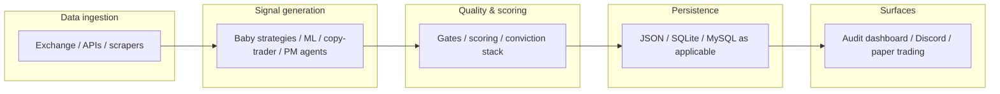

# Architecture overview — trading / audit stack

This repository is a **monorepo**. The trading path is **not** a single binary; several subsystems coexist. Below is the **intended** logical flow for the main audit / alpha pipeline.

## High-level flow

## Major components

| Area | Path (typical) | Responsibility |
|------|------------------|----------------|
| Strategy logic | `baby_strategies/`, `alpha_engine/*.py` | Indicators, `generate_signals`, some ML |
| Forward / portfolio sim | `alpha_engine/forward_test_portfolios.py` | TP/SL, sizing, paper portfolios |
| Recording / dashboard data | `audit_trail/` | Payloads, generators (do not run destructive gens locally per project rules) |
| Copy / PM research | `copy_trader_intel/` | Scraped JSON, merged candidates |
| Cross-system alerts | `cross_aggregation/conviction_picks.py` | High-bar Discord alerts |
| Web / API | `favcreators/`, `api/`, PHP | Hosting integration |
| Tests | `tests/` | Pytest + Playwright |

## Boundaries to preserve

1. **Publishing picks** should go through **quality gates** and scoring consistent with `TESTING_PROTOCOL.MD`.  
2. **Dashboard HTML:** edit templates where documented (e.g. `audit_dashboard/template.html`), not only generated `index.html`.  
3. **Secrets:** environment variables only; never commit tokens.

## Related docs

- `docs/CODE_REVIEW_QUANT_SYSTEM_2026-04-13.md` — full review checklist  
- `TESTING_PROTOCOL.MD` — validation layers  
- `docs/DATA_SOURCES_INTEGRATION.md` — data file map  
