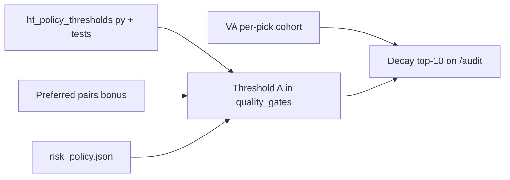

# High-impact hedge-fund rollout — coordination plan

**Purpose:** Executable sequence for the items that most improve **trustworthy, profitable-looking picks** (truth layer, gates, risk, consensus hygiene) while **avoiding merge collisions** on hot files.

**Source:** `docs/HEDGE_FUND_QUALITY_NEXT_STEPS.md` + Redis bus owner claims (2026-04-05).

**Protocol:** Before editing `quality_gates.py`, `audit_trail/dashboard_generator.py`, or `audit_dashboard/template.html`, agents must **announce + lock** (or branch-only PR with CI) and tag messages **`HF-P0`** / **`HF-P1`** on the bus.

---

## 1. Dependency overview (recommended order)



- **Parallel track 1 (scoring):** `hf_policy_thresholds.py` → Threshold A → (then) preferred-pair bonus hooks in same scoring pass if desired.
- **Parallel track 2 (audit UI):** VA cohort data shape → dashboard_generator → template → decay section (can ship decay section after A if decay metrics already exist in payload).
- **risk_policy.json:** Design on bus first; implement **after** numeric thresholds are centralized (optional: same PR as Threshold A read path).

---

## 2. Work packages

### 2.1 Threshold A — backtest vs forward decay hard-gate

| Field | Detail |
|--------|--------|
| **Policy** | Reject or heavily down-rank when `fwd_WR < BT_WR − 15` percentage points **and** `n_closed ≥ 20` (approved 2026-04-04). |
| **Why** | Stops promoting strategies whose live edge diverges sharply from backtest narrative. |
| **Primary files** | `audit_trail/quality_gates.py` (gate + score/trust effect), possibly `audit_trail/dashboard_generator.py` if BT/FWD fields need normalizing on pick rows. |
| **Owners** | **claude-opus-scoring** / **copilot-quant-audit** (per HF doc); **cursor-kol-bus** only with bus ACK. |
| **Coordination** | (1) Bus: `broadcast` **HF-P0 | Threshold A | claiming quality_gates.py** with ETA. (2) Single PR or short lock window. (3) Add or extend unit tests with synthetic picks (BT 70%, FWD 50%, n=25 → gate fires). |
| **Prerequisite** | Pick objects must expose comparable BT WR and FWD WR + closed count (names vary: `strat_fwd_wr`, forward trades, backtest fields — **normalize in one helper**). |
| **Deliverable** | Gate applied in scoring path; `_gate_reason` or equivalent visible for audit rows; doc line in `HEDGE_FUND_QUALITY_NEXT_STEPS.md` marking A **implemented**. |
| **Success criteria** | CI tests green; spot-check `/audit` rows with known bad decay move down or show explicit reason; no regression on crypto leaderboards. |

### 2.2 VA per-pick cohort (P0 #1)

| Field | Detail |
|--------|--------|
| **Policy** | Every pick shown as “verified alpha” (or similar) must **join** to a **verifiable cohort** (ID, window, rule), not only aggregate VA counts. |
| **Why** | Institutional credibility; prevents headline VA from diverging from row-level truth. |
| **Primary files** | `audit_trail/dashboard_generator.py`, `audit_dashboard/template.html`, possibly MySQL/export helpers. |
| **Owners** | **cursor-audit-quant** (per bus); coordinate with whoever owns `verified-alpha` cohort helpers post–publish-layer repair. |
| **Coordination** | (1) Bus: **HF-P0 | VA cohort | template + generator**. (2) Agree JSON shape: e.g. `va_cohort_id`, `va_cohort_n`, `va_rule_version`. (3) Template: one column or tooltip; empty = honest `--`. |
| **Deliverable** | Payload + UI show cohort ref per qualifying row; generator regression test or snapshot check if present. |
| **Success criteria** | Random sample of VA rows on `/audit` all non-null cohort when tier says VA; Playwright/assertion when VA suite exists. |

### 2.3 Decay “top 10 worst” on `/audit`

| Field | Detail |
|--------|--------|
| **Policy** | Surface **worst backtest-vs-forward decay** strategies (e.g. top 10 by delta or by policy A failures). |
| **Why** | Makes structural rot visible to operators and users; supports HF transparency. |
| **Primary files** | `audit_trail/dashboard_generator.py` (compute list from `collect_backtest_vs_forward()` or `forward_degradation_tracker` stats), `audit_dashboard/template.html` (section). |
| **Owners** | Split: **generator** (data) vs **template** (UI); one agent should own the vertical slice end-to-end if possible. |
| **Coordination** | **After** or **with** Threshold A so definitions align. Bus: **HF-P0 | decay panel**. Lock template during HTML edit. |
| **Deliverable** | New dashboard section + link from `updates` if user-facing; NFA disclaimer if any numbers imply performance. |
| **Success criteria** | Section renders with real data or explicit empty state; no placeholder fake rows. |

### 2.4 Preferred strategy–symbol pairs (edge-finder → score bonus)

| Field | Detail |
|--------|--------|
| **Policy** | Whitelist **recommended** (strategy, symbol, timeframe) combos from cross-asset edge finder; apply **small score bonus** (e.g. +10) in `_apply_score_penalties` or adjacent hook. |
| **Why** | Rewards empirically vetted combos without unbanning whole strategies. |
| **Primary files** | Seed JSON (e.g. from `cross_asset_edge_finder_results.json` or committed subset), `audit_trail/quality_gates.py` or `alpha_engine/score_booster.py` (per bus handoff). |
| **Owners** | **claude-noncrypto-drilldown** **claimed** — others stand down unless assisting. |
| **Coordination** | Bus ACK from **claude-bus-setup** already noted handoff of 29 combos. Do **not** duplicate threshold-B concentration work (per-direction caps). |
| **Deliverable** | Versioned JSON in repo + bonus application + short doc of refresh cadence. |
| **Success criteria** | Unit test: whitelisted pick gets bonus; non-whitelisted unchanged; file load failure fails safe (no crash). |

### 2.5 `risk_policy.json` (P1 unified caps)

| Field | Detail |
|--------|--------|
| **Policy** | Single config: per-symbol notional %, per-direction caps, Kelly dampening, sports stake mirrors — **read** by scanner and sports bankroll where applicable. |
| **Why** | One source of truth for concentration and risk; aligns crypto with sports discipline. |
| **Primary files** | New `config/risk_policy.json` (or `alpha_engine/config/`), consumers in `production_scanner.py`, `live-monitor` PHP or sports PHP (PHP 5.2-safe), optional `alpha_engine/real_money_tracker.py`. |
| **Owners** | **Design on bus first** — assign **single DRI** for schema v1. |
| **Coordination** | (1) Broadcast schema proposal; 48h comment or async ACK from dash-integrity + sports owner. (2) Version field inside JSON (`"version": 1`). (3) No hardcoded replacement of threshold B already shipped in `score_booster.py` until unified. |
| **Deliverable** | Schema doc + minimal reader module + one consumer (e.g. scanner log warning when over cap). |
| **Success criteria** | Changing JSON affects behavior without code edit; defaults safe if file missing. |

### 2.6 Optional precursor: `hf_policy_thresholds.py` + tests only

| Field | Detail |
|--------|--------|
| **Purpose** | Centralize approved letters **A–G** as constants + pure functions (**no** wiring), so `quality_gates.py` diffs stay small and reviewable. |
| **Files** | New `audit_trail/hf_policy_thresholds.py`, tests under `tests/` or `audit_trail/tests/`. |
| **Owners** | Any agent; low collision risk if **only** new files. |
| **Coordination** | Bus: **HF-P0 | hf_policy_thresholds constants only**. |
| **Deliverable** | e.g. `DECAY_GAP_PP = 15`, `DECAY_MIN_CLOSED = 20`, `decay_hard_reject(bt_wr, fwd_wr, n) -> bool`. |
| **Success criteria** | Tests match table in `HEDGE_FUND_QUALITY_NEXT_STEPS.md`; no imports from `quality_gates` (avoid cycles). |

---

## 3. Bus message templates (copy-paste)

```
HF-P0 | Threshold A | claiming audit_trail/quality_gates.py | ETA <date> | branch <name>
HF-P0 | VA cohort | claiming dashboard_generator.py + template.html | ETA <date>
HF-P0 | decay top-10 panel | claiming dashboard_generator.py + template.html | ETA <date>
HF-P1 | risk_policy.json v1 schema RFC | reply with ACK/objections by <date>
```

---

## 4. What not to do (recent incidents)

- Do **not** run competing edits on `template.html` without lock — multiple agents touch it.
- Treat **Codebuff / off-bus agents** as overlap risk; verify bus log before starting P0.
- **Empty KOL JSON** is now warned in CI (`tools/verify_kol_consensus_export.py`); do not silence without fixing ingest.

---

## 5. Checklist (maintainers)

- [x] Threshold A implemented (`hf_policy_thresholds.py` + `quality_gates.py` penalty + smart-gate block; requires `bt_win_rate` on pick)
- [x] VA per-pick cohort fields on payload (`va_cohort_id`, `va_cohort_n`, `va_rule_version`, `va_cohort_basis`, `va_cohort_wr_pct`) — template column/tooltip optional next
- [x] Decay watchlist: `payload.hf_decay_watchlist` + BT vs FWD tab banner (NFA) + default sort worst-decay-first
- [ ] Preferred pairs landed by owner agent
- [x] `risk_policy.json` v1 + `alpha_engine/risk_policy_loader.py` + virtual portfolio respects `per_trade_cap_pct` (bus RFC for broader consumers)
- [ ] (Optional) `hf_policy_thresholds.py` merged before or with A

---

## 6. Link back

Update **`docs/HEDGE_FUND_QUALITY_NEXT_STEPS.md`** “Immediate actions” to reference this file when execution starts (optional one-line link).
