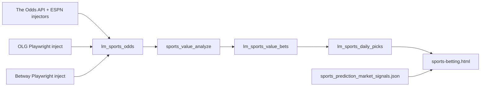

# Sports edge: OLG ProLine+, Betway, and prediction markets — integration plan

**Date:** 2026-04-26  
**Scope:** [live-monitor/sports-betting.html](https://findtorontoevents.ca/live-monitor/sports-betting.html), Canadian book integrations ([OLG ProLine+](https://www.olg.ca/en/sports/prolineplus.html#home), [Betway en-CA](https://betway.com/g/en-ca/sports)), and cross-references to prediction markets / communities.  
**Disclaimer:** This document describes **paper trading** and **analytical** integrations. It does not guarantee “high-probability wins.” Markets are efficient; any edge is small, noisy, and must be measured with CLV, sample size, and bankroll rules.

---

## 1. Executive summary

| Layer | Current state | Recommended next step |
|--------|----------------|------------------------|
| **OLG ProLine+** | [olg_prolineplus_scraper.py](../live-monitor/olg_prolineplus_scraper.py) injects `olg_prolineplus` into `lm_sports_odds` via `inject_fallback`; CI runs Playwright step | Surface **OLG vs median soft** in UI; add health check column in `olg_line_checker` output |
| **Betway** | [betway_ca_scraper.py](../live-monitor/betway_ca_scraper.py) uses **betway.ca/ca-on/...** (ON storefront). Global URL **betway.com/g/en-ca/sports** is the same product family; confirm locale/cookies if parser drifts | Add alternate base URL + regression snapshot test; show Betway in “line shop” when present in `all_odds` JSON |
| **Prediction markets** | [sports_picks.php](../live-monitor/api/sports_picks.php) loads `sports_prediction_market_signals.json` (Polymarket-style) and decorates `action=today` with `prediction_market_*` when teams match | Automate **signal file** generation in CI; add **divergence flag** when `true_prob` (devig) vs PM price disagree beyond threshold |
| **Methodology** | Devig (Jensen / Pinnacle anchor), multi-book +EV, quarter-Kelly, auto_place guardrails in [sports_bets.php](../live-monitor/api/sports_bets.php) | Optional **score** bump when OLG is best price *and* PM agrees; require ≥N books still |

**No “sure wins.”** “High-probability” in a statistical sense means **favorable expected value and disciplined sizing**, not win-rate certainty.

---

## 2. How data flows today

- **OLG and Betway are already in the de-vig funnel** as extra bookmakers, improving `minBooks` and consensus `true_prob` when inject succeeds.  
- **They are not first-class in the page narrative** (users mostly see “FanDuel / DraftKings” in copy).  
- **Prediction market JSON** is optional on disk; if missing, `action=today` simply omits PM fields.

---

## 3. Book-specific notes

### 3.1 OLG ProLine+ (`https://www.olg.ca/en/sports/prolineplus.html`)

- **Role:** ON-regulated retail/online; often **tighter or softer** lines vs offshore aggregation — useful as a **regional anchor** and for **compliance-aligned** “where can I actually bet in Ontario” messaging.  
- **Code:** `olg_prolineplus` rows in `lm_sports_odds`; [sports_value_analyze_lib.php](../live-monitor/api/sports_value_analyze_lib.php) `sports_value_book_is_canadian` treats OLG as CA-relevant.  
- **Risk:** SPA / gateway changes break Playwright; [olg_line_checker.py](../live-monitor/olg_line_checker.py) already probes gateway health.

### 3.2 Betway (Canada)

- **Implemented URL:** `BETWAY_BASE = 'https://betway.ca/ca-on/en-ca/sports/cat/'` in [betway_ca_scraper.py](../live-monitor/betway_ca_scraper.py).  
- **User-linked URL:** `https://betway.com/g/en-ca/sports` — typically redirects to a regional experience. **Suggestion:** add `BETWAY_BASE_ALT` or env `BETWAY_BASE_URL` so operators can switch without a code change if Betway changes routing.  
- **Role:** increases book count for NBA/NHL/NFL/MLB when The Odds API’s Canadian set is thin.

---

## 4. Prediction markets & communities (methodology cross-reference)

| Source | How it maps to this stack | Caution |
|--------|----------------------------|--------|
| **Polymarket / Kalshi / Metaculus** (binary event contracts) | Treat as **independent prior** on win probability; compare to devig `true_prob` from books | Illiquid markets, selection bias, US election skew; **do not** weight PM above closing line without calibration |
| **Sharp consensus** (Pinnacle, Circa) | Already used when every outcome has Pinnacle in [sports_value_truep_pinnacle](../live-monitor/api/sports_value_analyze_lib.php) | If Pinnacle missing, falls back to Jensen consensus |
| **Communities (e.g. r/sportsbook, model forums)** | Use for **feature ideas** (rest, travel, ref assignments), not as truth | Backtest; avoid double-counting with ESPN situation scoring already in copy |

**Concrete integration idea:**  
- Generate `sports_prediction_market_signals.json` on a schedule (e.g. daily) from a small script that pulls **sports-tagged** Polymarket (or whitelisted events only).  
- In UI: badge **“PM aligned”** when `|p_model - p_pm| < 0.05` and **“PM vs market”** when divergence > 0.10 (requires calibration).

---

## 5. Suggested fixes (phased, for edge — not for guarantees)

### Phase A — Data visibility (low risk, high clarity)

1. **Line shop section:** For each `value_bet` card, if `all_odds` contains `olg_prolineplus` or `betway`, show a **mini table** “Canadian books” with price vs best global soft.  
2. **Copy update** on [sports-betting.html](../live-monitor/sports-betting.html): list OLG + Betway alongside existing books where inject is active.  
3. **Health:** Expose `olg_line_checker` / last inject timestamp via read-only `sports_odds.php?action=injector_status` (optional).

### Phase B — Scoring (medium risk, needs backtest)

1. **PM agree gate:** optional column `pm_agree` (0/1) in API; optional filter “PM confirmed only.”  
2. **Divergence penalty:** if PM implies **p < implied** and EV looks high, cap EV display or add **“suspicious line”** (possible stale PM or book).  
3. **OLG as execution book:** in paper `auto_place`, if `sports_value_book_is_canadian` and OLG is best, prefer for **story**; keep **whitelist** as today.

### Phase C — URL / internationalization

1. Betway: config-driven `BETWAY_BASE` for `betway.com/g/en-ca/sports` vs `betway.ca/...` with the **same** parser hook once DOM equivalence is verified (manual QA in Playwright).

---

## 6. Testing & safety

- **No placeholder odds** in production paths (per project rules). Scraper failures must **degrade** with exit 0 and log (already the pattern).  
- **php 5.2** and **MySQL** constraints unchanged for PHP endpoints.  
- **Deploy:** any HTML/PHP change: syntax check + `validate_php52` on touched PHP, then FTP deploy per project rules.

---

## 7. PR checklist (for implementers)

- [ ] `docs/SPORTS_EDGE_OLG_BETWAY_PM_INTEGRATION.md` reviewed  
- [ ] If UI work: `node tools/check_syntax.js live-monitor/sports-betting.html` (when acorn present)  
- [ ] If new JSON pipeline: document path and scheduler (cron / GHA)  
- [ ] Optional: E2E fetch `sports_picks.php?action=today` and assert `all_odds` includes `olg_prolineplus` when inject last ran  

---

## 8. References in repo

| File | Purpose |
|------|--------|
| [live-monitor/olg_prolineplus_scraper.py](../live-monitor/olg_prolineplus_scraper.py) | OLG odds inject |
| [live-monitor/betway_ca_scraper.py](../live-monitor/betway_ca_scraper.py) | Betway odds inject |
| [live-monitor/olg_line_checker.py](../live-monitor/olg_line_checker.py) | OLG vs our picks audit |
| [live-monitor/api/sports_value_analyze_lib.php](../live-monitor/api/sports_value_analyze_lib.php) | +EV, devig, CA book list |
| [live-monitor/api/sports_picks.php](../live-monitor/api/sports_picks.php) | `sports_pm_*`, `action=today` |
| [.github/workflows/sports-betting-refresh.yml](../.github/workflows/sports-betting-refresh.yml) | Odds + scrapers schedule |

---

## 9. Honest limitation

**“High-probability wins”** are not a deliverable. The stack can deliver:

- **More stable +EV detection** (more books, better devig),  
- **Transparent disagreement** (market vs PM), and  
- **Measurable** outcomes (CLV, ROI on paper, cohort toggles on the page).

That is the correct bar for production-grade sports analytics.
