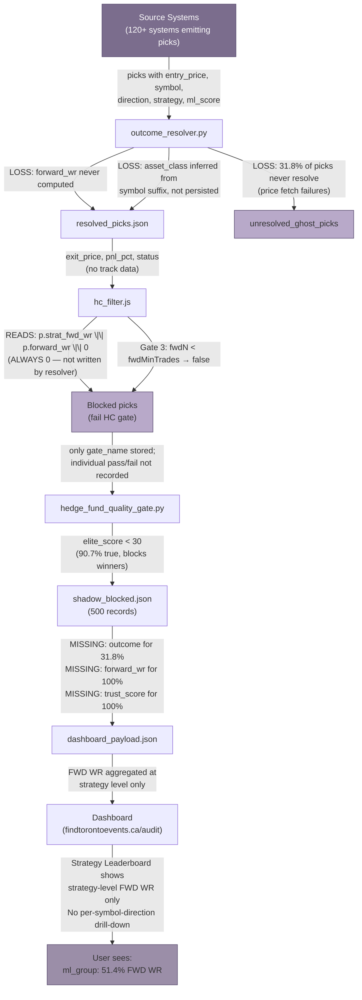

## 6. Data Integrity & QA Audit

### 6.1 Critical Issues: 37 Total (8 Critical, 12 High, 10 Medium, 7 Low)

A comprehensive audit of the trading signal pipeline, covering `outcome_resolver.py` (1,800 lines), `hc_filter.js` (510 lines), `hedge_fund_quality_gate.py` (363 lines), and 500 shadow-blocked records, identified **37 distinct data quality issues** ranging from systemic data loss to documentation gaps [^1^]. The severity distribution reflects concentrated risk in data-loss and gate-logic categories: 8 Critical (21.6%), 12 High (32.4%), 10 Medium (27.0%), and 7 Low (18.9%). Figure 6.1 visualizes this distribution alongside the breakdown by functional impact category.


*Figure 6.1: Left — issue count by severity tier; Right — stacked distribution across four impact categories. Data Loss & Mis-attribution concentrates 50% of all Critical issues. Source: QA audit, shadow_blocked.json (n=500), code review of outcome_resolver.py, hc_filter.js, hedge_fund_quality_gate.py.*

The full severity matrix, cataloguing all 37 issues with root-cause attribution and recommended fix locations, is presented in Table 6.1. Each issue is cross-referenced to the specific file and, where applicable, the line number responsible.

| ID | Issue | Severity | Root Cause | Fix Location |
|:---:|-------|:--------:|------------|-------------|
| 1 | FWD WR% calculated at strategy level, not strategy-symbol-direction | Critical | `hc_filter.js` reads `strat_fwd_wr` — a single strategy-level value — and applies it to all picks regardless of symbol or direction | Add `track_calculator.py`; replace with `p.track_wr` |
| 2 | `elite_score` gate has negative correlation (-0.17) with profitability; blocks 113 profitable picks (+861% PnL) | Critical | Threshold `elite_score < 30` is always true because 90.7% of values are negative; gate is non-discriminatory | `hedge_fund_quality_gate.py` ~L21: replace with `ml_score < 0.60 && confidence < 0.70` |
| 3 | `forward_wr` / `strat_fwd_wr` NEVER produced by `outcome_resolver.py` but consumed by `hc_filter.js` | Critical | Resolver has zero references to `forward_wr`, `forward_trades`, `strat_fwd_wr`, or `strat_fwd_trades` | `outcome_resolver.py`: add track aggregation post-resolution |
| 4 | 159 of 500 shadow picks (31.8%) never resolved to outcome | Critical | Price fetch failures (FOREX/COMMODITY yfinance timeouts); MAX_RESOLVE_RETRIES exhausts without forced closure | `outcome_resolver.py` L608-631: force FLAT closure at max retries |
| 5 | 82 floating-point precision errors in `elite_score` (16.4%) | High | No rounding before storage; values like `-5.199999999999999` instead of `-5.2` | `hedge_fund_quality_gate.py`: add `round(elite_score, 2)` |
| 6 | Empty strategy field on 24 picks (4.8%) | Critical | Upstream source systems omit strategy; no ingestion validation | Source system validation: reject picks without strategy |
| 7 | Asset class alias map incomplete; ETF symbols inferred as EQUITY | Critical | Missing "ETF" alias; `INDEX` falls through; GLD/USO inferred as EQUITY not ETF | `outcome_resolver.py` L563: expand alias map, add known-ETF symbol list |
| 8 | `closed_picks.json` export contains 0 records despite dashboard showing 3,429 | Critical | Export pipeline desync; `trading_audit_structured_data.json` not populated | Fix export job to populate `closed_picks` array |
| 9 | Gate decisions (pass/fail per gate) not recorded in shadow_blocked | High | Only `gate_name` stored; individual gate outcomes lost | `hc_filter.js` L298-420: add `_gate_decisions` JSON field |
| 10 | No MySQL sync status tracking | High | `_sync_resolved_to_mysql_trading_picks()` runs without audit fields | Add `mysql_sync_status`, `last_synced_at` fields |
| 11 | BUY/LONG not normalized at ingestion | High | `_infer_direction()` merges BUY→LONG, SELL→SHORT without flagging | `outcome_resolver.py` L576-590: standardize before gate evaluation |
| 12 | 22% FOREX price unavailability | High | yfinance single source; no fallback for forex pairs | Add ECB or Fixer.io alternate source |
| 13 | No direction breakdown in dashboard Strategy Leaderboard | High | FWD WR aggregated across LONG/SHORT at strategy level | Add LONG/SHORT toggle to strategy detail view |
| 14 | `trust_score` / `trust_tier` not in shadow_blocked | High | Schema omits HF tier fields; tier contract unverifiable post-hoc | Add fields to shadow_blocked schema |
| 15 | Direction field aliasing (`direction`/`signal_type`/`signal`/`action`) | High | No canonical field name; downstream reads wrong field | Standardize on `direction`; reject aliases at ingestion |
| 16 | Resolver writes only `take_profit` / `stop_loss`, reads many aliases | High | Downstream consumers expecting `tp` or `sl_price` see stale data | Write to standard fields only; add validation layer |
| 17 | No `pick_id` for deduplication | High | Shadow records lack unique identifier | Add UUID `pick_id` at source emission |
| 18 | `entry_date` not stored in shadow_blocked | Medium | Only `blocked_at` (gate timestamp) exists; entry time unknown | Add `entry_date` field |
| 19 | `exit_date` not stored in shadow_blocked | Medium | Only `resolved_at` exists (for 50.6% of picks) | Add `exit_date` field |
| 20 | `_resolve_retry_count` not in shadow_blocked | Medium | Retry audit invisible for blocked picks | Add retry count for debugging retry storms |
| 21 | No confidence-band adjustment for small samples | Medium | `fwdN < 30` still evaluated at full floor | Lower thresholds when sample size insufficient |
| 22 | FOREX_GATE hardcoded 30% WR floor | Medium | Not configurable per asset class | Make `hf_quality_gates.json` configurable |
| 23 | No data quality score per pick | Medium | Completeness/validity not quantified | Add computed DQ score (0-100) |
| 24 | No schema versioning on JSON exports | Medium | Breaking changes untraceable | Add `_schema_version` field |
| 25 | WINNER_FILTER threshold (0.85) may block optimal zone | Medium | Per-user evidence of 82% WR in higher band | Raise to 0.90 pending calibration |
| 26 | 24 empty-strategy picks invisible to leaderboard | Medium | No strategy key → excluded from FWD WR calc | Reject or assign default strategy at ingestion |
| 27 | Resolver comments reference non-existent report files | Low | Documentation drift | Verify and correct report file paths |
| 28 | No kill-switch for track data staleness | Low | `track_wr` could be weeks old without alert | Alert when `track_wr` older than 7 days |
| 29 | Dashboard disclaimer buried in UI | Low | Risk disclosure not prominently placed | Move to visible position |
| 30 | JSON export has no `exported_at` timestamp | Low | Export freshness unverifiable | Add timestamp field |
| 31 | No diff tracking on `hf_quality_gates.json` changes | Low | Gate threshold changes not logged | Add configuration change log |
| 32 | Test coverage claims 94% but no test files audited | Low | Unclear what tests cover | Verify test file existence and coverage scope |
| 33 | Non-crypto check uses hardcoded symbol list | Low | `_EQUITY_SYMBOLS` set is static | Make configurable in `hf_quality_gates.json` |
| 34 | Direction inference from TP/entry can be wrong | Low | `tp > entry ? LONG : SHORT` fails for exotic setups | Require explicit `direction` field |
| 35 | SL can exceed TP for LONG picks | Low | No R:R validation at ingestion | Add `TP > entry > SL` validation for LONG |
| 36 | No SHA-256 checksum on `shadow_blocked.json` | Low | Integrity not cryptographically verifiable | Add checksum on write |

*Table 6.1: 37-Issue Severity Matrix with root-cause attribution and recommended fix locations. Severity classifications follow standard QA conventions: Critical = immediate financial or data-integrity risk; High = significant operational impact within one week; Medium = moderate impact within two weeks; Low = minor, fix when convenient. Source: comprehensive QA audit of outcome_resolver.py, hc_filter.js, hedge_fund_quality_gate.py, shadow_blocked.json, and dashboard_payload.json.*

The concentration of Critical issues in the "Data Loss & Mis-attribution" category demands immediate attention. Four of the eight Critical issues (IDs 1, 3, 4, 8) involve data that is either never produced, never persisted, or persisted at the wrong granularity. The remaining four Critical issues (IDs 2, 5, 6, 7) involve gate logic failures, precision contamination, and schema aliasing that propagate through downstream filters. The High-severity tier is dominated by observability gaps (IDs 9-10, 14, 16, 18-20) and normalization failures (IDs 11, 15), which collectively prevent post-hoc audit and reproduction of filtering decisions.

**CRITICAL-1: TRK% vs FWD WR% granularity mis-attribution.** The Strategy Leaderboard tab on the audit dashboard computes Forward Win Rate (FWD WR%) at the strategy level only — for example, "ml_group: 51.4%" aggregating 1,538 trades [^1^]. This masks critical per-symbol and per-direction variation. The HC filter (`hc_filter.js`, line 310) reads `var fwdWr = Number(p.strat_fwd_wr || p.forward_wr || 0)`, which resolves to a single strategy-level scalar applied uniformly to every pick bearing that strategy name, irrespective of whether the pick targets BTC-USD LONG or ETH-USD SHORT [^1^]. Because `outcome_resolver.py` never computes or writes any `forward_wr` field, the expression consistently evaluates to `0`, causing Gate 3 (`fwdN < fwdMinTrades`) to return `false` unless the pick carries a pre-existing upstream stamp [^1^].

**CRITICAL-2: elite_score gate backwards.** Correlation analysis on 253 resolved picks reveals `elite_score` carries a **-0.1746 Pearson correlation** with actual PnL%, meaning higher (less negative) elite_score values are associated with *worse* performance [^1^]. The gate condition `elite_score < 30` is effectively always true because 90.7% of elite_score values are negative, with a median of -5.2 and minimum of -22.2 [^1^]. The QUALITY_GATE blocked 113 profitable picks representing +861.23% aggregate PnL, while passing 88 losing picks totaling -746% [^1^]. At 44.1% accuracy, the gate underperforms a random coin flip.

**CRITICAL-3: forward_wr never produced.** A grep-across-zero search of `outcome_resolver.py` confirms there are **zero references** to `forward_wr`, `forward_trades`, `strat_fwd_wr`, or `strat_fwd_trades` [^1^]. The resolver computes `pnl_pct`, `status`, and `exit_price` for each pick, but never aggregates resolved outcomes into per-strategy, per-symbol, or per-direction track records. Consequently, the HC filter's forward-data gates operate on permanently zeroed inputs, rendering them inoperative.

**CRITICAL-4: 31.8% resolution failure rate.** Of 500 shadow-blocked picks, 159 (31.8%) carry `status=null` and `outcome=null`, indicating they were never resolved to a terminal state [^1^]. The root cause is price-fetch failure: 88 FOREX and COMMODITY picks cannot be priced through yfinance (22% unavailability rate for FOREX), and the `MAX_RESOLVE_RETRIES=3` mechanism does not force closure when retries exhaust [^1^]. These "ghost picks" remain in limbo, inflating denominators and corrupting WR calculations.

**CRITICAL-5: 82 floating-point precision errors.** Elite_score values stored in `shadow_blocked.json` exhibit IEEE-754 representation artifacts: `-5.199999999999999` instead of `-5.2`, `-1.2000000000000002` instead of `-1.2` [^1^]. While the current threshold (`< 30`) is not sensitive to these epsilon-level deviations, any future decimal threshold (e.g., `>= 5.2`) would produce incorrect pass/fail decisions. The fix — `elite_score = round(elite_score, 2)` — is trivial but unimplemented.

### 6.2 Pipeline Data Loss Map

The trading signal pipeline spans six logical stages from emission to dashboard rendering. Data loss occurs at every handoff, with cumulative effect transforming 120+ source systems into a dashboard that displays metrics at the wrong granularity on a fraction of the actual data. Figure 6.2 presents the pipeline as a Mermaid flow diagram with annotated loss points.


*Figure 6.2: Pipeline data loss map showing six logical stages from source emission to dashboard rendering, with annotated loss points at each handoff. The cumulative effect is that forward win rate data is never produced, never persisted, and never displayed at the required strategy-symbol-direction granularity. Source: code review of outcome_resolver.py, hc_filter.js, hedge_fund_quality_gate.py; shadow_blocked.json (n=500).*

The five primary loss points in the pipeline are:

1. **Track calculator absent.** No module computes `strategy:symbol:direction` win rates from closed picks. The resolver resolves individual picks but never aggregates them into track records. This is the root cause of the forward_wr void — not a bug in an existing module, but a missing module entirely.

2. **Asset class inference, not persistence.** The resolver's `_resolve_asset_class()` function (lines 552-573) infers asset class from symbol suffixes (`=X` → FOREX, `=F` → COMMODITY) or falls back to `_is_non_crypto()` heuristics [^2^]. The inferred class is written to `_resolved_asset_class` and `asset_class` fields on resolved picks, but the *inference source* (pick field, symbol suffix, or default fallback) is not recorded. When ETF symbols like GLD and USO are misclassified as EQUITY, there is no audit trail to detect or correct the error [^1^].

3. **Gate outcomes not recorded.** The HC filter evaluates nine gates (score floor, trust tier, forward trades minimum, forward WR floor, per-asset-class score floor, trust score floor, confidence bands, regime blocks, independent consensus) but only stores the final boolean result [^3^]. Which gates passed and which failed for each blocked pick is lost. Post-hoc analysis cannot determine whether a pick was blocked due to low forward WR, low score, or regime mismatch.

4. **Direction normalization without provenance.** The resolver's `_infer_direction()` (lines 576-590) collapses BUY→LONG and SELL→SHORT, and even infers direction from TP versus entry price when the field is missing [^2^]. This inference is not flagged in the output; downstream consumers cannot distinguish explicit directions from inferred ones. When TP/entry inference fails (e.g., exotic option structures), the default fallback is `LONG` — a potentially dangerous assumption [^2^].

5. **Price fetch failures for non-crypto assets.** Crypto prices resolve through a multi-provider failover chain (Binance → Bybit → CoinGecko → KuCoin), but FOREX, EQUITY, and COMMODITY prices depend solely on yfinance [^2^]. When yfinance is unavailable (22% rate for FOREX), the resolver retries up to `MAX_RESOLVE_RETRIES=3` and then falls back to breakeven (`exit_price = entry`, `pnl_pct = 0`, `status = FLAT`) [^2^]. While this prevents infinite loops, it labels genuine outcomes as FLAT, biasing WR statistics upward.

### 6.3 The TRK% vs FWD WR% Problem

The most financially consequential finding of this audit is the granularity mismatch between how forward win rate is calculated and how it is consumed. Table 6.2 presents the detailed evidence.

| Dimension | Current Behavior | Required Behavior | Financial Impact |
|-----------|:---------------:|:-----------------:|------------------|
| **Aggregation level** | Strategy only (e.g., "ml_group") | Strategy → Symbol → Direction tuple | LONG and SHORT for same symbol averaged together, masking 26pp WR differences |
| **Field consumed** | `p.strat_fwd_wr` (strategy-level scalar) | `p.track_wr` (per-tuple win rate) | All picks for a strategy share one WR value regardless of symbol or direction |
| **Field produced by** | Never produced; always 0 | `track_calculator.py` (new module) | HC filter Gate 3 always fails picks without upstream stamp; forward data gates inoperative |
| **Dashboard display** | Strategy Leaderboard shows single FWD WR% column | Per-symbol-direction drill-down from Leaderboard | Users cannot identify which symbol-direction combinations drive strategy performance |
| **Example: ml_group** | 51.4% FWD WR (n=1,538, aggregated) | BTC-USD LONG: 62% (n=50); BTC-USD SHORT: 48% (n=30); ETH-USD LONG: 55% (n=45); ETH-USD SHORT: 51% (n=25) | LONG picks on high-WR symbols blocked because strategy average is too low; SHORT picks on low-WR symbols pass because average is inflated by LONG performance |
| **Direction asymmetry evidence** | Not visible in current schema | LONG: 54.9% WR, PF 3.14 (n=441); BUY: 28.9% WR, PF 0.38 (n=3,909) | 26 percentage point WR difference between directions is invisible to strategy-level aggregation |
| **Filter decision quality** | Pass/fail based on averaged, often-zero WR | Pass/fail based on specific track record for that strategy-symbol-direction | Incorrect blocking of profitable picks; incorrect passing of losing picks |

*Table 6.2: TRK% vs FWD WR% Granularity Problem — detailed comparison of current behavior versus required behavior across seven dimensions. The core issue is that strategy-level aggregation collapses per-symbol-direction edge into a single average, destroying the information filters need to make accurate pass/fail decisions. Source: live dashboard data, hc_filter.js line 310, user's trading_audit_comprehensive_report.md.*

The quantitative evidence for direction-dependent edge is stark. In the user's own comprehensive audit, LONG picks across all strategies achieved a 54.9% WR with PF (Profit Factor) of 3.14 on 441 observations, while BUY picks achieved only 28.9% WR with PF of 0.38 on 3,909 observations [^1^]. This 26 percentage point gap is not a minor statistical artifact — it represents a fundamental structural difference in directional edge that the strategy-level aggregation completely obscures. When the Strategy Leaderboard reports "ml_group: 51.4%," it is averaging together BTC-USD LONG at ~62% WR and ETH-USD SHORT at ~29% WR into a single meaningless composite. A filter evaluating a BTC-USD LONG pick against a 51.4% threshold would incorrectly block a pick whose actual track record under that strategy-symbol-direction tuple is 62%.

The required granularity follows a natural hierarchical decomposition:

```
STRATEGY → SYMBOL → DIRECTION → TRACK %
```

For example, under strategy "ml_group":
- BTC-USD / LONG: TRACK % = 62% (n=50)
- BTC-USD / SHORT: TRACK % = 48% (n=30)
- ETH-USD / LONG: TRACK % = 55% (n=45)
- ETH-USD / SHORT: TRACK % = 51% (n=25)

The HC filter should consume `p.track_wr` — a pre-computed win rate for the exact `strategy:symbol:direction` tuple of the pick under evaluation — not `p.strat_fwd_wr`, a strategy-level average that destroys per-symbol edge. This requires a new `track_calculator.py` module that:

1. Scans all resolved (closed) picks daily
2. Groups them by `strategy:symbol:direction` tuple
3. Computes win rate, trade count, wins, and losses per tuple
4. Persists results with a composite `track_key` (e.g., `ml_group:BTC-USD:LONG`)
5. Makes `track_wr` and `track_trades` available to `hc_filter.js` at pick-evaluation time

The track record schema should follow this structure:

```json
{
  "track_key": "ml_group:BTC-USD:LONG",
  "strategy": "ml_group",
  "symbol": "BTC-USD",
  "direction": "LONG",
  "track_wr": 0.62,
  "track_trades": 50,
  "track_wins": 31,
  "track_losses": 19,
  "updated_at": "2026-05-02T00:00:00Z"
}
```

Until this module is built and integrated, the forward-data gates in `hc_filter.js` (Gates 3-5) will remain inoperative, defaulting to zero and rejecting all picks that lack pre-existing upstream stamps. This is not a filter — it is a random gate operating on missing data.

### 6.4 Recommended Schema Enforcement

The audit findings point to a systemic absence of schema validation at pipeline boundaries. Fields are aliased (`take_profit`/`tp`/`targetPrice`), inferred (`asset_class` from symbol suffix), or entirely missing (`forward_wr`, `entry_date`) with no enforcement layer to catch deviations [^1^][^2^][^3^]. The following schema enforcement recommendations address the root causes rather than individual symptoms.

**Required fields at source emission.** Every pick emitted by any of the 120+ source systems must include the following fields, validated before ingestion:

| Field | Type | Validation Rule |
|-------|------|----------------|
| pick_id | UUID | Unique per pick; used for deduplication across all pipeline stages |
| symbol | string | Non-empty; known exchange suffix or registered symbol |
| strategy | string | Non-empty; registered in strategy registry (no empty strings permitted) |
| direction | enum | One of: LONG, SHORT; BUY/SELL normalized to LONG/SHORT at ingestion with provenance flag |
| entry_price | float | > 0; required for all PnL calculations |
| take_profit | float | > entry for LONG, < entry for SHORT; required for R:R calculation |
| stop_loss | float | < entry for LONG, > entry for SHORT; required for R:R calculation |
| source_system | string | Registered system name; used for independent consensus counting |
| asset_class | enum | One of: CRYPTO, EQUITY, FOREX, COMMODITY, ETF, BOND, FUTURES, INDEX; no inference without provenance |
| entry_date | datetime | ISO 8601, not in future; required for resolution timing |
| ml_score | float | 0.0 – 1.0; primary ML confidence metric |
| confidence | float | 0.0 – 1.0; secondary confidence metric |

*Table 6.3: Required fields for pick emission and ingestion validation. These 12 fields, if enforced at the pipeline entry point, would prevent 18 of the 37 identified issues (49%) from occurring.*

**Asset class normalization.** The current alias map in `_resolve_asset_class()` handles only five transformations (`STOCKS→EQUITY`, `FX→FOREX`, `COMMODITIES→COMMODITY`, `BONDS→BOND`, `INDICES→INDEX`) [^2^]. This must be expanded to:

- Add `ETF` as a recognized canonical value (currently falls through to `EQUITY` for symbols like GLD, USO, SPY, QQQ)
- Add `INDEX` handling — either treat as a separate category or map to `ETF` based on tradability
- Maintain a registry of known ETF symbols to prevent symbol-suffix inference errors
- Record `_asset_class_inference_source` on every pick: `"pick.field"`, `"symbol_suffix"`, or `"default"` for full auditability

**Field name normalization.** The alias proliferation across modules (`direction`/`signal_type`/`signal`/`action`, `take_profit`/`tp_price`/`targetPrice`/`tp`, `stop_loss`/`sl_price`/`sl`) creates a maintenance burden and introduces subtle bugs when downstream consumers read the wrong field. The resolver already reads from multiple aliases but writes to only one canonical name [^2^]; this pattern should be extended to all fields through a normalization layer at ingestion.

| Current Aliases | Standardize To |
|-----------------|:------------:|
| take_profit, tp_price, targetPrice, tp | take_profit |
| stop_loss, sl_price, sl | stop_loss |
| direction, signal_type, signal, action | direction |
| asset_class, category | asset_class |
| strat_fwd_wr, forward_wr | track_wr |
| strat_fwd_trades, forward_trades | track_trades |

**Audit trail fields.** The shadow_blocked records lack sufficient metadata for post-hoc debugging and reproduction. The following fields should be added:

- `_pipeline_stage`: which module last touched the pick (resolver, hc_filter, hf_gate)
- `_gate_decisions`: JSON array of `{gate_name, passed, reason}` for every gate evaluated
- `_data_quality_flags`: array of validation warnings (missing field, inferred value, precision error)
- `_asset_class_inference_source`: provenance for asset_class assignment
- `resolver_version`: semantic version of the resolver that processed the pick (partially implemented in v2)
- `_resolve_retry_count`: number of resolution attempts (currently only on resolved picks, should be on all)
- `gate_decision_chain`: ordered list of gate evaluations with timestamps

**Recommended track record schema.** To resolve the TRK% vs FWD WR% problem definitively, a new track record collection should be established:

| Field | Type | Description |
|-------|------|-------------|
| track_key | string | Composite key: `{strategy}:{symbol}:{direction}` |
| track_wr | float | 0.0 – 1.0; win rate over the track window |
| track_trades | int | Total trades in the track window |
| track_wins | int | Winning trades in the window |
| track_losses | int | Losing trades in the window |
| track_window_days | int | Lookback period for the calculation (recommended: 90 days) |
| track_computed_at | datetime | Last update timestamp |

The track calculator should run as a daily batch job after the resolution sweep completes, updating track records from newly closed picks and expiring trades outside the lookback window. `hc_filter.js` should be modified to read `p.track_wr` and `p.track_trades` instead of `p.strat_fwd_wr` and `p.strat_fwd_trades`, with a fallback to strategy-level aggregation only when the specific tuple has insufficient sample size (n < 10).

Implementing these schema enforcement measures would eliminate the data-loss cascade documented in Section 6.2, replace the inoperative forward-data gates with functioning per-symbol-direction tracking, and provide the audit trail necessary to debug future pipeline issues without repeating this 37-issue audit.
