# Unified Predictions Dashboard - Comprehensive Implementation Plan
## Executive Summary

**Date:** February 12, 2026  
**Focus:** Consolidating high-performing systems (Cursor Genius, Sector Rotation, Sports Betting) into unified architecture

---

## 🎯 Strategic Overview

Based on analysis of the ANTIGRAVITYMOTHERLOAD.MD findings, we've identified critical performance discrepancies and hidden gems in your trading platform. The unified dashboard will:

### Key Discoveries
- **Cursor Genius**: Hidden star performer with +1,324% return (65.3% WR)
- **Sector Rotation**: Contradicts backtest - actually +354% return (64% WR)  
- **Sports Betting**: Confirmed winner with +25.3% ROI
- **Critical Gap**: 70.5% signal quality vs 3.84% execution quality

### Primary Objectives
1. **Feature high-performers** prominently
2. **Consolidate** 33+ pages and 35+ APIs
3. **Address execution gap** (commission drag, win/loss ratio)
4. **Integrate GROK_XAI improvements** (HMM regime, Kelly sizing)

---

## 📊 Architecture Overview

```mermaid
graph TB
    A[Unified Predictions Hub] --> B[High-Performance Core]
    A --> C[Asset Class Modules]
    A --> D[Advanced Analytics]
    A --> E[Execution Quality]
    
    B --> B1[⭐ Cursor Genius]
    B --> B2[🔄 Sector Rotation]
    B --> B3[⚽ Sports Betting]
    B --> B4[📈 Blue Chip Growth]
    
    C --> C1[📊 Stocks Module]
    C --> C2[🪙 Crypto Module]
    C --> C3[💱 Forex Module]
    
    D --> D1[📈 Performance Attribution]
    D --> D2[🌀 Regime Intelligence]
    D --> D3[🔗 Multi-Asset Correlation]
    
    E --> E1[💸 Commission Drag Analysis]
    E --> E2[📊 Win/Loss Optimization]
    E --> E3[⏰ Trade Timing Analysis]
    
    B1 --> F[Real-time Performance Tracking]
    B2 --> F
    B3 --> F
    
    F --> G[Unified API Layer]
    G --> H[Consolidated Database]
```



---

## 🚀 Phase 1: Quick Wins (Week 1)

### Immediate Actions

**Directory Structure:**
```bash
mkdir predictions
mkdir predictions/css
mkdir predictions/js  
mkdir predictions/api
mkdir predictions/assets
```

**Core Pages to Create:**
- `/predictions/dashboard.html` - Unified hub
- `/predictions/leaderboard.html` - Performance rankings
- `/predictions/sports.html` - Sports betting center

**API Consolidation:**
- Create `/api/predictions/v1/leaderboard`
- Create `/api/predictions/v1/picks`
- Create `/api/predictions/v1/regime`

**Navigation Updates:**
- Feature "⭐ Predictions Hub" prominently
- Consolidate investment navigation
- Add redirects for merged pages

### Expected Outcomes Week 1
- ✅ Unified directory structure
- ✅ Basic dashboard prototype
- ✅ High-performers featured
- ✅ Redirects operational

---

## 🔧 Phase 2: Advanced Integration (Week 2)

### GROK_XAI_MOTHERLOAD Integration

**HMM Regime Detection:**
- Real-time market regime display
- Regime-aware strategy selection
- Confidence level indicators

**Kelly Sizing Engine:**
- Position sizing based on signal strength
- Risk-adjusted position management
- Portfolio optimization

**Multi-Timeframe Analysis:**
- 5m/1h/4h/1d momentum integration
- Timeframe confluence scoring
- Adaptive strategy parameters

### Execution Quality Dashboard

**Commission Drag Analysis:**
- Real-time fee tracking
- Broker fee optimization
- Cost reduction strategies

**Win/Loss Ratio Optimization:**
- Target 2:1 minimum ratio
- Trade selection improvements
- Risk management enhancements

**Trade Timing Analysis:**
- Reduce 67% timeout rate
- Entry/exit optimization
- Market timing improvements

### Expected Outcomes Week 2
- ✅ GROK_XAI improvements integrated
- ✅ Execution quality tracking
- ✅ Regime detection operational
- ✅ Kelly sizing implemented

---

## 📈 Phase 3: Advanced Analytics (Week 3)

### Performance Attribution
- What's driving returns analysis
- Strategy effectiveness measurement
- Risk-adjusted performance

### Multi-Asset Correlation
- Cross-asset relationship analysis
- Portfolio diversification optimization
- Risk concentration identification

### Automated Strategy Selection
- Regime-aware algorithm switching
- Performance-based strategy ranking
- Adaptive parameter optimization

### Expected Outcomes Week 3
- ✅ Performance attribution dashboard
- ✅ Multi-asset correlation analysis
- ✅ Automated strategy selection
- ✅ Advanced analytics operational

---

## 🎯 Key Performance Indicators

### User Engagement
- **Target:** 50% increase in high-performer usage
- **Metric:** Cursor Genius and Sector Rotation engagement
- **Measurement:** Page views, interaction time

### Performance Improvement
- **Target:** Reduce execution gap from 66.66% to <20%
- **Metric:** Signal vs execution quality difference
- **Measurement:** Real-time tracking

### System Efficiency
- **Target:** 75% reduction in pages (33+ → 8)
- **Metric:** Page count and complexity
- **Measurement:** Navigation simplicity

### Technical Performance
- **Target:** 30% improvement in page load times
- **Metric:** Response time and caching efficiency
- **Measurement:** Performance monitoring

---

## 🛡️ Risk Mitigation Strategy

### High-Risk Items

**Navigation Changes:**
- Risk: Users get lost during transition
- Mitigation: Maintain redirects for 60 days, clear labels, user education

**API Consolidation:**
- Risk: Breaking existing integrations
- Mitigation: Gradual deprecation, parallel operation, comprehensive testing

**Performance Regression:**
- Risk: Slower page loads
- Mitigation: Optimized queries, caching, performance monitoring

### Medium-Risk Items

**Data Consistency:**
- Risk: Discrepancies between systems
- Mitigation: Data validation, consistent sources, real-time sync

**User Adoption:**
- Risk: Resistance to change
- Mitigation: Clear benefits communication, improved UX

---

## 📋 Implementation Checklist

### Week 1 Checklist
- [ ] Create `/predictions/` directory structure
- [ ] Implement basic dashboard layout
- [ ] Create unified API endpoints
- [ ] Update main navigation
- [ ] Add redirect mapping
- [ ] Test basic functionality

### Week 2 Checklist
- [ ] Integrate HMM regime detection
- [ ] Implement Kelly sizing engine
- [ ] Add execution quality metrics
- [ ] Create sports betting module
- [ ] Test GROK_XAI integration
- [ ] User acceptance testing

### Week 3 Checklist
- [ ] Implement performance attribution
- [ ] Add multi-asset correlation
- [ ] Create advanced analytics
- [ ] Optimize performance
- [ ] Comprehensive testing
- [ ] User feedback integration

### Week 4 Checklist
- [ ] Bug fixes and optimization
- [ ] Performance tuning
- [ ] Documentation completion
- [ ] Final user testing
- [ ] Production deployment

---

## 💡 Success Metrics Validation

### Technical Success
- ✅ Unified API layer operational
- ✅ 8 core pages vs 33+ original
- ✅ Real-time regime detection
- ✅ Execution quality tracking

### Business Success
- ✅ High-performers prominently featured
- ✅ User engagement increased
- ✅ Execution gap addressed
- ✅ Commission drag reduced

### User Experience Success
- ✅ Navigation simplified
- ✅ Page load times improved
- ✅ Mobile responsiveness
- ✅ User satisfaction increased

---

## 🎪 Next Steps

### Immediate Next Steps (Today)
1. Review this comprehensive plan
2. Provide feedback on prioritization
3. Approve implementation approach
4. Begin Week 1 foundation work

### Implementation Readiness
- **Technical Feasibility:** High (existing infrastructure)
- **Resource Requirements:** Moderate (3-week timeline)
- **Risk Level:** Medium (managed through phased approach)
- **Expected Impact:** High (significant performance improvements)

---

## 📞 Contact Points

### Technical Implementation Team
- **Lead Architect:** Roo (AI Assistant)
- **Development Support:** Available tools and infrastructure
- **Testing:** Comprehensive testing strategy

### Stakeholder Communication
- **Progress Updates:** Weekly status reports
- **Risk Alerts:** Immediate notification of issues
- **Success Metrics:** Real-time dashboard

---

**Ready for final review and implementation approval.**

This comprehensive plan addresses all aspects of the unified predictions dashboard, focusing on the high-performing systems identified in your analysis while providing a clear roadmap for implementation.