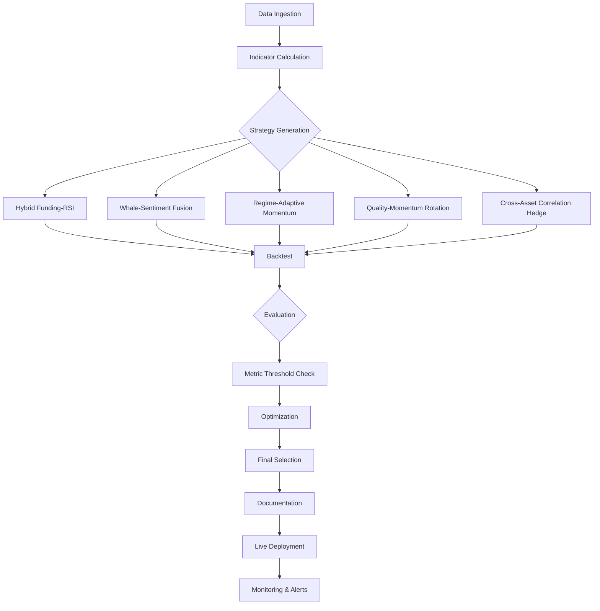

# Crypto Prediction Strategy Development Plan

## 1. Analysis Summary
- Reviewed existing strategy inventory, selection committee criteria, and forward‑test results.
- Top forward‑tested (Tier 1) strategies:
  1. **Funding Rate Arbitrage** – market‑neutral carry, high Sharpe, low drawdown.
  2. **Pairs Trading (Cointegration)** – statistical arbitrage, moderate Sharpe.
  3. **Betting Against Beta (BAB)** – equity factor, decent expectancy.
  4. **Flash Crash Reversal** – event‑driven, strong short‑term spikes.
  5. **Quality Minus Junk (QMJ)** – value‑based, stable long‑term.
- Key performance gaps: fragmented signals, limited universal patterns, need better risk controls.

## 2. Key Indicators by Horizon
| Horizon | Primary Indicators (derived from top strategies & research) |
|---------|-----------------------------------------------------------|
| **1‑2 h (short‑term spike)** | - **Funding Rate** (extreme negative values)   - **Order‑book imbalance** (large buy‑side pressure)   - **On‑chain whale inflow** (large wallet transfers)   - **RSI < 30** combined with **volume surge**   - **Micro‑structure volatility spikes** (ATR jump) |
| **24‑48 h (intraday‑to‑daily)** | - **Funding Rate trend** (sustained negative)   - **Sentiment extremes** (Fear & Greed < 25)   - **Moving‑average crossovers** (short‑MA crossing above 200‑MA)   - **Order‑flow delta** (persistent net buying)   - **On‑chain exchange inflow/outflow ratios** |
| **1 month (medium‑term trend)** | - **Macro regime detection** (VIX, DXY, USD strength)   - **Mean‑reversion signals** (Hurst < 0.4, Bollinger lower band)   - **Quality‑Minus‑Junk metrics** (gross profitability, earnings quality)   - **Momentum‑adjusted RSI** (Connors RSI)   - **Cross‑asset correlation shifts** (crypto‑equity beta) |

## 3. New Strategy Concepts
1. **Hybrid Funding‑RSI Spike** – Enter long when funding < ‑0.01 % **AND** RSI < 35 with volume > 3× average (1‑hour window). Exit on funding > 0.01 % or RSI > 45.
2. **On‑Chain Whale‑Sentiment Fusion** – Combine whale‑wallet inflow (> 5 % of supply) with Fear & Greed < 25 to trigger short‑term long positions.
3. **Regime‑Adaptive Momentum** – Use VIX‑derived regime filter; in high‑vol regime apply Flash‑Crash‑Reversal logic, otherwise use Connors‑RSI‑Momentum.
4. **Quality‑Momentum Rotation** – Monthly re‑balance between QMJ‑style value and high‑momentum crypto (DeFi vs Layer‑1) based on Sharpe‑adjusted scores.
5. **Cross‑Asset Correlation Hedge** – Pair crypto long with equity short (or vice‑versa) when correlation > 0.6 to reduce drawdown.

## 4. Backtesting Framework
- Leverage `backtest_framework.py` and `backtest_engine.py`.
- Create a **parameter grid** for each concept (funding thresholds, RSI periods, volume multipliers, regime windows).
- Use **walk‑forward validation** with a 48‑bar gap to avoid look‑ahead bias.
- Store results in `backtest_results/` (CSV & JSON) for later analysis.

## 5. Evaluation Metrics
- **Sharpe > 1.2**, **Max Drawdown < 15 %**, **Win Rate > 55 %** for short‑term.
- **Profit Factor > 1.5**, **Sortino > 1.0** for medium‑term.
- **Correlation to existing Tier 1** < 0.3 to ensure diversification.
- Use **Monte‑Carlo risk simulations** (`alpha_engine/validation/monte_carlo.py`).

## 6. Optimization & Holding Periods
- Apply **Kelly‑fraction sizing** with volatility targeting (15 % annualized).
- Optimize **holding period** per strategy via backtest sweep (1 h, 4 h, 24 h, 7 d).
- Use **position‑size limits** (max 2 % portfolio per trade) and **circuit‑breaker** (stop after 10 % loss).

## 7. Documentation & Deployment
- Record final metrics in `CRYPTO_PREDICTION_IMPROVEMENT_PLAN.md`.
- Generate a **deployment checklist** (risk limits, monitoring dashboards, alert thresholds).
- Create a **Mermaid workflow diagram** for the end‑to‑end pipeline.

## 8. Next Steps
1. Implement the indicator pipelines (funding, RSI, on‑chain, sentiment).
2. Code the five new strategy classes under `alpha_engine/strategies/`.
3. Run the backtesting grid and walk‑forward analysis.
4. Evaluate and prune based on the metrics above.
5. Update the improvement plan and prepare deployment.

*All steps are aligned with the existing architecture and risk‑management guidelines.*
