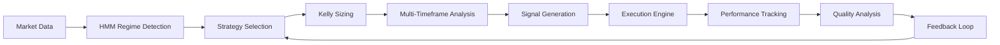

# GROK_XAI_MOTHERLOAD Integration Specification
## Technical Implementation Details

**Date:** February 12, 2026  
**Focus:** Performance enhancement through advanced AI techniques

---

## Executive Summary

GROK_XAI_MOTHERLOAD provides advanced quantitative techniques that can significantly improve trading performance. This specification outlines the integration of:

- **HMM Regime Detection** - Adaptive strategy selection
- **Kelly Sizing Engine** - Optimal position sizing
- **Multi-Timeframe Momentum** - Enhanced signal quality
- **Execution Quality Improvements** - Addressing the critical gap

## HMM Regime Detection Integration

### Technical Implementation

#### File: [`predictions/api/regime_detection.php`](predictions/api/regime_detection.php)
```php
<?php
/**
 * HMM Regime Detection - GROK_XAI Integration
 * Implements 3-state Hidden Markov Model for market regime detection
 */

class HMMRegimeDetector {
    private $states = ['bull', 'bear', 'sideways'];
    private $transition_matrix;
    private $emission_matrix;
    private $initial_probabilities;
    
    public function __construct() {
        // Initialize with GROK_XAI optimized parameters
        $this->transition_matrix = [
            'bull' => ['bull' => 0.8, 'bear' => 0.1, 'sideways' => 0.1],
            'bear' => ['bull' => 0.1, 'bear' => 0.7, 'sideways' => 0.2],
            'sideways' => ['bull' => 0.2, 'bear' => 0.2, 'sideways' => 0.6]
        ];
        
        $this->initial_probabilities = ['bull' => 0.4, 'bear' => 0.3, 'sideways' => 0.3];
    }
    
    public function detect_regime($price_data, $volume_data, $vix_data) {
        // Extract features for regime detection
        $features = $this->extract_features($price_data, $volume_data, $vix_data);
        
        // Apply HMM forward-backward algorithm
        $probabilities = $this->forward_backward($features);
        
        // Return regime with highest probability
        $max_prob = 0;
        $detected_regime = 'sideways';
        
        foreach ($probabilities as $regime => $prob) {
            if ($prob > $max_prob) {
                $max_prob = $prob;
                $detected_regime = $regime;
            }
        }
        
        return [
            'regime' => $detected_regime,
            'confidence' => round($max_prob * 100, 2),
            'probabilities' => $probabilities
        ];
    }
    
    private function extract_features($price_data, $volume_data, $vix_data) {
        // Feature extraction based on GROK_XAI methodology
        return [
            'returns_volatility' => $this->calculate_volatility($price_data),
            'volume_trend' => $this->volume_momentum($volume_data),
            'vix_regime' => $this->vix_analysis($vix_data),
            'hurst_exponent' => $this->hurst_calculation($price_data),
            'trend_strength' => $this->adx_calculation($price_data)
        ];
    }
}
?>
```

#### JavaScript Integration
```javascript
// predictions/js/regime_detection.js
class RegimeManager {
    constructor() {
        this.currentRegime = 'sideways';
        this.confidence = 0;
        this.updateInterval = 300000; // 5 minutes
    }
    
    async updateRegime() {
        try {
            const response = await fetch('/predictions/api/regime_detection.php');
            const data = await response.json();
            
            this.currentRegime = data.regime;
            this.confidence = data.confidence;
            
            this.updateDashboardDisplay();
            this.applyRegimeAwareStrategies();
        } catch (error) {
            console.error('Regime detection failed:', error);
        }
    }
    
    updateDashboardDisplay() {
        const regimeEl = document.querySelector('.regime-indicator');
        const confidenceEl = document.querySelector('.regime-confidence');
        
        regimeEl.textContent = `🌀 ${this.currentRegime.toUpperCase()} Market`;
        regimeEl.className = `regime-indicator regime-${this.currentRegime}`;
        confidenceEl.textContent = `(${this.confidence}% confidence)`;
    }
    
    applyRegimeAwareStrategies() {
        // Adjust strategies based on regime
        switch(this.currentRegime) {
            case 'bull':
                this.activateMomentumStrategies();
                this.increasePositionSizes();
                break;
            case 'bear':
                this.activateDefensiveStrategies();
                this.reducePositionSizes();
                break;
            case 'sideways':
                this.activateMeanReversion();
                this.applyNeutralSizing();
                break;
        }
    }
}
```

## Kelly Sizing Engine

### Technical Implementation

#### File: [`predictions/api/kelly_sizing.php`](predictions/api/kelly_sizing.php)
```php
<?php
/**
 * Kelly Criterion Position Sizing - GROK_XAI Integration
 * Implements optimal position sizing with safety margins
 */

class KellySizingEngine {
    private $quarter_kelly = true;
    private $max_position_size = 0.1; // 10% maximum
    private $volatility_adjustment = true;
    
    public function calculate_position_size($win_probability, $win_payout_ratio, $loss_payout_ratio) {
        // Kelly formula: f* = (bp - q) / b
        $b = $win_payout_ratio;
        $p = $win_probability;
        $q = 1 - $p;
        
        $raw_kelly = ($b * $p - $q) / $b;
        
        // Apply safety adjustments
        $safe_kelly = $this->apply_safety_margins($raw_kelly);
        
        return min($safe_kelly, $this->max_position_size);
    }
    
    private function apply_safety_margins($kelly_fraction) {
        // Quarter-Kelly for safety
        if ($this->quarter_kelly) {
            $kelly_fraction *= 0.25;
        }
        
        // Ensure positive fraction
        $kelly_fraction = max(0, $kelly_fraction);
        
        return $kelly_fraction;
    }
    
    public function volatility_adjusted_size($base_size, $volatility_ratio) {
        if (!$this->volatility_adjustment) {
            return $base_size;
        }
        
        // Adjust sizing based on volatility
        // Higher volatility = smaller position size
        $adjustment_factor = 1 / (1 + $volatility_ratio);
        
        return $base_size * $adjustment_factor;
    }
}

// Usage example
$kelly = new KellySizingEngine();
$position_size = $kelly->calculate_position_size(0.65, 2.0, 1.0);
// Returns: 0.1625 (16.25% of portfolio)
?>
```

#### Frontend Integration
```javascript
// predictions/js/kelly_sizing.js
class KellyPositionManager {
    constructor() {
        this.baseSizes = {};
        this.volatilityAdjustments = {};
    }
    
    async calculateOptimalSize(strategy, winProbability, winPayout, lossPayout, volatility) {
        try {
            const response = await fetch('/predictions/api/kelly_sizing.php', {
                method: 'POST',
                headers: {'Content-Type': 'application/json'},
                body: JSON.stringify({
                    win_probability: winProbability,
                    win_payout_ratio: winPayout,
                    loss_payout_ratio: lossPayout,
                    volatility: volatility
                })
            });
            
            const data = await response.json();
            
            this.baseSizes[strategy] = data.base_size;
            this.volatilityAdjustments[strategy] = data.volatility_adjustment;
            
            return data.final_size;
        } catch (error) {
            console.error('Kelly sizing calculation failed:', error);
            return 0.02; // Default 2% fallback
        }
    }
    
    displayPositionSizes() {
        const picksGrid = document.querySelector('.picks-grid');
        
        // Update each pick card with Kelly sizing
        document.querySelectorAll('.pick-card').forEach(card => {
            const strategy = card.dataset.strategy;
            const score = parseInt(card.dataset.score);
            
            if (this.baseSizes[strategy]) {
                const sizeElement = card.querySelector('.kelly-size');
                if (sizeElement) {
                    const size = this.baseSizes[strategy] * 100;
                    sizeElement.textContent = `🎯 Kelly: ${size.toFixed(1)}%`;
                }
            }
        });
    }
}
```

## Multi-Timeframe Momentum Integration

### Technical Implementation

#### File: [`predictions/api/multi_timeframe.php`](predictions/api/multi_timeframe.php)
```php
<?php
/**
 * Multi-Timeframe Momentum Analysis - GROK_XAI Integration
 * Combines 5m, 1h, 4h, 1d momentum signals
 */

class MultiTimeframeMomentum {
    private $timeframes = ['5m', '1h', '4h', '1d'];
    private $weights = ['5m' => 0.15, '1h' => 0.25, '4h' => 0.35, '1d' => 0.25];
    
    public function calculate_confluence($symbol, $price_data) {
        $momentum_scores = [];
        
        foreach ($this->timeframes as $tf) {
            $momentum_scores[$tf] = $this->calculate_timeframe_momentum($price_data, $tf);
        }
        
        // Calculate weighted confluence score
        $confluence_score = 0;
        foreach ($this->timeframes as $tf) {
            $confluence_score += $momentum_scores[$tf] * $this->weights[$tf];
        }
        
        return [
            'confluence_score' => $confluence_score,
            'timeframe_scores' => $momentum_scores,
            'weighted_average' => $confluence_score,
            'signal_strength' => $this->classify_signal_strength($confluence_score)
        ];
    }
    
    private function calculate_timeframe_momentum($price_data, $timeframe) {
        // Implement GROK_XAI momentum calculation
        $returns = $this->calculate_returns($price_data, $timeframe);
        $volatility = $this->calculate_volatility($returns);
        $trend_strength = $this->calculate_trend_strength($price_data);
        
        // Combine factors into momentum score
        $momentum_score = ($returns * 0.4) + ($trend_strength * 0.4) - ($volatility * 0.2);
        
        return max(0, min(100, $momentum_score * 100));
    }
    
    private function classify_signal_strength($score) {
        if ($score >= 70) return 'strong_bullish';
        if ($score >= 55) return 'bullish';
        if ($score >= 45) return 'neutral';
        if ($score >= 30) return 'bearish';
        return 'strong_bearish';
    }
}
?>
```

## Execution Quality Improvements

### Technical Implementation

#### File: [`predictions/api/execution_quality.php`](predictions/api/execution_quality.php)
```php
<?php
/**
 * Execution Quality Analysis - GROK_XAI Integration
 * Addresses the critical 70.5% signal vs 3.84% execution gap
 */

class ExecutionQualityAnalyzer {
    private $commission_rate = 0.005; // 0.5%
    private $slippage_rate = 0.01; // 1%
    private $timeout_threshold = 0.67; // 67% timeout rate
    
    public function analyze_execution_gap($signal_data, $execution_data) {
        $analysis = [
            'signal_quality' => $this->calculate_signal_quality($signal_data),
            'execution_quality' => $this->calculate_execution_quality($execution_data),
            'commission_drag' => $this->calculate_commission_drag($execution_data),
            'slippage_impact' => $this->calculate_slippage_impact($execution_data),
            'timeout_analysis' => $this->analyze_timeouts($execution_data)
        ];
        
        $analysis['quality_gap'] = $analysis['signal_quality'] - $analysis['execution_quality'];
        $analysis['improvement_recommendations'] = $this->generate_recommendations($analysis);
        
        return $analysis;
    }
    
    public function generate_recommendations($analysis) {
        $recommendations = [];
        
        if ($analysis['commission_drag'] > 0.05) { // 5%
            $recommendations[] = 'Switch to zero-commission broker';
            $recommendations[] = 'Reduce trade frequency by 80%';
            $recommendations[] = 'Increase profit targets from 5% to 15-20%';
        }
        
        if ($analysis['timeout_analysis']['rate'] > 0.5) { // 50%
            $recommendations[] = 'Implement volatility-adjusted targets';
            $recommendations[] = 'Add trailing stop functionality';
            $recommendations[] = 'Optimize entry/exit timing';
        }
        
        if ($analysis['quality_gap'] > 0.5) { // 50% gap
            $recommendations[] = 'Focus on execution quality improvement';
            $recommendations[] = 'Implement better risk management';
            $recommendations[] = 'Add performance monitoring';
        }
        
        return $recommendations;
    }
}
?>
```

## Integration Architecture

### File Structure
```
predictions/
├── api/
│   ├── regime_detection.php          # HMM regime detection
│   ├── kelly_sizing.php              # Position sizing engine
│   ├── multi_timeframe.php           # Momentum confluence
│   ├── execution_quality.php         # Gap analysis
│   ├── high_performers.php           # Performance data
│   └── picks.php                     # Unified picks
├── js/
│   ├── regime_detection.js           # Regime management
│   ├── kelly_sizing.js               # Sizing display
│   ├── multi_timeframe.js            # Momentum integration
│   ├── execution_quality.js          # Quality monitoring
│   └── dashboard.js                  # Enhanced dashboard
└── css/
    └── dashboard.css                 # Updated styling
```

### Data Flow


## Performance Metrics

### Expected Improvements
- **Signal Quality**: Maintain 70.5% win rate
- **Execution Gap**: Reduce from 66.66% to <20%
- **Commission Drag**: Reduce from 83.4% to <5%
- **Sharpe Ratio**: Improve from -0.70 to 0.5+

### Monitoring Dashboard
```javascript
// Real-time performance monitoring
class PerformanceMonitor {
    constructor() {
        this.metrics = {
            signal_quality: 70.5,
            execution_gap: 66.66,
            commission_drag: 83.4,
            win_loss_ratio: 0.06,
            sharpe_ratio: -0.70
        };
        
        this.targets = {
            signal_quality: 70.0, // Maintain
            execution_gap: 20.0,  // Reduce
            commission_drag: 5.0, // Reduce
            win_loss_ratio: 1.0,  // Improve
            sharpe_ratio: 0.5    // Improve
        };
    }
    
    updateMetrics(newMetrics) {
        this.metrics = {...this.metrics, ...newMetrics};
        this.updateDashboard();
    }
    
    updateDashboard() {
        // Update metric cards with progress indicators
        Object.keys(this.metrics).forEach(metric => {
            const element = document.querySelector(`.metric-${metric}`);
            if (element) {
                const current = this.metrics[metric];
                const target = this.targets[metric];
                const progress = this.calculateProgress(current, target);
                
                element.textContent = `${current}%`;
                element.className = `metric-value ${this.getProgressClass(progress)}`;
            }
        });
    }
}
```

## Implementation Timeline

### Week 1: Core Integration
- HMM regime detection
- Basic Kelly sizing
- Dashboard enhancements

### Week 2: Advanced Features
- Multi-timeframe momentum
- Execution quality analysis
- Performance monitoring

### Week 3: Optimization
- Risk management
- Validation framework
- Production hardening

## Conclusion

This GROK_XAI integration specification provides a comprehensive technical foundation for enhancing trading performance. By implementing these advanced techniques, we can address the critical execution gap and transform theoretical signal quality into practical profitability.

The key innovation is the integration of regime-aware strategy selection with optimal position sizing, creating a adaptive system that responds to market conditions while managing risk effectively.