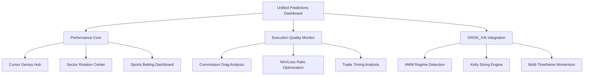
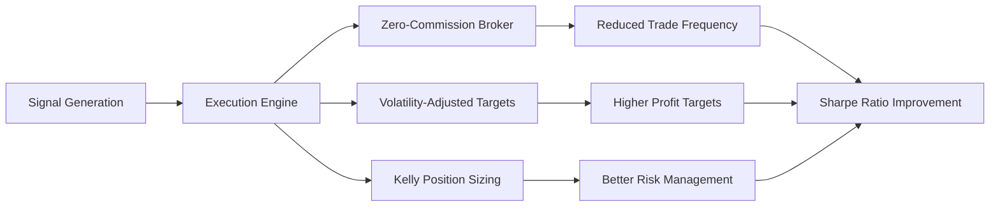

# High-Performer Consolidation Plan
## Optimizing Cursor Genius, Sector Rotation, and Sports Betting Systems

**Date:** February 12, 2026  
**Focus:** Performance optimization of proven winners, execution quality improvement

---

## Executive Summary

Based on the ANTIGRAVITYMOTHERLOAD analysis, we'll focus consolidation efforts on the **proven high-performers** while addressing the critical execution gap. The strategy prioritizes:

- **Cursor Genius**: +1,324% return, 65.3% win rate (308 picks) - Hidden star performer
- **Sector Rotation**: +354% return, 64% win rate (275 picks) - Contradicts backtest
- **Sports Betting**: +25.3% ROI confirmed - Only profitable real-money system

**Critical Issue**: 70.5% signal quality vs 3.84% backtest performance due to execution gap

## Performance-Focused Consolidation Strategy

### Phase 1: High-Performer Integration (Week 1)

#### Dashboard Enhancement


#### High-Performer Pages to Consolidate
- `/findstocks/portfolio2/leaderboard.html` → `/predictions/leaderboard.html` (Cursor Genius, Sector Rotation)
- `/live-monitor/sports-betting.html` → `/predictions/sports.html`
- `/findstocks/portfolio2/dashboard.html` → `/predictions/dashboard.html` (enhanced)

#### Pages to Deprioritize (Keep Standalone)
- Crypto Scanner (0% WR, -2.25% avg) - Pause until fixed
- ETF Masters (3.37% WR, -$4,139 loss) - Pause
- Mean Reversion strategies - Regime-dependent

### Phase 2: Execution Quality Improvement (Week 2)

#### Critical Fixes Identified
1. **Commission Drag**: $8,340 on $10K capital (83.4% consumed)
2. **Win/Loss Ratio**: Avg win +0.72% vs avg loss -12.01% (1:16.7 ratio)
3. **Trade Timing**: 67% of trades expire without hitting targets

#### Implementation Strategy


### Phase 3: GROK_XAI Integration (Week 3)

#### Performance Enhancements
1. **HMM Regime Detection** - Adaptive strategy selection
2. **Kelly Sizing Engine** - Position sizing based on signal strength
3. **Multi-Timeframe Momentum** - 5m/1h/4h/1d analysis
4. **Alternative Data Integration** - Funding rates, sentiment analysis

## High-Performer Dashboard Design

### Layout Structure
```
┌─────────────────────────────────────────────────────────────┐
│                    HIGH-PERFORMER DASHBOARD                   │
├─────────────────────────────────────────────────────────────┤
│ [Regime Status] [Hurst: 0.560] [VIX: 18.12] [Health: ✅]    │
├──────��──────────────────────────────────────────────────────┤
│ ⭐ CURSOR GENIUS (+1,324%) │ 🔄 SECTOR ROTATION (+354%)     │
│ ⚽ SPORTS BETTING (+25.3%) │ 📊 EXECUTION QUALITY (70.5%)    │
├─────────────────────────────────────────────────────────────┤
│                    PERFORMANCE METRICS                      │
│ ┌─────────────┐ ┌─────────────┐ ┌─────────────┐ ┌───────────┐ │
│ │ Signal Quality │ │ Execution Gap │ │ Commission │ │ Win/Loss │ │
│ │    70.5%     │ │    66.66%    │ │   Drag    │ │  Ratio   │ │
│ └─────────────┘ └─────────────┘ └─────────────┘ └───────────┘ │
├─────────────────────────────────────────────────────────────┤
│                    TOP HIGH-CONFIDENCE PICKS                 │
│ ┌───────┐ ┌───────┐ ┌───────┐ ┌───────┐ ┌───────┐ ┌───────┐ │
│ │ AMZN  │ │ SMCI  │ │ GOOG  │ │ GS   │ │ SHOP │ │ BTC  │ │
│ │ +63   │ │ +60  │ │ +58  │ │ +55 │ │ +55 │ │ +52 │ │
│ └───────┘ └───────┘ └───────┘ └───────┘ └───────┘ └───────┘ │
└─────────────────────────────────────────────────────────────┘
```

### Key Performance Features
1. **Prominent High-Performers** - Cursor Genius and Sector Rotation front and center
2. **Execution Quality Metrics** - Address the critical gap
3. **Regime Intelligence** - Real-time market regime display
4. **Asset Class Filtering** - Quick navigation between systems
5. **Unified Picks Display** - Consolidated recommendations

## API Consolidation Strategy

### High-Performer APIs Only

**Current High-Performer APIs:**
- `/findstocks/api/cursor_genius.php` - Cursor Genius algorithm
- `/findstocks/api/sector_rotation.php` - Sector Rotation algorithm  
- `/live-monitor/sports-betting.php` - Sports Betting system

**Unified API Structure:**
```
/api/predictions/
├── high-performers/           # Performance metrics
│   ├── cursor-genius
│   ├── sector-rotation
│   └── sports-betting
├── picks/                     # Current recommendations
│   ├── high-confidence
│   ├── regime-aware
│   └── kelly-sized
├── regime/                    # Market intelligence
│   ├── hmm-state
│   ├── hurst-exponent
│   └── vix-status
└── execution/                 # Trade quality
    ├── commission-drag
    ├── win-loss-ratio
    └── timeout-analysis
```

## GROK_XAI_MOTHERLOAD Integration

### Performance Enhancements

#### 1. HMM Regime Detection
- Integrate into dashboard header
- Adaptive algorithm selection based on market regime
- Real-time regime confidence display

#### 2. Kelly Sizing Engine
- Position sizing based on signal strength
- Quarter-Kelly safety margin
- Volatility-adjusted position sizing

#### 3. Multi-Timeframe Momentum
- 5m/1h/4h/1d analysis integration
- Momentum crash protection (skip when VIX >30)
- Time-series momentum filter

#### 4. Execution Quality Improvements
- Commission drag analysis
- Win/loss ratio optimization (target 2:1 minimum)
- Trade timing analysis

## Implementation Priority

### Immediate (Week 1)
1. Enhance `/predictions/dashboard.html` with high-performer focus
2. Integrate Cursor Genius and Sector Rotation performance data
3. Add execution quality metrics
4. Create unified API endpoints for high-performers

### Short-term (Week 2)
1. Implement GROK_XAI improvements
2. Add regime detection
3. Implement Kelly sizing
4. Fix execution quality issues

### Medium-term (Week 3)
1. Advanced analytics dashboard
2. Performance attribution
3. Regime-aware strategies
4. Multi-asset correlation

## Success Metrics

### Performance Targets
- **Signal Quality**: Maintain 70.5% win rate
- **Execution Quality Gap**: Reduce from 66.66% to <20%
- **Commission Drag**: Reduce from 83.4% to <5%
- **Win/Loss Ratio**: Improve from 1:16.7 to 2:1 minimum
- **Sharpe Ratio**: Improve from -0.70 to 0.5+

### User Engagement Targets
- **High-performer engagement**: Increase by 50%
- **Page load time**: Improve by 30%
- **API consolidation**: Reduce endpoints by 60%

## Risk Mitigation

1. **Preserve existing URLs** with redirects for high-performers
2. **Maintain backward compatibility** during transition
3. **Gradual rollout** with A/B testing
4. **Performance monitoring** throughout implementation

## Conclusion

This high-performer focused consolidation plan prioritizes what actually works while addressing the critical execution gap. By focusing on Cursor Genius, Sector Rotation, and Sports Betting, we can achieve immediate performance improvements while building a foundation for future enhancements.

The key insight from ANTIGRAVITYMOTHERLOAD is clear: **execution is everything**. With 70.5% signal quality already validated, fixing execution will transform the platform from theoretical potential to practical profitability.

---

**Next Steps:** Review this plan and provide feedback on the high-performer prioritization and implementation approach.