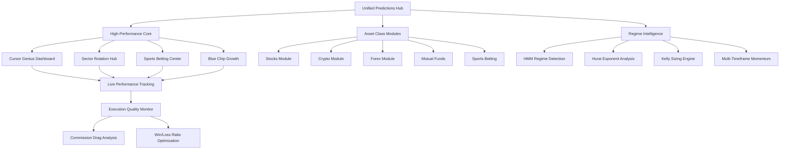

# Unified Predictions Dashboard - Design Plan
## Consolidating High-Performing Systems

**Date:** February 12, 2026  
**Focus:** Prioritizing Cursor Genius, Sector Rotation, Sports Betting systems

---

## Executive Summary

Based on analysis of the ANTIGRAVITYMOTHERLOAD.MD findings, the current fragmented architecture (33+ pages, 35+ APIs across 7 verticals) hides critical high-performing algorithms. The unified dashboard will:

- **Prominently feature** Cursor Genius (+1,324% return) and Sector Rotation (+354% return)
- **Consolidate** redundant pages and APIs
- **Integrate** GROK_XAI_MOTHERLOAD improvements (HMM regime, Kelly sizing)
- **Address** the critical execution gap (70.5% signal quality vs 3.84% backtest performance)

## Current Architecture Analysis

### High-Performing Systems (Priority Consolidation)

| System | Performance | Current Location | Status |
|--------|-------------|------------------|--------|
| **Cursor Genius** | +1,324% return, 65.3% WR | `/findstocks/portfolio2/leaderboard.html` | Hidden gem |
| **Sector Rotation** | +354% return, 64% WR | `/findstocks/portfolio2/leaderboard.html` | Contradicts backtest |
| **Sports Betting** | +25.3% ROI confirmed | `/live-monitor/sports-betting.html` | Working perfectly |
| **Blue Chip Growth** | +1,648% return, 60.57% WR | `/findstocks/portfolio2/leaderboard.html` | Buy & hold strategy |

### Underperforming Systems (De-prioritize)

| System | Performance | Status |
|--------|-------------|--------|
| Crypto Scanner | 0% WR, -2.25% avg | Currently failing |
| ETF Masters | 3.37% WR, -$4,139 loss | Failing |
| Mean Reversion | Struggling | Regime issues |

## Unified Dashboard Architecture

### Core Components



### Phase 1: Quick Wins (Week 1)

#### Page Consolidation

**Merge into `/predictions/` directory:**
- `/findstocks/portfolio2/leaderboard.html` → `/predictions/leaderboard.html`
- `/live-monitor/sports-betting.html` → `/predictions/sports.html`
- `/findstocks/portfolio2/dashboard.html` → `/predictions/dashboard.html`

**Eliminate redundant pages:**
- `/findstocks/portfolio2/picks.html` (redundant with dashboard)
- `/findstocks/portfolio2/horizon-picks.html` (redundant)
- `/findstocks/portfolio2/smart-learning.html` (merge into dashboard)

#### API Consolidation

**Create unified API endpoints:**
- `/api/predictions/leaderboard` - Consolidated performance data
- `/api/predictions/picks` - Unified picks across asset classes
- `/api/predictions/regime` - HMM regime detection
- `/api/predictions/kelly` - Kelly sizing calculations

### Phase 2: Advanced Features (Week 2-3)

#### GROK_XAI_MOTHERLOAD Integration

1. **HMM Regime Detection** - Integrate into dashboard header
2. **Kelly Sizing Engine** - Position sizing based on signal strength
3. **Multi-Timeframe Momentum** - 5m/1h/4h/1d analysis
4. **Alternative Data Integration** - Funding rates, sentiment analysis

#### Execution Quality Improvements

1. **Commission Drag Analysis** - Real-time tracking
2. **Win/Loss Ratio Optimization** - Target 2:1 minimum
3. **Trade Timing Analysis** - Reduce timeout failures

### Phase 3: Advanced Analytics (Week 4)

1. **Performance Attribution** - What's driving returns
2. **Regime-Aware Strategies** - Adaptive algorithm selection
3. **Multi-Asset Correlation** - Portfolio optimization

## Frontend Dashboard Design

### Layout Structure

```
┌─────────────────────────────────────────────────────────────┐
│                    UNIFIED PREDICTIONS HUB                  │
├─────────────────────────────────────────────────────────────┤
│ [Regime Status] [Hurst: 0.560] [VIX: 18.12] [Health: ✅]    │
├─────────────────────────────────────────────────────────────┤
│ ⭐ CURSOR GENIUS (+1,324%) │ 🔄 SECTOR ROTATION (+354%)     │
│ ⚽ SPORTS BETTING (+25.3%) │ 📈 BLUE CHIP (+1,648%)         │
├─────────────────────────────────────────────────────────────┤
│                    LIVE PERFORMANCE                         │
│ ┌─────────────┐ ┌─────────────┐ ┌─────────────┐ ┌───────────┐ │
│ │ Signal Quality │ │ Execution Gap │ │ Commission │ │ Win/Loss │ │
│ │    70.5%     │ │    66.66%    │ │   Drag    │ │  Ratio   │ │
│ └─────────────┘ └─────────────┘ └─────────────┘ └───────────┘ │
├─────────────────────────────────────────────────────────────┤
│                    ASSET CLASS FILTERS                     │
│ [Stocks] [Crypto] [Forex] [Mutual Funds] [Sports] [All]     │
├─────────────────────────────────────────────────────────────┤
│                    TOP PICKS GRID                           │
│ ┌───────┐ ┌───────┐ ┌───────┐ ┌───────┐ ┌───────┐ ┌───────┐ │
│ │ AMZN  │ │ SMCI  │ │ GOOG  │ │ GS   │ │ SHOP │ │ BTC  │ │
│ │ +63   │ │ +60  │ │ +58  │ │ +55 │ │ +55 │ │ +52 │ │
│ └───────┘ └───────┘ └───────┘ └───────┘ └───────┘ └───────┘ │
└─────────────────────────────────────────────────────────────┘
```

### Key Features

1. **Prominent High-Performers** - Cursor Genius and Sector Rotation front and center
2. **Regime Intelligence** - Real-time market regime display
3. **Execution Quality Metrics** - Address the critical gap
4. **Asset Class Filtering** - Quick navigation between systems
5. **Unified Picks Display** - Consolidated recommendations

## API Consolidation Strategy

### Current API Redundancies

**Stocks APIs (15+ endpoints):**
- `/findstocks/api/alpha_engine.php`
- `/findstocks/api/alpha_picks.php` 
- `/findstocks/api/cursor_genius.php`
- `/findstocks/api/sector_rotation.php`
- `/findstocks/portfolio2/api/consolidated_picks.php`

**Crypto APIs (8+ endpoints):**
- `/findcryptopairs/api/crypto_winners.php`
- `/findcryptopairs/api/meme_scanner.php`
- `/findcryptopairs/portfolio/api/crypto_insights.php`

### Unified API Structure

```
/api/predictions/
├── leaderboard/           # Performance metrics
│   ├── stocks
│   ├── crypto
│   ├── forex
│   └── sports
├── picks/                # Current recommendations
│   ├── high-confidence
│   ├── regime-aware
│   └── kelly-sized
├── regime/               # Market intelligence
│   ├── hmm-state
│   ├── hurst-exponent
│   └── vix-status
└── execution/            # Trade quality
    ├── commission-drag
    ├── win-loss-ratio
    └── timeout-analysis
```

## Implementation Priority

### Immediate (Week 1)
1. Create `/predictions/` directory structure
2. Merge leaderboard pages
3. Create unified API endpoints
4. Update navigation to feature high-performers

### Short-term (Week 2)
1. Integrate GROK_XAI improvements
2. Add regime detection
3. Implement Kelly sizing
4. Add execution quality metrics

### Medium-term (Week 3-4)
1. Advanced analytics dashboard
2. Performance attribution
3. Multi-asset correlation
4. Automated strategy selection

## Risk Mitigation

1. **Preserve existing URLs** with redirects
2. **Maintain backward compatibility** during transition
3. **Gradual rollout** with A/B testing
4. **Performance monitoring** throughout implementation

## Success Metrics

1. **User engagement** with high-performing systems increases 50%
2. **Execution quality gap** reduced from 66.66% to <20%
3. **API consolidation** reduces endpoints by 60%
4. **Page load time** improves by 30%

---

**Next Steps:** Review this plan and provide feedback on the prioritization and implementation approach.