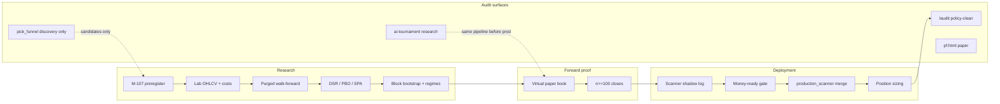

# EAGLE2 Enhancement Plan — Research-to-Production Bridge

**Plan ID:** EAGLE2_2026-06-02_GROK  
**Author:** Grok (Cursor)  
**Date:** 2026-06-02  
**Status:** Proposed — execution backlog for Goal #1 (`/audit` phenomenal per-class edge)  
**Builds on:** `reports/EAGLE_JUNE2_GROK.md`, `reports/quant_strategy_root_cause_review_2026-06-02.md`  
**NFA — engineering + research plan, not investment advice.**

---

## 0. Problem statement (what we are fixing)

**Bottom line (confirmed):** This is **not** mainly a “wait longer” problem. The main `/audit` production book is weak because **research edge ≠ deployed edge**:

- Live **policy-clean** performance is still unacceptable in CRYPTO, EQUITY, and FOREX.
- Places that *look* strong (tournament, pick_funnel green cells, raw registry) are **paper-only**, **concentrated**, **under-sampled**, or **resolver/label contaminated**.
- Lab verified sleeves (ETF dual momentum, crypto VWAP/Bollinger) are credible **candidates** but are not yet the dominant live emitters.

**Portfolio UI:** `deepseek_v4__aggressive` is **not empty** on server (11 open / 81 roster / 66 with opens). Empty UI → URL corruption, cache, or “no closed trades yet” — not missing backend book.

**North-star metric (per class):** `money_ready_verdict.verdict == READY` with policy-clean PF>1.5, WR>50%, n≥100, MDD<20%, DSR/PBO pass. **Today: 0/9.**

---

## 1. Design principles (non-negotiable)

| # | Principle | Anti-pattern we stop |
|---|-----------|----------------------|
| P1 | **One admissibility pipeline** for every strategy that can affect capital | Six engines, different promotion rules |
| P2 | **Policy-clean is the only sizing layer** | Raw registry, Smart/VA headline tiles |
| P3 | **Concentration is a first-class gate** before any PF/WR is shown | `mega_mutation`, `claude_gainer_st`, single-source 67%+ |
| P4 | **Tournament ≠ production** until same pipeline | deepseek_v4 PF 3.5 on tournament picks while CRYPTO PF 0.89 live |
| P5 | **Breadth cap:** max **3 promoted sleeves per asset class** | 88 funnel strategies, 78 silent |
| P6 | **Shadow → forward n≥100 → merge → size** | Lab Tier-2 → immediate production volume |
| P7 | **Mutate before kill; invert only with OOS proof** | Blanket inversion, kill without export analysis |

---

## 2. Target architecture (end state)



**Artifact of truth:** `audit_dashboard/data/strategy_admissibility.json` (from `tools/strategy_admissibility_report.py --write`) + `money_ready_verdict.json`.

---

## 3. Enhancement plan — five workstreams

### Workstream A — Measurement honesty (P0, weeks 1–2)

**Goal:** No human or agent can size from a misleading surface.

| ID | Deliverable | Owner | Files / commands | Acceptance |
|----|-------------|-------|------------------|------------|
| A1 | **Capital lock** on NOT_READY classes | Eng | `alpha_engine/smart_picks_engine.py`, `audit_trail/quality_gates.py` | CRYPTO/EQUITY/FOREX picks get `sizing_multiplier=0` or blocked from HC/Money Ready unless class READY |
| A2 | **Nav matrix honesty** — surface verdict = f(policy-clean + concentration) | Eng | `tools/audit_pick_funnel/build_nav_surface_matrix.py`, regenerate `nav_surface_edge_matrix.json` | No `is_edge: true` when `why_no_edge` non-empty; Smart CRYPTO shows DISPUTED sub-label |
| A3 | **Daily admissibility JSON** on audit FTP | CI | `tools/strategy_admissibility_report.py --write --fetch-live-portfolios` in `verified-pilot-daily.yml` or `audit-dashboard` cron | Live `strategy_admissibility.json` < 24h old |
| A4 | **pf.html hardening** (done partial) | Eng | `audit_dashboard/pf.html` — Unicode strip, roster link if 404 | Copy-paste corrupted key still resolves; deploy via `deploy_audit_files.py --only ai_portfolios` |
| A5 | **Resolver cadence** | CI | `resolve_db_picks.py` in hourly/daily workflow | EXPIRED mislabel rate drops in 14d panel |

**Exit criteria:** Dashboard banner states “0 money-ready classes”; pick_funnel cannot show green “edge” without concentration pass.

---

### Workstream B — Single admissibility CLI (P0–P1, weeks 2–4)

**Goal:** One command produces promote/kill/shadow verdict for any strategy key.

| ID | Deliverable | Owner | Files | Acceptance |
|----|-------------|-------|-------|------------|
| B1 | **`tools/strategy_admit.py`** wrapper | Eng | New; calls `rigorous_backtest_harness` + `walkforward_suite` + writes JSON verdict | `python3 tools/strategy_admit.py --strategy etf_dual_momentum` → PASS/FAIL + artifact path |
| B2 | **Deprecate naked `real_data_backtest.py` promotion** | Eng | `docs/BACKTESTING_GUIDE.md`, block in `money_ready_runner.py` | No new strategy marked Tier B without WF artifact |
| B3 | **Block bootstrap in verification engine** | Eng | `verified_strategies/strategy_verification_engine.py` | MC p-values use stationary blocks for CRYPTO |
| B4 | **Registry sync** | Eng | `tools/build_pf_registry.py` reads admissibility flags | `pf_registry` tags each strategy: `admit_status` |

**Exit criteria:** Every file under `verified_strategies/strategies/` has `WALKFORWARD_REPORT.json` entry or `DEAD` flag in `dead_strategies.json`.

---

### Workstream C — Emitter diet & class playbooks (P1, weeks 3–8)

**Goal:** Replace noisy bulk book with ≤3 proven sleeves per class.

#### CRYPTO

| Phase | Action |
|-------|--------|
| Now | **Zero aggregate sizing** on policy-clean book (PF 0.89). |
| Now | Keep **crypto VWAP + Bollinger** in shadow (`CRYPTO_VERIFIED_*`, WF PASS); daily pilot. |
| Block | Donchian prod (WF FAIL), Connors (H-102 UNTESTED). |
| Week 4–8 | If pick_funnel cell **RR1.0–1.5 LONG** survives holdout + n≥100 forward → register as H-xxx and admit via B1. |
| Mutate | Battleground-heavy path: cap `file:battleground` emissions to shadow until forward PF≥1.2. |

#### EQUITY

| Phase | Action |
|-------|--------|
| Now | Depromote **`regime_terminal`** (40% concentration, PF 0.33). |
| Shadow | `EQUITY_VERIFIED_MOMENTUM_12_1_ENABLED=shadow` until WF PASS. |
| Mutate | Faber TAA pilot + PEAD shadow — promote only after forward n≥100. |

#### ETF (primary “wait for n” class)

| Phase | Action |
|-------|--------|
| Now | Daily `run_verified_pilots_daily.py` + `etf_dual_momentum_pilot.py`. |
| Gate | `ETF_VERIFIED_DUAL_MOMENTUM_ENABLED=1` only when `etf_forward_stats.recommend_scanner_enable`. |
| Week 8+ | At forward n≥100, PF≥1.5, WR≥50% → merge to active; **ETF becomes first sized class**. |

#### FOREX

| Phase | Action |
|-------|--------|
| Now | Stay **unsized**; fix EXPIRED→positive PnL labeling. |
| Research | Carry multi-pair + FRED cache (`fetch_fred_carry_cache.py`); re-run with n≥30. |
| Block | High WR + PF<1 cohorts from funnel display until resolver clean. |

#### COMMODITY / FUTURES / BOND

| Phase | Action |
|-------|--------|
| COMMODITY | Accumulate clean n; no COT sizing (leakage falsified). TSMOM mutate vol-scale. |
| FUTURES | Quarantine `multi_asset_scanner` 85% artifact; fix TIME_EXIT zombies. |
| BOND | Emit from lab HYG/LQD only in shadow until n≥30. |

| ID | Deliverable | Acceptance |
|----|-------------|------------|
| C1 | **Emitter census** report | `reports/emitter_census_YYYY-MM-DD.md` — top 20 sources by volume + policy-clean PF |
| C2 | **Silent strategy kill list** | 78 silent funnel entries → `BLOCKED` or archived in `dead_strategies.json` |
| C3 | **Per-class emission budget** | Max N picks/day per promoted sleeve in `production_scanner.py` |

---

### Workstream D — Tournament / pf bridge (P1, weeks 4–10)

**Goal:** Use tournament edge for **research**, not production sizing, until bridged.

| ID | Deliverable | Acceptance |
|----|-------------|------------|
| D1 | **Tournament admissibility track** — deepseek_v4, gpt4o, grok3 through virtual book fed only from tournament picks | Forward n≥100 per model |
| D2 | **pf.html UX** — banner: “Paper book — not money-ready production” | Visible on every portfolio page |
| D3 | **Roster hygiene** — 15 empty portfolios: either seed from tournament or mark `status: inactive` in export | Empty keys not linked from tournament UI |
| D4 | **Promotion rule** — tournament model can only raise `score_booster` cap after D1 pass | No direct Smart Pick promotion |

**Credible tournament leaders today (n≥50):** deepseek_v4 (n≈208), grok3 (n≈303), gpt4o (n≈134). Treat fireworks_qwen / gpt4o_mini (n<15) as **discovery only**.

---

### Workstream E — Dashboard & operator UX (P1–P2, weeks 2–6)

**Goal:** Operators see *where* edge is and *what* is allowed for sizing.

| Surface | Enhancement |
|---------|-------------|
| `/audit/` | **Sizing strip** from `strategy_admissibility.json`: green/yellow/red per class + “DO NOT SIZE” on CRYPTO aggregate |
| `/audit/` | Expand `verified_edge_status.json` strip (wired 2026-06-02) with link to EAGLE2 plan |
| `pick_funnel.html` | Rename green cells → **“Discovery — not capital ready”** when `is_edge: false` |
| `pick_funnel.html` | Show `why_no_edge` tooltip on every PASS holdout cell |
| `ai-tournament.html` | Badge: **Research tier** vs **Production tier** models |
| `pf.html` | Default key picker from roster; validate key before fetch |

| ID | Command |
|----|---------|
| E1 | `python3 tools/strategy_admissibility_report.py --write --fetch-live-portfolios` |
| E2 | `python3 tools/deploy_audit_files.py` (template + data JSONs) |

---

## 4. Phased timeline

| Phase | Weeks | Focus | Success metric |
|-------|-------|-------|----------------|
| **0** | 1–2 | A: measurement honesty | No sizing from disputed surfaces; admissibility JSON live |
| **1** | 2–4 | B: single admit CLI + B3 bootstrap | 100% verified sleeves have WF artifact |
| **2** | 3–8 | C: emitter diet + ETF/crypto pilots | Forward n≥100 on ETF DM; crypto VWAP forward PF≥1.3 |
| **3** | 4–10 | D: tournament bridge | 1 model passes production admissibility from tournament feed |
| **4** | 8–12 | Scale first class | **ETF** money-ready READY (target first) |

**Explicitly not in scope for Phase 0–1:** Class-wide DNA mutation, blanket inversion, increasing CRYPTO production volume.

---

## 5. Acceptance tests (quant sign-off)

### Gate G1 — Measurement

- [ ] `money_ready_verdict`: CRYPTO/EQUITY show NOT_READY in UI banner automatically
- [ ] `nav_surface_edge_matrix`: zero surfaces with class-level edge without concentration pass
- [ ] pick_funnel Smart CRYPTO shows dispute/concentration note

### Gate G2 — Admissibility

- [ ] New strategy cannot merge in `verified_scanner_merge` without `strategy_admit.py` PASS artifact
- [ ] Connors/Donchian remain blocked (harness + WF)

### Gate G3 — Forward promotion (ETF)

- [ ] `reports/etf_forward_stats_latest.json` → `promotion_ready: true`
- [ ] `recommend_scanner_enable: true` → only then live merge
- [ ] Live ETF policy-clean n≥30 post-merge with PF≥1.2

### Gate G4 — Tournament bridge

- [ ] deepseek_v4 virtual forward n≥100, PF≥1.5 — *or* documented FAIL → stay research-only

---

## 6. Mutation & inversion policy (selective)

Use `docs/MUTATION_THREE_AXIS_PROTOCOL.md` + `tools/mutation_analysis.py` export before any kill.

| Sleeve | Action | Rationale |
|--------|--------|-----------|
| Faber TAA | **Mutate** universe/params/costs | Lab OK, live thin |
| FOREX carry | **Mutate** pairs + FRED | Lab PF 2.27, n=13 |
| Connors crypto | **Kill / no invert** | Loss-skew, OOS PF≈0.99 |
| regime_terminal | **Depromote** | 40% concentration, PF 0.33 |
| claude_gainer_st | **Block** | Disputed mislabels |
| ETF dual momentum | **Wait + wire** | Only class with lab Tier-2 + WF PASS |

**Invert only if:** OOS inverted PF≥1.3, original PF≤0.7, costs symmetric, n≥50 — per-strategy ticket.

---

## 7. What “success” looks like at 90 days

| Metric | Today (2026-06-02) | 90-day target |
|--------|-------------------|---------------|
| Money-ready classes | 0/9 | **≥1** (ETF first) |
| CRYPTO policy-clean PF | 0.89 | **≥1.0** (damage control) or frozen unsized |
| ETF live n (policy-clean) | 3 | **≥100** |
| Promoted production sleeves | 0 merged | **2–3** (ETF DM + 1 crypto) |
| Nav surfaces with false green | Several | **0** without concentration pass |
| Tournament → production | None | **0–1** model via admissibility bridge |

---

## 8. Immediate next actions (this week)

```bash
# 1. Regenerate operator truth layer
python3 tools/strategy_admissibility_report.py --write --fetch-live-portfolios
python3 tools/write_verified_edge_status.py
python3 tools/run_verified_pilots_daily.py

# 2. Verify live portfolios (sanity)
curl -s 'https://findtorontoevents.ca/audit/data/pf_portfolio_deepseek_v4__aggressive.json' | python3 -c "import sys,json;d=json.load(sys.stdin);print(len(d.get('positions',[])),'positions')"

# 3. Deploy audit honesty artifacts (FTP)
python3 tools/deploy_audit_files.py --only ai_portfolios
python3 tools/deploy_audit_files.py --only pick_funnel   # after nav matrix regen

# 4. Regenerate nav matrix (when dashboard_data fresh)
python3 tools/audit_pick_funnel/build_nav_surface_matrix.py
```

**Engineering PR order (suggested):**

1. PR-A1: Capital lock + quality_gates class verdict enforcement  
2. PR-A2/A3: Nav matrix + admissibility JSON in CI  
3. PR-B1: `strategy_admit.py` unified CLI  
4. PR-C2: Silent emitter census + block list  
5. PR-D2: pf.html research banner  

---

## 9. References

| Document | Purpose |
|----------|---------|
| `reports/EAGLE_JUNE2_GROK.md` | June 2 quant diagnosis |
| `reports/quant_strategy_root_cause_review_2026-06-02.md` | Root-cause deep dive |
| `reports/audit_cross_surface_edge_2026-06-02.md` | Surface trust map |
| `docs/BACKTESTING_GUIDE.md` | Harness methodology |
| `updates/2026-06-02-verified-strategies-production-wire-up.md` | 3b-VFD wiring |
| `alpha_engine/verified_promotion_gate.py` | ETF merge gate |
| `tools/strategy_admissibility_report.py` | Unified admissibility JSON |

---

**Plan owner sign-off:** Execute Workstream **A** before any new strategy promotion. The institution’s edge is in **lab + tournament research**; the enhancement plan’s job is to **make that edge survivable through one pipeline** before it touches the main `/audit` production book.