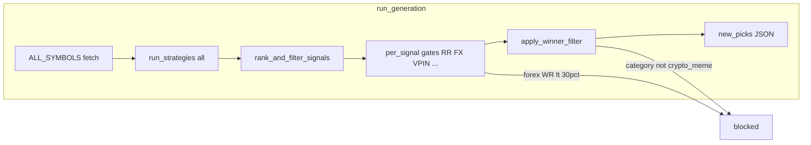

# Non-crypto actives + forex/equity WR/PF — diagnosis and remediation plan

**Scope:** This document records investigation findings only. **No code changes** were made as part of authoring or committing this file.

**Date:** 2026-04-18

---

## Executive summary

Most **commodity, futures, ETF, and bond** directional picks never reach `active_picks.json` from `run_generation` because **`forward_validator.apply_winner_filter()`** only allows **`category` in `crypto` or `meme`**. Scanner universe expansion and strategy registration are largely in place; the **bottleneck is intentional (or legacy) gating after signals are produced**.

**Forex** faces the same winner filter **plus** an aggregate **forex WR &lt; 30%** gate when there are enough closed trades. **Equity** and **commodity** picks that do survive earlier stages are often removed in **`production_scanner.apply_quality_gates` Gate 0** (“crypto-only mode” for those categories).

Low **win rate / profit factor** on forex and equity in dashboards is consistent with **strategy mix, weak edges on some systems, ML/R:R tuned on crypto-heavy history**, and **survivor bias** where equity flow is mostly alternate/legacy paths.

---

## Root causes: why non-crypto actives are thin

| # | Cause | Where | Effect |
|---|--------|--------|--------|
| 1 | **Crypto/meme-only winner filter** | [`alpha_engine/forward_validator.py`](alpha_engine/forward_validator.py) — `WINNER_FILTER_CONFIG["allowed_asset_classes"]` = `["crypto", "meme"]`; `apply_winner_filter()` ~L462–466 | Any directional signal with explicit `category` ∈ {forex, equity, stock, futures, etf, bond, commodity, …} is **blocked** before pick emission ~L2644–2656. |
| 2 | **Empty `category` bypass** | Same — `if category and category not in ...` | Missing or empty `category` **skips** Check 1; behavior is **inconsistent** vs properly tagged signals. |
| 3 | **Forex aggregate WR gate** | Same file ~L2214–2244 | If forex WR from `closed_picks.json` is **&lt; 30%** with **≥5** trades, **all forex** signals are dropped before winner filter. |
| 4 | **Winner filter R:R band** | `WINNER_FILTER_CONFIG`: `rr_min` 1.5, `rr_max` 3.0 ~L406–408 | Non-crypto strategies with R:R outside this band are rejected even if asset class were allowed. |
| 5 | **Production Gate 0 (equity/commodity)** | [`alpha_engine/production_scanner.py`](alpha_engine/production_scanner.py) `apply_quality_gates` ~L2074–2080 | Hard-rejects **`equity` / `stock` / `commodity`** after load; aligns with “crypto-only” for those buckets on the production path. |
| 6 | **HC / verified-edge policy** | [`memory/2026-04-15.md`](memory/2026-04-15.md) — COMMODITY/BOND/ETF rejected for HC | Affects **dashboard “verified” presentation**, not raw pick generation; still makes cards look inactive. |
| 7 | **Symbol vs dashboard class** | [`alpha_engine/asset_class.py`](alpha_engine/asset_class.py) | e.g. **IEF** can classify as **etf** before `category: bond`, so **bond** card stays sparse. |
| 8 | **Universe ≠ policy** | [`alpha_engine/config.py`](alpha_engine/config.py) `ALL_SYMBOLS`; [`alpha_engine/scanner.py`](alpha_engine/scanner.py) `run_strategies` for `"all"` | Symbols and commodity/futures/ETF/bond **strategies are wired**; **policy gates** cap what survives. |

### Pipeline sketch (generation)

---

## Forex and equity: WR / profit factor — investigation directions

### Forex

- **Stacked gates:** Winner filter asset class + **aggregate forex WR** gate + confidence/R:R sweet spot (winner filter) + **`non_crypto_quality_gate`** / **`non_crypto_policy`** probation rules for many strategies.
- **Attribution:** Export closed picks; compute WR and PF **by strategy**, **symbol**, and **regime** (e.g. dominance of `regime_strong_bear` or similar). Compare to gates in [`alpha_engine/non_crypto_quality_gate.py`](alpha_engine/non_crypto_quality_gate.py) and policy tables in [`alpha_engine/non_crypto_policy.py`](alpha_engine/non_crypto_policy.py).
- **ML skew:** Ranker and features may be **crypto-calibrated**; non-crypto signals may rank low or get inconsistent `elite_score`.

### Equity

- **Gate 0** in production explicitly disables **equity/stock** (and **commodity**) in quality gates — any equity in dashboards may come from **merge paths** (e.g. copy-trader, isolated integrators) or **older** picks, not a single healthy scanner→validator pipe.
- **PF/WR** on the equity card then reflects **mixed lineage + small edge**, not a clean “live equity book.”

### General

- [`alpha_engine/scanner.py`](alpha_engine/scanner.py) `rank_and_filter_signals`: falling-knife is **crypto/meme**-targeted; other gates (R:R, confidence) still apply broadly.

---

## Suggested remediation plan (future work — not done in this commit)

| Phase | Action |
|-------|--------|
| **A — Instrumentation** | Log counts at each gate (`WINNER_FILTER` by reason, `FOREX_GATE`, RR, `apply_quality_gates`) for one CI run; compare to raw `run_strategies` signal counts. |
| **B — Policy alignment** | Decide **crypto-only live** vs **multi-asset live**. If multi-asset: replace or parameterize `allowed_asset_classes` with **per-class** or **per-strategy** allowlists aligned with [`non_crypto_policy.py`](alpha_engine/non_crypto_policy.py). |
| **C — Category hygiene** | Require canonical `category` on all emitted signals; **reject** or explicitly default missing category — remove silent bypass of winner filter Check 1. |
| **D — R:R and ML** | Per-class `rr_min` / `rr_max` (or exemptions for validated non-crypto strategies); optional **non-crypto ML** calibration / features. |
| **E — WR/PF cleanup** | Per-strategy attribution on closed book; regime splits; demotion/kill only after repo protocol (e.g. [`docs/STRATEGY_INVESTIGATION_BEFORE_KILL.md`](docs/STRATEGY_INVESTIGATION_BEFORE_KILL.md) and mutation workflow where applicable). |

---

## Verification checklist (after future code changes)

- [ ] CI logs show non-zero “passed” non-crypto directional picks **after** winner filter (if policy allows).
- [ ] `blocked_asset_class` in winner filter summary moves in line with config changes.
- [ ] Dashboard active/closed counts by asset class move **together** with `active_picks.json` / `closed_picks.json`, not only HC tiles.

---

## Commit note

This file was added as **documentation only**. No application code was modified in the same commit as this diagnosis.
