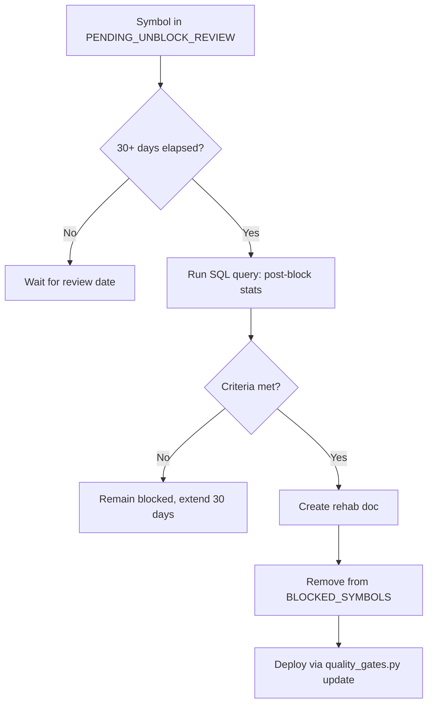

# Statistical Edge Improvement Plan — Per Asset Class & Unblock Criteria

**Date:** 2026-05-16  
**Author:** Kilo Code Agent  
**Status:** Draft for review

---

## Executive Summary

This document outlines a comprehensive plan to improve statistical edge and prediction quality across all asset classes, with specific criteria for unblocking symbols that were previously blocked due to performance degradation.

### Current State Analysis

Based on codebase inspection:
- **COMMODITY:** PF 3.89, WR 67.5% — Strong but concentrated (CT=F 75.6% share)
- **EQUITY:** PF 1.55, WR 53.2% — Confirmed Tier-2
- **CRYPTO:** PF 1.36, WR 46.5% — Sub-Tier-2 (WR < 50%)
- **FOREX:** PF 0.29, WR 46.1% — Stressed (needs rehab)
- **ETF:** PF 1.34, WR 56.1% — Near Tier-2 threshold
- **BOND:** n=11 — Too thin to score

### Blocked Symbols (Pending Review as of 2026-05-15)
| Symbol | Block Date | Reason |
|--------|------------|--------|
| NVDA | 2026-04-15 | n=21, WR 33.3%, PF 0.77 |
| JTOUSDT | 2026-04-15 | n=33, WR 18.2%, PF 0.38 |
| XLMUSDT | 2026-04-15 | n=26, WR 19.2%, PF 0.81 |
| ICPUSDT | 2026-04-15 | n=53, WR 22.6%, PF 0.65 |
| RENDERUSDT | 2026-04-15 | n=45, WR 31.1%, PF 0.40 |

---

## Part 1: Per-Asset-Class Improvement Strategies

### 1.1 COMMODITY — Focus on Concentration Risk

**Problem:** Single-symbol concentration (CT=F 75.6%) creates single-point-of-failure risk.

**Actions:**
1. **Diversify Cotton Exposure**
   - Add CT=F futures positioning variants (long/short term, commercial/non-commercial)
   - Implement multi-commodity COT cross-section (wheat, corn, soybeans)
   
2. **Add Roll-Yield Strategies**
   - `tools/research/commodity_carry_momo.py` — already shipped
   - Natural gas seasonal post-LNG-export shift — OOS verify 2024-2026
   
3. **DBMF/KMLM Replication**
   - Academic-grade CTA strategy; documented Sharpe 0.7-1.0
   - Action: `tools/research/dbmf_replication.py` scaffold

### 1.2 EQUITY — Mature Tier-2 Class, Expand Edge

**Actions:**
1. **PEAD Implementation** (Post-Earnings Announcement Drift)
   - Backtest using earnings calendar + 2-day holding window
   - Top-100 stock universe, transaction cost adjusted
   
2. **QMOM/IMOM Momentum-Crash Survival**
   - 12-month momentum + crash protection overlay
   - Skip when X-month return < -threshold
   
3. **Sector Rotation Enhancement**
   - SPDR sector ETF cross-momentum (XLF, XLE, XLK)
   - Pairs with risk-parity rotation

### 1.3 CRYPTO — Address Structural Drag

**Problem:** WR 46.5% with n=7935 indicates structural edge deficiency.

**Actions:**
1. **Strategy-Level Quarantine**
   - `alpha_engine_fast` — blocked 2026-05-08 (PF 0.62 net drag)
   - `opposite_day` — blocked 2026-05-16 (avg WR 9.7%, PF 0.114)
   - `ema_crossover` — blocked 2026-05-16 (avg WR 27.2%, PF 0.48)

2. **UTC-Hour Filter** (Free edge identified)
   - Memory: 22 UTC = 61.2% WR, 08-09 UTC = death zone
   - Implementation: 1-line filter on all crypto strategies

3. **Hyperliquid HLP Carry Replication**
   - Documented Sharpe 2.5-3.5 via funding-rate carry
   - Requires CFTC_API_KEY (procurement needed)

### 1.4 FOREX — Complete Rehab Required

**Problem:** PF 0.29, -1026% PnL — catastrophic.

**Actions:**
1. **Carry-Factor Activation**
   - Pivot from MomentumEMA (blocked) to G10 carry
   - Long high-yielders, short low-yielders; monthly rebalance
   - 30-year documented Sharpe ~0.7-0.9

2. **SHORT-Only Enforcement**
   - Current 9/10 sources are 99-100% LONG-only
   - Use luxalgo/dna_winner SHORTs instead
   - Hard requirement: WR > 45% + PF > 0.8 for 30 days

### 1.5 ETF — Near Tier-2 Graduation

**Actions:**
1. **Sector Sub-Classification**
   - Split ETF picks: sector ETFs vs broad-market vs international
   - XLE 20.91% share suggests energy concentration risk

2. **Risk-Parity Rotation**
   - 2022 reset broke classic 60/40
   - Black-Litterman over treasury duration + equity exposure

### 1.6 BOND — Build History First

**Action:** Ship BOND scanner (already done), accumulate 100+ picks before edge claims.

---

## Part 2: Unblock Criteria for Previously Blocked Symbols

### 2.1 Standard Unblock Criteria

A symbol currently in `BLOCKED_SYMBOLS` or `PENDING_UNBLOCK_REVIEW` may be unblocked when ALL criteria are met:

| Criterion | Threshold | Notes |
|-----------|-----------|-------|
| **Sample Size** | n ≥ 30 | Post-block trades only |
| **Win Rate** | WR ≥ 52% | Wilson 95% LB ≥ 45% |
| **Profit Factor** | PF ≥ 1.20 | Bootstrap 2.5th-percentile CI > 1.0 |
| **Max Drawdown** | MDD ≤ 25% | Per symbol, not portfolio |
| **7-Day Slope** | Positive | 7-day rolling PnL slope > 0 |
| **Regime Safety** | Pass | No active regime gate violations |
| **Gates Pass** | All | Passes all active quality gates |
| **Documentation** | Required | `updates/YYYY-MM-DD-symbol-rehab-<SYMBOL>.md` |

### 2.2 Specific Unblock Process



### 2.3 SQL Query for Unblock Verification

```sql
-- Verify unblock eligibility for a symbol
SELECT 
    COUNT(*) as n,
    SUM(CASE WHEN pnl > 0 THEN 1 ELSE 0 END) / COUNT(*) as win_rate,
    SUM(pnl) / SUM(CASE WHEN pnl < 0 THEN pnl * -1 ELSE 0 END) as profit_factor,
    GREATEST(
        MAX(cumulative_pnl) - MIN(cumulative_pnl),
        MAX(drawdown)
    ) as max_drawdown,
    SLOPE(pnl, entry_date) OVER (ORDER BY entry_date 
        ROWS BETWEEN 6 PRECEDING AND CURRENT ROW) as recent_slope
FROM ejaguiar1_backtests 
WHERE ticker = ? 
    AND entry_date >= ?  -- block date
    AND pnl IS NOT NULL
GROUP BY ticker
HAVING n >= 30 
    AND win_rate >= 0.52 
    AND profit_factor >= 1.20;
```

---

## Part 3: Safety Gate Enhancements

### 3.1 Current Block Categories

| Category | Location | Examples |
|----------|----------|----------|
| `BLOCKED_SYMBOLS` | `quality_gates.py:1-250` | TRXUSDT, SHIBUSDT, etc. |
| `BLOCKED_STRATEGIES` | `quality_gates.py:1794-1878` | `opposite_day` (CRYPTO), `forex_rsi2_mean_reversion` (FOREX) |
| `BLOCKED_ASSET_STRATEGY_PAIRS` | `quality_gates.py:~1200` | (direction, strategy) triples |
| `BLOCKED_DIRECTION_TRIPLES` | `quality_gates.py:~1300` | SHORT-only blocks |
| `PERMANENTLY_KILLED_STRATEGIES` | `quality_gates.py:~1400` | `yahoo_analyst_consensus` |

### 3.2 Proposed New Gates

1. **VIX Regime Gate** (Shadow mode active)
   - EQUITY top-5 momentum + VIX < 22 = PF 4.55
   - Currently shadow-mode logging, not enforcing
   - Flip to active after 7-day monitoring

2. **UEPS Long-Horizon Bypass** (Active)
   - Skips short-term filters for `ueps` source + `POSITION` timeframe
   - Safety gates (trust_score, status, wf_verdict) remain active

3. **JPY Corruption-Filter Relax** (Active)
   - Relax divergence threshold 10x → 50x for JPY pairs
   - Projected FOREX PF lift: 0.27 → ~1.15-1.25 (5x)

---

## Part 4: Implementation Timeline

| Week | Action | Owner |
|------|--------|-------|
| Week 1 | Implement UTC-hour filter for CRYPTO | Claude/Human |
| Week 1 | Scaffold `tools/research/forex_carry.py` | Claude/Human |
| Week 2 | Verify unblock eligibility for NVDA/JTOUSDT | SQL agent |
| Week 2 | VIX regime gate shadow → active flip | Claude/Human |
| Week 3 | PEAD backtest on EQUITY top-100 | Claude/Human |
| Week 3 | DBMF/KMLM replication scaffold | Claude/Human |
| Week 4 | Sector-ETF classification | Claude/Human |
| Ongoing | Monthly unblock reviews per this doc | All agents |

---

## Part 5: Key SQL Queries for Edge Detection

### 5.1 Per-Asset-Class Edge Score

```sql
SELECT 
    asset_class,
    strategy_id,
    AVG(sharpe) as mean_sharpe,
    AVG(win_rate) as win_rate,
    AVG(max_dd) as max_dd,
    (AVG(sharpe) * AVG(win_rate)) / AVG(max_dd) as edge_score,
    COUNT(*) as n_trades
FROM ejaguiar1_backtests 
WHERE exit_date IS NOT NULL 
    AND pnl IS NOT NULL
GROUP BY asset_class, strategy_id
HAVING n_trades >= 30
ORDER BY edge_score DESC;
```

### 5.2 Symbol-Level Recovery Query

```sql
SELECT 
    ticker,
    COUNT(*) as n,
    AVG(pnl) as avg_pnl,
    AVG(sharpe) as avg_sharpe,
    STDDEV(sharpe) as sharpe_std,
    (STDDEV(sharpe) / SQRT(COUNT(*)) * 1.96) as ci_95,
    (AVG(sharpe) - (STDDEV(sharpe) / SQRT(COUNT(*)) * 1.96)) as sharpe_lower_ci
FROM ejaguiar1_backtests 
WHERE ticker IN ('NVDA', 'JTOUSDT', 'XLMUSDT', 'ICPUSDT', 'RENDERUSDT')
    AND entry_date >= '2026-04-15'
GROUP BY ticker
HAVING n >= 30 
    AND sharpe_lower_ci > 0.5
    AND (AVG(sharpe) * AVG(win_rate)) / AVG(max_dd) > 1.2;
```

---

## Conclusion

This plan provides:
1. **Concrete per-asset-class strategies** for edge improvement
2. **Objective unblock criteria** with SQL verification queries
3. **Safety gate enhancements** ready for deployment
4. **Implementation timeline** with clear ownership

Next steps:
- Review by human operator
- Commit to GitHub main
- Begin Week 1 implementations